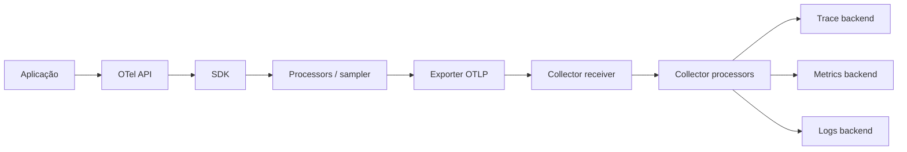
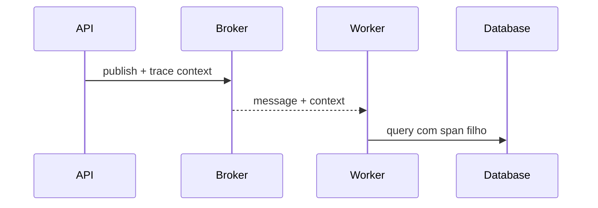
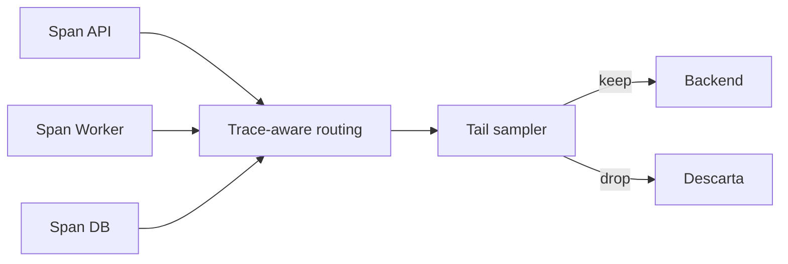

# OpenTelemetry

OpenTelemetry (OTel) é um conjunto vendor-neutral de APIs, SDKs, semantic
conventions, protocolos e Collector para gerar, transportar e processar traces,
metrics e logs. Ele não é um backend de armazenamento por si só.

O modelo mental mais útil é separar **instrumentação**, **processamento** e
**armazenamento**. Cada camada possui custo, limites e falhas diferentes.

## 1. O caminho de um sinal



A aplicação cria telemetria. O SDK aplica configuração local. O Collector pode
agregar, limitar, redigir, amostrar e rotear. O backend indexa e consulta.

Quando "o trace sumiu", descobrir em qual fronteira ele desapareceu é mais útil
do que trocar aleatoriamente a configuração inteira.

## 2. Resources e instrumentation scope

Resource descreve a entidade que produz telemetria. Exemplos úteis:

- `service.name`;
- `service.version`;
- ambiente/deployment;
- cluster/region quando semanticamente estáveis.

Instrumentation scope identifica a biblioteca/componente responsável pela
instrumentação.

Escolha attributes com governança. Um atributo usado em toda query vira parte do
modelo de dados operacional.

Não transforme IDs de usuário, UUIDs e URLs arbitrárias em dimensions de métrica.
Cardinalidade cresce mais rápido que o dashboard revela.

## 3. Traces

Um trace representa uma cadeia causal de operações. Spans possuem timestamps,
attributes, events, status e relações.

Um bom span responde:

- qual operação aconteceu?
- quanto demorou?
- qual serviço/versão executou?
- qual dependência foi chamada?
- qual erro técnico ocorreu?
- qual contexto é seguro e necessário?

Não use nome de span contendo IDs dinâmicos, como:

```text
GET /orders/98f2...
```

Prefira rota estável:

```text
GET /orders/{id}
```

Isso melhora agrupamento e custo.

## 4. Context propagation

Tracing distribuído depende de propagar contexto entre processos. Para HTTP, W3C
Trace Context é a base comum. Em messaging, headers/properties transportam o
contexto conforme semantic conventions e biblioteca.



Propagação quebrada produz traces fragmentados. O problema pode estar em:

- proxy removendo header;
- producer não injetando contexto;
- consumer não extraindo;
- formato de propagator incompatível;
- execução assíncrona perdendo context local.

## 5. Baggage não é mochila infinita

Baggage propaga dados pelo contexto e pode atravessar múltiplos serviços. Isso o
torna útil e perigoso.

Evite:

- PII;
- tokens;
- payloads;
- valores de alta cardinalidade sem justificativa;
- dados que serviços intermediários não deveriam receber.

Baggage é parte do caminho de dados. Trate-o como superfície de segurança e
performance.

## 6. Metrics

Métricas representam agregações ao longo do tempo. Instrumentos comuns modelam:

- contadores monotônicos;
- valores observáveis;
- distribuições/histogramas.

A decisão crítica não é só "qual instrumento", mas quais dimensions serão
associadas.

Exemplo ruim:

```text
http.server.duration{user_id,request_id,url_completa}
```

Exemplo mais sustentável:

```text
http.server.duration{service,route,method,status_class}
```

Métrica serve para agregado. Use trace/log para detalhe de uma ocorrência.

## 7. Histograms e percentis

Latency é uma distribuição. Média pode parecer saudável enquanto uma cauda
significativa viola SLO.

Histogramas preservam informação agregável sobre distribuição conforme a
configuração. O desenho dos buckets/temporality/export precisa ser compatível com
o backend e queries.

Não use trace sampling como fonte primária de p99 de serviço. Métricas de SLI
precisam representar o tráfego relevante independentemente de quais traces foram
guardados.

## 8. Logs e correlação

OpenTelemetry também modela logs e correlação com trace/span context.

Um log útil não precisa repetir todo o span. Ele pode registrar evento detalhado
e manter `trace_id`/`span_id` para navegação.

Estruture logs para consulta e evite:

- body inteiro por padrão;
- token/cookie;
- segredo de configuração;
- stack trace em todo erro esperado;
- cardinalidade arbitrária em labels indexadas.

## 9. SDK: processors e exporters

O SDK local decide quanto trabalho de telemetria a aplicação faz.

Batch processors reduzem overhead de export. Exporters assíncronos ajudam a
separar o caminho da request do backend de observabilidade.

Ainda assim existe capacidade finita:

- fila local;
- memória;
- tempo de export;
- número de conexões;
- CPU de serialização.

Se o backend fica indisponível, a aplicação não deve acumular telemetria sem
limite até morrer. Prefira perda controlada de telemetria a transformar falha de
observabilidade em indisponibilidade do produto, salvo requisitos muito
específicos.

## 10. Head sampling

Head sampling decide cedo se um trace será amostrado. TraceID ratio é simples,
barato e previsível em volume.

O problema é epistemológico: no começo do trace você ainda não sabe se ele vai
terminar lento ou com erro raro.

Exemplo:

```text
1% de head sampling
→ custo previsível
→ aproximadamente 99% das ocorrências não serão armazenadas como trace completo
```

Isso pode ser totalmente aceitável se métricas preservam SLO e o objetivo dos
traces é diagnóstico amostral.

## 11. Parent-based sampling

Parent-based mantém decisão coerente ao longo da árvore quando um parent já
possui decisão de sampling.

Sem coerência, um downstream pode guardar spans de um trace cujo upstream foi
descartado, criando fragmentação e custo difícil de prever.

Defina comportamento também para roots locais e tráfego vindo de fontes não
confiáveis. Não deixe cliente externo decidir sozinho seu custo de tracing.

## 12. Tail sampling

Tail sampling observa spans antes de decidir guardar o trace. Isso permite regras
como:

- erros;
- alta latência;
- rotas críticas;
- percentual baseline;
- atributos específicos.

O preço é operacional. O componente precisa reter estado até decidir, consumindo
memória e exigindo que spans do mesmo trace cheguem ao mesmo ponto lógico de
decisão.



Se spans do mesmo trace forem espalhados por samplers independentes, a decisão
pode ser incompleta. Topologia e load balancing fazem parte da semântica do tail
sampling.

## 13. Tail sampling não é filtro de métricas

É comum reduzir traces para 1% ou 5% e esperar que métricas derivadas desses
traces representem tráfego real. Isso pode distorcer taxa e SLO.

Use signal adequado ao objetivo:

- métrica para contagem/distribuição agregada;
- trace para causalidade e investigação;
- log para evento detalhado.

Signals se complementam, não precisam duplicar todos os dados.

## 14. Collector pipeline

Um Collector organiza pipelines por signal:

```text
receiver → processors → exporter
```

Receivers aceitam OTLP ou outros formatos. Processors podem fazer batch, filter,
redaction, memory limiting e transformações. Exporters enviam para destinos.

A ordem importa. Redação depois de exportar para fora do trust boundary é tarde
demais.

## 15. Memory limiter e backpressure

Collector também pode saturar. Receber mais dados do que consegue processar leva
a filas, memória e retries.

Proteções típicas:

- memory limiter;
- batch;
- bounded queues;
- retry com backoff;
- load balancing;
- múltiplas réplicas;
- limites de payload/conexões.

Defina o comportamento sob overload: quais sinais podem ser descartados? Por
quanto tempo vale retry? Onde alarmar antes de chegar ao limite?

## 16. Agent, sidecar e gateway

### Agent por node

Bom para coletar dados locais e reduzir fan-out direto dos workloads.

### Sidecar

Isola pipeline por workload, mas multiplica custo operacional e recursos.

### Gateway

Centraliza políticas, credenciais, tail sampling e export. Em contrapartida, vira
componente compartilhado de alto blast radius.

Arquiteturas reais combinam agent + gateway.

## 17. Alta disponibilidade do Collector

Escalar Collector horizontalmente é simples para pipelines stateless. Fica mais
complexo quando existe estado por trace, como tail sampling.

Pergunte:

- o load balancer preserva afinidade necessária?
- perder um Collector perde só telemetria ou afeta app?
- queues sobrevivem restart quando requisito exige?
- exporters possuem quota própria?
- deployment de Collector pode descartar todos os buffers ao mesmo tempo?

Observe o observador.

## 18. Semantic conventions

Semantic conventions evitam inventar nomes diferentes para a mesma coisa em cada
serviço.

Benefícios:

- dashboards reutilizáveis;
- queries consistentes;
- instrumentação automática interoperável;
- migração de backend menos dolorosa.

Ainda assim, atributos de negócio precisam de governança própria. Não use
semantic convention como desculpa para anexar todos os dados disponíveis.

## 19. Auto-instrumentation versus manual

Auto-instrumentation cobre bibliotecas/frameworks rapidamente. É ótima para HTTP,
DB, messaging e runtime.

Instrumentação manual deve adicionar o que a biblioteca não conhece:

- operação de negócio relevante;
- boundary assíncrona customizada;
- atributos estáveis do domínio;
- eventos úteis para investigação.

Evite criar span para cada função. Tracing deve representar causalidade e
operações, não stack trace distribuído permanente.

## 20. Cardinalidade

Cardinalidade é uma das formas mais silenciosas de quebrar observabilidade.

Considere uma métrica com:

```text
100 services × 50 routes × 5 statuses × 100k users
```

Adicionar `user_id` multiplica brutalmente a quantidade de séries.

Antes de criar um attribute de métrica, pergunte:

- quantos valores possíveis existem?
- o conjunto cresce sem bound?
- a dimensão é necessária para alerta/SLO?
- detalhe poderia viver em trace/log?

## 21. Segurança e privacidade

Telemetria atravessa muitas boundaries e costuma ser acessível por mais pessoas
que o banco transacional.

Não capture por padrão:

- Authorization;
- cookies;
- bodies;
- SQL parameters;
- prompts/respostas sensíveis;
- tokens de tool;
- secrets;
- PII desnecessária.

Redija antes de exportar. Controle RBAC no backend e retenção. Criptografe OTLP
conforme arquitetura.

## 22. Falhas recorrentes

| Falha | Sintoma | Evidência | Resposta |
| --- | --- | --- | --- |
| propagation quebrada | traces fragmentados | trace IDs diferentes | corrigir inject/extract |
| cardinalidade alta | custo/memória explode | séries/attributes | normalizar/remover |
| exporter lento | fila cresce | queue/retry metrics | limitar e escalar pipeline |
| tail sampler fragmentado | trace incompleto | spans em samplers distintos | roteamento trace-aware |
| PII em attributes | exposição | amostra de spans/logs | redaction + policy |
| sampling agressivo | incidente sem trace | sample rate | combinar regras/métricas |
| Collector sem limite | OOM | memory/queue | limiter e bounded queues |
| span names dinâmicos | milhões de operações | operation cardinality | usar route/template |

## 23. Troubleshooting: traces desapareceram

Siga as fronteiras:

1. instrumentation criou span?
2. SDK está ativo e sampler manteve o trace?
3. exporter local conseguiu enfileirar?
4. OTLP saiu da aplicação?
5. receiver recebeu?
6. processor filtrou/redigiu/descartou?
7. exporter do Collector conseguiu enviar?
8. backend ingeriu e indexou?
9. query usa tenant/time range corretos?

Instrumente métricas do SDK/Collector quando disponíveis. A ausência de trace é
um problema de pipeline, não necessariamente do código instrumentado.

## 24. Testes

### Unitário

Use exporter/in-memory adequado para verificar:

- nome do span;
- attributes essenciais;
- status;
- ausência de secrets.

### Integração

Faça HTTP → broker → consumer e confirme continuidade de contexto.

### Resiliência

Derrube Collector/backend e confirme:

- aplicação mantém SLO;
- memória fica bounded;
- drop/retry é observável;
- recovery não cria tempestade.

## 25. Laboratórios

### Beginner

- instrumente uma API com auto-instrumentation;
- adicione um span manual de negócio;
- navegue trace → log correlacionado.

### Intermediate

- propague contexto por fila;
- quebre a propagação de propósito;
- diagnostique onde a cadeia se fragmentou.

### Advanced

- compare 100% versus ratio sampling;
- configure gateway Collector com memory limiter e batch;
- injete backend lento e observe queue/drop.

### Expert

Monte duas réplicas de Collector com tail sampling. Gere traces distribuídos com
erro raro e alta latência. Primeiro use balanceamento aleatório e observe
fragmentação; depois ajuste a topologia para manter decisão por trace. Meça custo,
memória, taxa de retenção e capacidade de explicar um incidente.

## Referências oficiais

- OpenTelemetry. [Concepts](https://opentelemetry.io/docs/concepts/).
- OpenTelemetry. [Collector](https://opentelemetry.io/docs/collector/).
- OpenTelemetry. [Semantic conventions](https://opentelemetry.io/docs/specs/semconv/).
- CNCF. [OpenTelemetry project](https://www.cncf.io/projects/opentelemetry/).

---

[← Sinais](signals.md) · [↑ Observabilidade](README.md) · [SLOs e incidentes →](slos-and-incidents.md)
