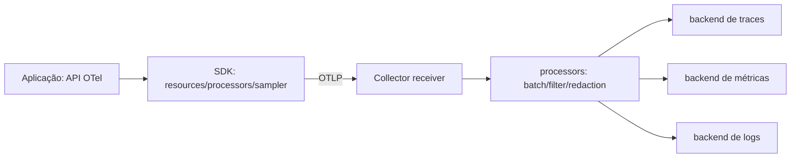

# OpenTelemetry

OpenTelemetry (OTel) fornece APIs, SDKs, semantic conventions e Collector vendor-neutral para gerar/processar/exportar traces, metrics e logs. Ele não é backend de armazenamento/visualização por si só.

## Arquitetura

Instrumentation libraries criam sinais; SDK aplica sampling/export; Collector recebe, processa e exporta. Agent/sidecar reduz blast radius local; gateway centraliza políticas e tail sampling. Combinações são comuns.

## Instrumentação

- defina `service.name`, version, environment/deployment e resource attributes estáveis;
- use auto-instrumentation para cobertura e manual para operações de negócio;
- siga semantic conventions para HTTP, DB e messaging;
- não capture SQL parameters, prompts, bodies ou headers sensíveis por padrão;
- registre status de erro sem marcar erro esperado de negócio indiscriminadamente;
- propague W3C Trace Context e baggage mínimo; baggage viaja e pode vazar.

## Collector confiável

Batch reduz overhead; memory limiter evita colapso; queues/retry absorvem falha curta. Filter/redaction deve acontecer antes de sair do trust boundary. TLS/mTLS e auth protegem OTLP. Configure limites; backpressure pode descartar telemetria ou afetar app conforme exporter.

## Sampling

Parent-based mantém decisão coerente. TraceID ratio controla volume, mas perde incidentes raros. Tail sampling preserva erro/latência após observar spans, com custo/memória e possível fragmentação. Métricas de SLO não devem depender de trace sampling.

## Testes

Use in-memory/exporter de teste para verificar span names, atributos essenciais e ausência de secrets. Em integração, envie ao Collector de laboratório e valide propagation HTTP→fila→consumer. Injete exporter indisponível e confirme que aplicação continua dentro do SLO.

## Referências oficiais

- OpenTelemetry. [Concepts](https://opentelemetry.io/docs/concepts/).
- [Collector](https://opentelemetry.io/docs/collector/).
- [Semantic conventions](https://opentelemetry.io/docs/specs/semconv/).
- CNCF. [OpenTelemetry project](https://www.cncf.io/projects/opentelemetry/).

---

[← Sinais](signals.md) · [↑ Observabilidade](README.md) · [SLOs e incidentes →](slos-and-incidents.md)
