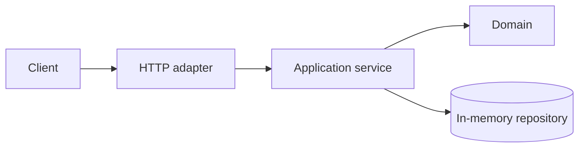

# Projeto 1 — REST API

## Objetivo

Criar uma API HTTP em memória para fontes de estudo, separando contrato,
aplicação e domínio sem antecipar banco, cache ou mensageria.

## Requisitos

- cadastrar, consultar, listar e arquivar uma fonte;
- validar título, URL, tipo e nível de dificuldade;
- filtrar por assunto e paginar com ordem determinística;
- retornar erros consistentes em JSON;
- disponibilizar especificação OpenAPI e health endpoint.

## Arquitetura

## Restrições

Use uma das linguagens do Alexandria, biblioteca HTTP madura e nenhum banco.
Não transforme handlers em local de regra de negócio. Defina IDs, timestamps e
semântica de `PUT`, `PATCH` e `DELETE` explicitamente.

## Milestones

1. Contrato e caminho feliz com testes de API.
2. Validação, erros e paginação.
3. Separação entre transport, use case e domínio.
4. Shutdown gracioso, logs estruturados e documentação executável.

## Critérios de conclusão

- [ ] OpenAPI corresponde às respostas observadas.
- [ ] Testes cobrem conflito, ausência, input inválido e paginação.
- [ ] O domínio pode ser testado sem iniciar HTTP.
- [ ] Outra pessoa executa o projeto com um único comando documentado.

## Desafios extras

Implemente ETag/conditional requests e compare paginação por offset e cursor.

---

[← Projetos](README.md) · [↑ Projetos](README.md) · [PostgreSQL →](02-postgresql.md)
