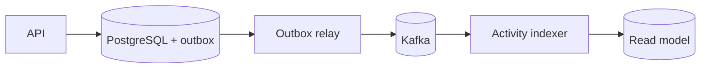

# Projeto 4 — Eventos com Kafka

## Objetivo

Publicar mudanças do catálogo como fatos duráveis e construir um índice de
atividade que possa ser refeito por replay.

## Requisitos

- produzir `SourceAdded`, `SourceUpdated` e `SourceArchived` com schema;
- preservar ordering por `source_id`;
- evitar perda entre commit PostgreSQL e publicação com transactional outbox;
- consumir de forma idempotente e observar consumer lag;
- versionar eventos com compatibilidade entre produtores e consumidores.

## Arquitetura

## Restrições

Não afirme “exactly once” fim a fim: delimite qual transação e quais efeitos
estão cobertos. Particione pela entidade que exige ordem e limite payloads.

## Milestones

1. Cluster local, topic e contratos versionados.
2. Outbox e relay reiniciável.
3. Consumidor idempotente sob duplicação e replay.
4. Rebalance, poison message, lag e recuperação exercitados.

## Critérios de conclusão

- [ ] Nenhum estado publicado precede o commit do domínio.
- [ ] Replay do zero reconstrói a projeção determinística.
- [ ] Métricas distinguem throughput, erro, lag e idade do evento.
- [ ] Runbook cobre partição indisponível e consumidor travado.

## Desafios extras

Implemente compacted topic para estado derivado e teste mudança incompatível de
schema em staging.

---

[← Redis](03-redis.md) · [↑ Projetos](README.md) · [SQS →](05-sqs.md)
