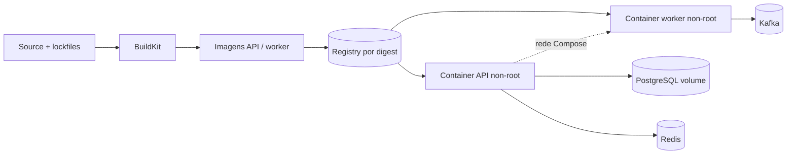

# Projeto 6 — Entrega com Docker

## Objetivo

Produzir imagens reprodutíveis, pequenas e seguras para API e workers, com um
ambiente local que reflita as dependências relevantes.

## Requisitos

- Dockerfile multi-stage com base e dependências fixadas;
- processo non-root, filesystem read-only quando possível e sinais propagados;
- `.dockerignore` que exclui contexto desnecessário;
- Compose para aplicação, PostgreSQL, Redis, Kafka e dependências selecionadas;
- health checks coerentes com liveness/readiness.

## Arquitetura

Build e scan produzem um único digest promovido entre ambientes. Compose
orquestra apenas o laboratório local: cada serviço tem rede, volume, health
check, limite e lifecycle explícitos; dependências ainda exigem timeout, retry e
shutdown gracioso na aplicação.

## Restrições

Secrets entram em runtime, nunca em `ARG`, camada ou imagem. Um container deve
ter responsabilidade e lifecycle claros; Compose não substitui um desenho de
produção.

## Milestones

1. Build reproduzível e inspeção de layers.
2. Usuário, permissões, PID 1 e shutdown.
3. Compose com redes, volumes e ordem baseada em saúde.
4. Scan, SBOM, limite de recursos e documentação.

## Critérios de conclusão

- [ ] O build usa cache sem carregar segredos.
- [ ] SIGTERM encerra trabalho e conexões dentro do grace period.
- [ ] A imagem não contém toolchain ou arquivos de desenvolvimento desnecessários.
- [ ] Estado sobrevive somente nos volumes intencionais.

## Desafios extras

Compare imagem distroless e base mínima considerando debug e supply chain.

---

[← SQS](05-sqs.md) · [↑ Projetos](README.md) · [Kubernetes →](07-kubernetes.md)
