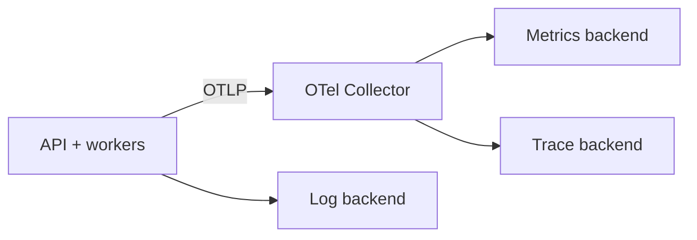

# Projeto 9 — Observabilidade com OpenTelemetry

## Objetivo

Instrumentar o caminho crítico fim a fim para responder perguntas operacionais,
sem depender de logs isolados ou telemetria de cardinalidade explosiva.

## Requisitos

- traces distribuídos propagando contexto por HTTP e mensageria;
- métricas RED da API e sinais de filas/dependências;
- logs estruturados correlacionados a trace e request;
- Collector separado da aplicação;
- SLI/SLO e alertas sobre impacto, não apenas uso de recurso.

## Arquitetura

## Restrições

Não registre tokens, credenciais ou conteúdo privado. Defina política de
sampling e atributos permitidos; `user_id` irrestrito como label causa custo e
risco.

## Milestones

1. Perguntas, SLIs e baseline antes da instrumentação.
2. Auto-instrumentação e spans manuais nos limites do domínio.
3. Propagação por Kafka/SQS e correlação com logs.
4. Incidente simulado: dependência lenta, retry amplification e diagnóstico.

## Critérios de conclusão

- [ ] Um trace mostra tempo de aplicação versus dependências.
- [ ] Métricas possuem unidades, descrição e cardinalidade controlada.
- [ ] Alertas indicam consumo de error budget com ação clara.
- [ ] Perda do backend de telemetria não derruba o caminho crítico.

## Desafios extras

Compare head e tail sampling em um erro raro e estime custo por sinal.

---

[← Microservices](08-microservices.md) · [↑ Projetos](README.md) · [RAG →](10-rag.md)
