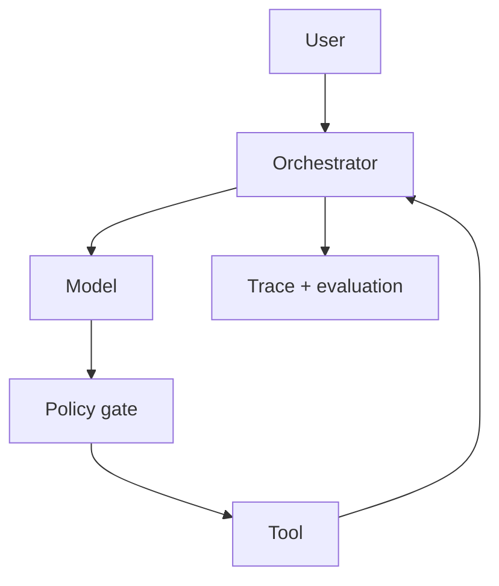

# Projeto 11 — AI Agent

## Objetivo

Permitir que um agente planeje um percurso de estudo e execute ações limitadas,
provando quando adaptação em runtime supera um workflow determinístico.

## Requisitos

- tools pequenas para buscar conteúdo, ler progresso e propor um plano;
- schemas estritos, autorização por ação e outputs não ambíguos;
- estado persistido fora do contexto do modelo;
- confirmação humana antes de qualquer escrita;
- limites de passos, tempo, tokens, custo e repetição.

## Arquitetura

## Restrições

Comece com read-only. Separe conteúdo observado de instrução confiável. Tools
destrutivas ou irreversíveis exigem escopo resolvido e confirmação no momento da
ação, não consentimento genérico no início.

## Milestones

1. Workflow determinístico e métricas como baseline.
2. Loop com uma tool read-only e stop conditions.
3. Estado, retries idempotentes e human-in-the-loop.
4. Avaliação adversarial, auditoria e comparação contra baseline.

## Critérios de conclusão

- [ ] Cada tool call possui causa, input validado e resultado rastreável.
- [ ] O loop encerra sob tool defeituosa, output inválido ou objetivo impossível.
- [ ] Prompt injection não amplia permissões.
- [ ] A autonomia traz ganho mensurável suficiente para justificar variância.

## Desafios extras

Exponha tools via MCP e compare isolamento, interoperabilidade e nova superfície
de ataque.

---

[← RAG](10-rag.md) · [↑ Projetos](README.md) · [Sistema completo →](12-distributed-system.md)
