# Projetos progressivos

Os doze projetos evoluem o mesmo domínio: uma plataforma de catálogo e estudo.
Isso torna visível o custo de cada nova capacidade. Faça um snapshot ou tag ao
final de cada etapa e registre decisões relevantes com ADRs.

```mermaid
flowchart LR
    P1[1 · REST] --> P2[2 · PostgreSQL]
    P2 --> P3[3 · Redis]
    P3 --> P4[4 · Kafka]
    P4 --> P5[5 · SQS]
    P5 --> P6[6 · Docker]
    P6 --> P7[7 · Kubernetes]
    P7 --> P8[8 · Microservices]
    P8 --> P9[9 · OpenTelemetry]
    P9 --> P10[10 · RAG]
    P10 --> P11[11 · Agent]
    P11 --> P12[12 · Sistema completo]
```

| # | Projeto | Decisão central |
| ---: | --- | --- |
| 1 | [REST API](01-rest-api.md) | contrato e fronteiras sem infraestrutura |
| 2 | [API com PostgreSQL](02-postgresql.md) | invariantes, transações e evolução de schema |
| 3 | [Cache com Redis](03-redis.md) | frescor, invalidação e degradação |
| 4 | [Eventos com Kafka](04-kafka.md) | log, idempotência e atomicidade entre recursos |
| 5 | [Jobs com SQS](05-sqs.md) | lease, retry, DLQ e deduplicação |
| 6 | [Entrega com Docker](06-docker.md) | artefato reproduzível e mínimo |
| 7 | [Operação no Kubernetes](07-kubernetes.md) | reconciliação, recursos e rollout |
| 8 | [Evolução para microservices](08-microservices.md) | limites e custo da distribuição |
| 9 | [Observabilidade com OpenTelemetry](09-opentelemetry.md) | perguntas operacionais e causalidade |
| 10 | [Assistente RAG](10-rag.md) | retrieval, grounding e avaliação |
| 11 | [AI Agent](11-ai-agent.md) | autonomia limitada e tools seguras |
| 12 | [Sistema distribuído completo](12-distributed-system.md) | integração, confiabilidade e evolução |

## Regras comuns

- mantenha um caminho de execução local documentado;
- nunca coloque credenciais reais no repositório;
- automatize testes proporcionais ao risco de cada etapa;
- exercite ao menos um modo de falha por milestone;
- meça antes de otimizar ou distribuir;
- mantenha um changelog de hipóteses confirmadas e refutadas.

---

[← Exercícios](../exercises/README.md) · [↑ Início](../README.md) · [REST API →](01-rest-api.md)
