# Projetos progressivos

Os doze projetos evoluem o mesmo domínio: uma plataforma de catálogo e estudo.
Isso torna visível o custo de cada nova capacidade. Faça um snapshot ou tag ao
final de cada etapa e registre decisões relevantes com ADRs.

```mermaid
flowchart LR
    P1[1 · REST] --> P2[2 · PostgreSQL]
    P2 --> P3[3 · Redis]
    P3 --> P4[4 · Kafka]
    P4 --> P5[5 · SQS]
    P5 --> P6[6 · Docker]
    P6 --> P7[7 · Kubernetes]
    P7 --> P8[8 · Microservices]
    P8 --> P9[9 · OpenTelemetry]
    P9 --> P10[10 · RAG]
    P10 --> P11[11 · Agent]
    P11 --> P12[12 · Sistema completo]
```

| # | Projeto | Decisão central |
| ---: | --- | --- |
| 1 | [REST API](01-rest-api.md) | contrato e fronteiras sem infraestrutura |
| 2 | [API com PostgreSQL](02-postgresql.md) | invariantes, transações e evolução de schema |
| 3 | [Cache com Redis](03-redis.md) | frescor, invalidação e degradação |
| 4 | [Eventos com Kafka](04-kafka.md) | log, idempotência e atomicidade entre recursos |
| 5 | [Jobs com SQS](05-sqs.md) | lease, retry, DLQ e deduplicação |
| 6 | [Entrega com Docker](06-docker.md) | artefato reproduzível e mínimo |
| 7 | [Operação no Kubernetes](07-kubernetes.md) | reconciliação, recursos e rollout |
| 8 | [Evolução para microservices](08-microservices.md) | limites e custo da distribuição |
| 9 | [Observabilidade com OpenTelemetry](09-opentelemetry.md) | perguntas operacionais e causalidade |
| 10 | [Assistente RAG](10-rag.md) | retrieval, grounding e avaliação |
| 11 | [AI Agent](11-ai-agent.md) | autonomia limitada e tools seguras |
| 12 | [Sistema distribuído completo](12-distributed-system.md) | integração, confiabilidade e evolução |

## Como os projetos alimentam as trilhas

Não é necessário executar todos os doze projetos para toda especialização. Use o
mesmo domínio e escolha os milestones que produzem a evidência exigida pela
trilha.

| Trilha | Núcleo | Extensões recomendadas | Evidência final |
| --- | --- | --- | --- |
| [Backend](../atlas/backend-engineer.md) | 1–5 e 9 | 6–7 quando operação fizer parte do escopo | API resiliente, idempotente e observável |
| [Distributed Systems](../atlas/distributed-systems-engineer.md) | 4–5, 8 e 12 | 2 e 9 para consistência e diagnóstico | falhas parciais, replay e recovery demonstrados |
| [Software Architect](../atlas/software-architect.md) | 1, 2, 8 e 12 | compare versões antes/depois de cada mudança | ADRs, fitness functions e evolução incremental |
| [Platform / Cloud](../atlas/platform-cloud-engineer.md) | 6–7 e 9 | 1 como workload e 12 para capacidade | golden path, SLO, policy e runbook |
| [AI Engineer](../atlas/ai-engineer.md) | 10–11 | 1, 2 e 9 como fundação de produto e tracing | evals, RAG e tools com segurança e budget |

### Regra importante

O projeto é um laboratório, não um checklist tecnológico. Se uma trilha pede
Kafka, Redis ou Kubernetes, você pode concluir que a tecnologia **não é
necessária** para o requisito atual. Nesse caso, entregue a medição e o ADR que
sustentam a decisão e defina o gatilho que faria revisitá-la.

## Pacote de evidências

Ao concluir um milestone relevante para sua trilha, preserve:

- hipótese e requisito que motivaram a mudança;
- código e testes reproduzíveis;
- uma medição antes/depois quando existir impacto de performance;
- cenário de falha exercitado;
- sinais usados para diagnóstico;
- ADR ou decisão curta com alternativa rejeitada;
- procedimento de rollback ou recuperação;
- retrospectiva do que o experimento mostrou.

Esse pacote transforma o projeto em portfólio técnico e evita que a trilha vire
uma coleção de tutoriais concluídos sem evidência de domínio.

## Regras comuns

- mantenha um caminho de execução local documentado;
- nunca coloque credenciais reais no repositório;
- automatize testes proporcionais ao risco de cada etapa;
- exercite ao menos um modo de falha por milestone;
- meça antes de otimizar ou distribuir;
- mantenha um changelog de hipóteses confirmadas e refutadas.

---

[← Exercícios](../exercises/README.md) · [↑ Início](../README.md) · [REST API →](01-rest-api.md)
