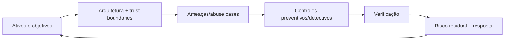

# Segurança de Software

Segurança é gestão contínua de risco: entender ativos, atores, trust boundaries e abuso; reduzir probabilidade/impacto; detectar e recuperar. Checklist ajuda, mas não substitui threat model e evidência.

## Trilha

| Guia | Foco |
| --- | --- |
| [Aplicações e APIs](application-security.md) | OWASP, validação, criptografia, SSRF e abuso de negócio |
| [Identidade e autorização](identity-and-access.md) | authn/authz, OAuth 2.0, OIDC, JWT e sessões |
| [Secrets e supply chain](secrets-and-supply-chain.md) | credenciais, CI/CD, SBOM, provenance e dependências |
| [Cloud e IA](cloud-and-ai.md) | shared responsibility, IAM, dados, prompt injection e tool use |
| [Exercícios](exercises.md) | threat modeling, testes e resposta |

## Processo

## Baseline transversal

- inventário/classificação, minimização, retenção e deleção de dados;
- defaults seguros, least privilege e separação de funções;
- validação no boundary e output encoding pelo contexto;
- criptografia por protocolo/biblioteca madura, com lifecycle de chaves;
- dependências e builds verificáveis;
- logs de segurança sem secrets/PII desnecessária;
- patching, backup/restore e incident response exercitados;
- testes baseados em abuso e autorização, não só happy path.

**Zero Trust** não significa “não confiar em ninguém” nem comprar um produto: não conceda confiança implícita por localização de rede; autentique explicitamente, autorize com mínimo privilégio e contexto, assuma breach, segmente e observe. Isso vale para pessoas, workloads e automação.

## Fontes canônicas

- OWASP. [Top 10](https://owasp.org/www-project-top-ten/), [ASVS](https://owasp.org/www-project-application-security-verification-standard/) e [API Security](https://owasp.org/API-Security/).
- NIST. [Cybersecurity Framework 2.0](https://www.nist.gov/cyberframework).
- NIST. [Secure Software Development Framework](https://csrc.nist.gov/projects/ssdf).
- MITRE. [CWE](https://cwe.mitre.org/).
- NIST. [Zero Trust Architecture — SP 800-207](https://csrc.nist.gov/pubs/sp/800/207/final).

---

[← Observabilidade](../observability/README.md) · [↑ Início](../README.md) · [Aplicações e APIs →](application-security.md)
