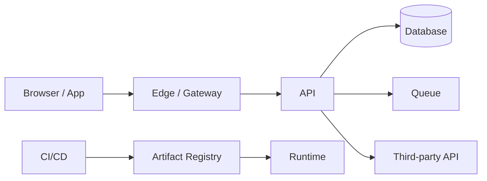
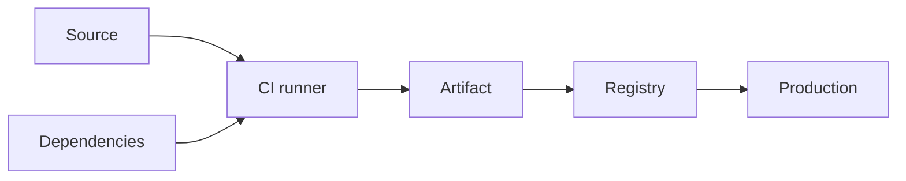

# Segurança de Software

Segurança é engenharia de risco sob adversários e acidentes. O objetivo não é
"deixar o sistema seguro" como estado final, mas identificar ativos, entender
quem pode causar dano, reduzir probabilidade e impacto, detectar violações e
recuperar com evidência.

Checklists são úteis como memória. Eles não substituem um threat model conectado
à arquitetura real.

## Trilha

| Guia | Foco |
| --- | --- |
| [Aplicações e APIs](application-security.md) | OWASP, validação, criptografia, SSRF e abuso de negócio |
| [Identidade e autorização](identity-and-access.md) | authn/authz, OAuth 2.0, OIDC, JWT e sessões |
| [Secrets e supply chain](secrets-and-supply-chain.md) | credenciais, CI/CD, SBOM, provenance e dependências |
| [Cloud e IA](cloud-and-ai.md) | shared responsibility, IAM, dados, prompt injection e tool use |
| [Exercícios](exercises.md) | threat modeling, testes e resposta |

## 1. Comece pelo que precisa ser protegido

"Temos OAuth" não é um threat model. Primeiro liste ativos:

- dinheiro;
- dados pessoais;
- credenciais;
- ações privilegiadas;
- disponibilidade;
- propriedade intelectual;
- integridade de registros;
- reputação e capacidade operacional.

Depois pergunte quem pode interagir:

- usuário legítimo;
- usuário malicioso;
- funcionário;
- workload comprometido;
- dependência externa;
- atacante sem credencial;
- automação com permissões excessivas.

Segurança nasce da relação entre **ativo, ator, caminho e impacto**.

## 2. Trust boundaries

Uma trust boundary aparece onde dados ou ações cruzam entre regiões com
privilégios/confiança diferentes.



Cada seta merece perguntas:

- quem autentica quem?
- quem autoriza a ação?
- o payload é confiável?
- integridade/confidencialidade são protegidas?
- existe replay?
- existe rate/size limit?
- o que é registrado?
- como revogar acesso?

## 3. Threat modeling como processo

Um fluxo prático:

1. defina ativos e objetivos de segurança;
2. desenhe componentes, dados e trust boundaries;
3. enumere abuse cases/ameaças;
4. priorize por probabilidade, impacto e exposição;
5. escolha controles preventivos, detectivos e de recovery;
6. verifique os controles;
7. registre risco residual e owner;
8. revise quando arquitetura ou ameaça mudar.

STRIDE pode ajudar a estimular perguntas, mas não é obrigatório. O perigo é
preencher categorias sem conectar a efeitos de negócio.

## 4. Autenticação e autorização são problemas diferentes

### Autenticação

Responde "quem/qual workload é este?".

### Autorização

Responde "esta identidade pode realizar esta ação sobre este recurso neste
contexto?".

Um JWT válido resolve apenas parte da autenticação. Ainda é necessário validar
issuer, audience, expiração e contexto apropriado. Depois, o domínio precisa
avaliar autorização.

Exemplo:

```text
usuário autenticado = 123
pedido = 42

Pergunta errada: token é válido?
Pergunta correta: usuário 123 pode cancelar pedido 42 no estado atual?
```

A segunda depende de ownership, papel, estado e regra de negócio.

## 5. Least privilege é uma propriedade de desenho

Least privilege não significa criar milhares de roles sem governança. Significa
conceder somente capacidades necessárias pelo tempo necessário e tornar excesso
de privilégio visível.

Aplique em:

- usuários;
- service accounts;
- CI/CD;
- database roles;
- cloud IAM;
- API keys;
- agent tools;
- acesso a secrets.

Credenciais curtas e identidade de workload reduzem o dano de vazamentos
comparadas a chaves estáticas de longa duração.

## 6. Validação de input não é "sanitizar tudo"

Valide dados conforme o contrato:

- tipo;
- tamanho;
- formato;
- faixa;
- enum;
- relação entre campos;
- autorização para a operação.

Depois use APIs seguras para o contexto de saída.

### Injection

SQL injection não é resolvida tentando remover aspas. Use parâmetros/prepared
statements para separar dados de código.

XSS não é resolvido por uma sanitização universal. Output encoding depende do
contexto HTML, atributo, URL, JavaScript ou CSS.

O princípio é separar **dados** de **instruções**, tema que reaparece em command
injection, template injection e prompt injection.

## 7. SSRF e confiança em destinos

Se uma aplicação busca uma URL fornecida pelo usuário, o atacante pode tentar
alcançar serviços internos, metadata endpoints ou endereços especiais.

Controles podem incluir:

- allowlist de destinos quando possível;
- resolução e validação de IPs;
- bloqueio de redes internas/link-local;
- egress policy;
- redirects controlados;
- timeouts e limites de resposta.

Validar apenas a string inicial da URL pode falhar com DNS rebinding ou redirect.
A proteção robusta considera o destino efetivo e a rede.

## 8. Criptografia: objetivo antes do algoritmo

Pergunte qual propriedade você precisa:

- confidencialidade;
- integridade/autenticidade;
- hashing de password;
- assinatura;
- derivação de chave.

Não invente criptografia. Use protocolos e bibliotecas maduras.

### Passwords

Passwords devem ser armazenadas com função de hashing adaptativa adequada ao
caso, sal e parâmetros de custo atualizáveis. Hash rápido como SHA-256 sozinho é
projetado para velocidade, justamente o oposto do desejado contra brute force.

### TLS

TLS protege dados em trânsito e autentica endpoints conforme configuração. Ele
não corrige autorização ruim nem impede vazamento no endpoint depois da
descriptografia.

### Lifecycle de chave

Uma chave tem criação, distribuição, uso, rotação, revogação e destruição.
"Criptografado" sem gestão de chave é uma descrição incompleta.

## 9. Sessions, tokens e revogação

Sessão server-side permite revogação central, pagando storage/lookup. Tokens
self-contained reduzem lookup, mas tornam revogação e atualização de claims um
problema de lifecycle.

Não escolha JWT porque "é stateless" sem avaliar:

- tempo de vida;
- rotação de signing keys;
- revogação;
- tamanho;
- armazenamento no cliente;
- audience;
- replay;
- propagação entre serviços.

## 10. CSRF, CORS e XSS: três problemas diferentes

### CSRF

Explora credenciais automaticamente enviadas pelo browser para induzir uma ação.
Mitigações incluem SameSite, tokens anti-CSRF e verificação de origem conforme
arquitetura.

### CORS

É uma política de browser para leitura de respostas cross-origin. Não é mecanismo
de autenticação e não impede chamadas feitas fora do browser.

### XSS

Permite executar conteúdo controlado pelo atacante no contexto da aplicação.
Output encoding contextual, frameworks seguros e CSP como defesa adicional
fazem parte da estratégia.

Misturar os três gera controles que parecem presentes, mas não protegem a ameaça
correta.

## 11. Abuso de negócio

Nem toda vulnerabilidade é uma falha de parser ou protocolo.

Exemplos:

- resgatar cupom mais vezes que permitido;
- enumerar recursos de outro tenant;
- automatizar compra limitada;
- manipular ordem de workflow;
- explorar refund/chargeback;
- usar feature legítima para exfiltrar dados.

Esses casos exigem invariantes, autorização, rate/fraud controls e observabilidade
do domínio.

## 12. Segurança de APIs

Perguntas mínimas:

- cada endpoint exige a identidade correta?
- autorização ocorre por objeto e função?
- listas/queries vazam dados por filtro frouxo?
- payload e response têm limites?
- rate limit controla abuso e custo?
- erros revelam detalhes sensíveis?
- versionamento preserva controles?
- operações de escrita são auditáveis?

Um endpoint escondido da UI continua exposto se a API aceita a chamada.

## 13. Secrets não pertencem ao source

Um secret commitado deve ser tratado como potencialmente comprometido mesmo após
remover o arquivo do último commit. Histórico, forks, caches e logs podem
preservar o valor.

Resposta correta geralmente inclui:

1. revogar/rotacionar;
2. avaliar uso indevido;
3. remover exposição;
4. melhorar prevenção/detecção.

Secret scanning evita parte dos acidentes, não substitui IAM mínimo.

## 14. Supply chain

A aplicação final depende de source, packages, actions, compilers, runners,
registries e imagens.



Ataques podem comprometer qualquer elo. Controles de defesa em profundidade:

- branch/review protection;
- lockfiles e política de dependência;
- ações pinadas;
- permissões mínimas no CI;
- builds isolados;
- SBOM;
- provenance/attestations;
- assinatura/verificação;
- promoção do mesmo artefato.

SBOM diz o que compõe o artefato. Provenance ajuda a responder como/onde ele foi
produzido. Nenhum dos dois prova ausência de vulnerabilidades.

## 15. Zero Trust sem marketing

Zero Trust não significa "não confiar em ninguém". A ideia central é não conceder
confiança implícita por localização de rede.

Princípios úteis:

- autenticação explícita;
- autorização contextual e mínima;
- identidade de usuários e workloads;
- segmentação;
- assume breach;
- sinais contínuos para detecção;
- políticas verificáveis.

Mover uma aplicação para rede privada não elimina a necessidade de autorização.

## 16. Logging e detecção

Security logging deve registrar eventos relevantes sem criar outro vazamento.

Exemplos:

- login/recovery sensíveis;
- falhas repetidas de autorização;
- mudanças de privilégio;
- criação/rotação de credenciais;
- ações administrativas;
- alterações de policy;
- acesso a dados altamente sensíveis.

Registre ator, ação, alvo, resultado, origem/contexto e correlation ID quando
apropriado. Evite tokens, passwords e payloads desnecessários.

## 17. Disponibilidade também é segurança

DoS, resource exhaustion e retry storms podem ser ataques ou acidentes com o
mesmo efeito operacional.

Controles:

- limites de tamanho;
- rate limits;
- quotas;
- bounded concurrency;
- timeout;
- circuit breaker;
- cache protegido contra stampede;
- custo máximo por request;
- filas com políticas explícitas.

Uma operação de IA que aceita contexto ilimitado pode ser vetor de custo mesmo
sem vulnerabilidade tradicional.

## 18. Segurança de dados

Mapeie lifecycle:

```text
coleta → transporte → processamento → armazenamento → compartilhamento → backup → deleção
```

Para cada etapa:

- o dado é necessário?
- quem acessa?
- por quanto tempo?
- está criptografado onde precisa?
- backups seguem retenção?
- logs copiam o dado?
- existe exclusão/retificação?

Minimização reduz blast radius porque dado que não existe não pode ser vazado.

## 19. Testes de segurança

Combine camadas:

- unit tests de regras de autorização;
- integration tests com identidade realista;
- testes negativos de objeto/tenant;
- fuzz/property-based tests para parsers;
- SAST/linters para classes específicas;
- dependency/container scanning;
- DAST para comportamento exposto;
- abuse-case tests;
- pentest/red team onde risco justificar.

Scanner com zero findings não é prova de segurança. Ele mede apenas as classes
que consegue observar.

## 20. Modos de falha

| Falha | Por que parece aceitável | Impacto | Controle |
| --- | --- | --- | --- |
| token válido = autorizado | simplifica middleware | IDOR/escalada | authz por recurso |
| secret em env/log | fácil de integrar | vazamento lateral | secret lifecycle + redaction |
| CORS como segurança da API | bloqueia browser | clientes externos ignoram | autenticação/autorização reais |
| role ampla no CI | "faz o pipeline funcionar" | supply-chain compromise | least privilege |
| criptografia sem rotação | checkbox atendido | chave comprometida persiste | lifecycle de chave |
| WAF como correção | bloqueia payloads conhecidos | lógica insegura continua | fix na aplicação + WAF complementar |
| rede privada = confiável | simplifica acesso interno | movimento lateral | workload identity + policy |

## 21. Resposta a incidente

Prevenção falha. Prepare:

1. detecção e severidade;
2. containment;
3. preservação de evidência;
4. erradicação;
5. recuperação;
6. comunicação;
7. análise pós-incidente;
8. ações verificáveis.

Durante comprometimento de credencial, rotação rápida é mais importante que
"limpar o Git" primeiro. Durante exfiltração, preservar logs/evidência pode ser
necessário antes de alterações destrutivas.

Runbooks precisam ser exercitados.

## 22. Laboratórios

### Beginner

- desenhe trust boundaries de uma API simples;
- escreva testes de autorização por recurso;
- compare parâmetro SQL versus concatenação insegura.

### Intermediate

- implemente session/token lifecycle com expiração e revogação;
- adicione rate limit e limite de payload;
- execute threat model de um upload de URL e trate SSRF.

### Advanced

- crie pipeline com SBOM/provenance e permissões mínimas;
- red-team um fluxo multi-tenant para IDOR;
- faça rotação de secret sem downtime.

### Expert

Projete e execute um game day de credencial de CI comprometida. Demonstre blast
radius, detecção, revogação, artefatos potencialmente afetados e critérios para
voltar a confiar na pipeline.

## Referências

- OWASP. [Application Security Verification Standard](https://owasp.org/www-project-application-security-verification-standard/)
  fornece requisitos verificáveis.
- OWASP. [Top 10](https://owasp.org/www-project-top-ten/) e
  [API Security Top 10](https://owasp.org/API-Security/) organizam classes comuns
  de risco.
- NIST. [Cybersecurity Framework 2.0](https://www.nist.gov/cyberframework)
  estrutura governança e gestão de risco.
- NIST. [Secure Software Development Framework](https://csrc.nist.gov/projects/ssdf)
  cobre práticas de desenvolvimento seguro.
- NIST. [Zero Trust Architecture, SP 800-207](https://csrc.nist.gov/pubs/sp/800/207/final)
  define a arquitetura de referência de Zero Trust.
- MITRE. [CWE](https://cwe.mitre.org/) cataloga classes de fraquezas de software.

---

[← Observabilidade](../observability/README.md) · [↑ Início](../README.md) · [Aplicações e APIs →](application-security.md)
