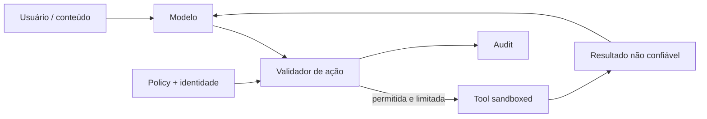

# Segurança em cloud e sistemas de IA

## Cloud: responsabilidade compartilhada

O provedor protege camadas específicas; o cliente continua responsável por identidades, dados, configuração e workload conforme serviço. “Managed” muda a fronteira, não remove responsabilidade.

Baseline:

- organizações/accounts/projects separados por ambiente e blast radius;
- federation/SSO + MFA, sem access keys humanas permanentes;
- workload identity curta e least privilege com conditions;
- rede privada/egress control e endpoints de serviço onde útil;
- encryption/KMS com policies, rotação e restore;
- configuration/audit logs centralizados e protegidos;
- guardrails policy-as-code e exceção com owner/expiração;
- incident response incluindo snapshots, credential revocation e provider coordination.

## IA: novas interfaces, velhos princípios

Model output é não confiável. Prompt injection pode vir do usuário ou conteúdo recuperado; separar mensagem “system” não cria security boundary. A defesa efetiva reduz autoridade: tools allowlisted, argumentos tipados/validados, autorização no momento da ação, sandbox, egress e confirmação humana para efeitos de alto impacto.

## Riscos de IA

- prompt injection e indirect injection via RAG/web/documentos;
- excessive agency e autorização confusa entre user/agent/tool;
- sensitive information disclosure em prompt, output, logs e training;
- insecure output handling (SQL, HTML, shell) sem validação contextual;
- model/data supply chain, poisoned corpus e modelo não verificado;
- denial of wallet/resource por token/tool loops;
- avaliação insuficiente e drift de modelo/prompt/retrieval.

## Controles para RAG e agents

Preserve ACL na ingestão e aplique filtro com identidade atual na recuperação; chunk não pode perder tenant/classificação. Versione corpus, embedding/modelo e permita deleção/reindexação. Tool call recebe capability mínima e idempotency key; limite passos, custo, tempo e egress. Registre decisão/ação com redaction. Teste ataques adaptativos e falha de dependência, sem afirmar que um detector resolve injection.

## Referências oficiais

- NIST. [AI Risk Management Framework](https://www.nist.gov/itl/ai-risk-management-framework).
- OWASP GenAI Security Project. [LLM Top 10](https://genai.owasp.org/llm-top-10/).
- MITRE. [ATLAS](https://atlas.mitre.org/).
- AWS. [Shared Responsibility Model](https://aws.amazon.com/compliance/shared-responsibility-model/).

---

[← Secrets e supply chain](secrets-and-supply-chain.md) · [↑ Segurança](README.md) · [Exercícios →](exercises.md)
