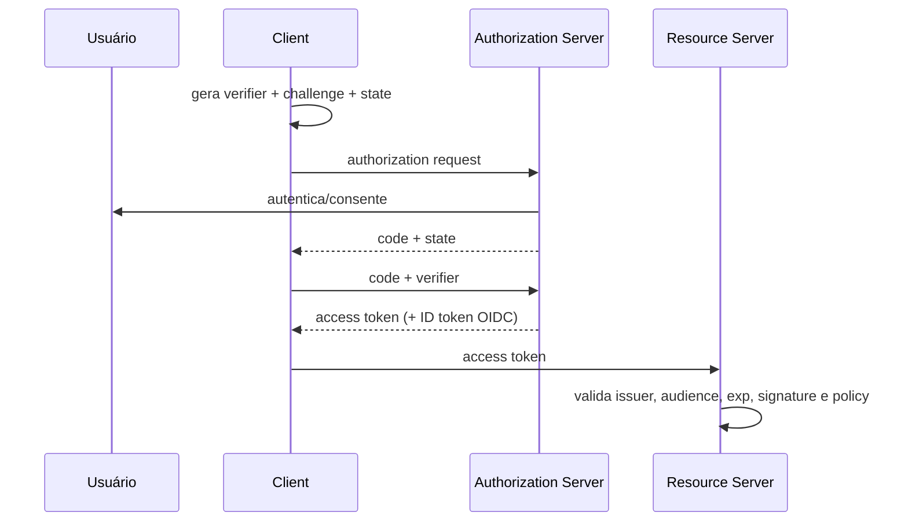

# Identidade, OAuth 2.0, OpenID Connect e JWT

**Autenticação** estabelece quem controla uma identidade; **autorização** decide se aquele principal pode realizar ação sobre recurso no contexto. Auditing registra decisão/efeito. Separe human, workload e device identity.

## Sessão ou token

Sessão opaca guarda estado no servidor e facilita revogação; cookie deve ser `Secure`, `HttpOnly`, `SameSite` apropriado, prefixos quando úteis e proteção CSRF. Token self-contained reduz lookup, mas propaga claims stale e dificulta revogação. Escolha pelo modelo, não por moda.

## OAuth e OIDC

OAuth 2.0 é delegação de acesso; OIDC adiciona autenticação e ID Token. Para aplicações modernas, Authorization Code + PKCE é baseline. O client redireciona ao Authorization Server, troca code vinculado ao verifier e recebe tokens; Resource Server valida access token para si.

`state` liga resposta à sessão/CSRF; `nonce` liga ID Token à autenticação OIDC. Redirect URI é comparação estrita. Public clients não mantêm client secret. Device flow atende dispositivos com input restrito; client credentials é workload, sem usuário.

## JWT

JWT é formato de claims, não sistema de auth. Fixe algoritmos aceitos; nunca confie no header para escolher livremente. Valide assinatura, issuer, audience, expiration/not-before com clock skew limitado e tipo/contexto. Use key ID apenas para lookup seguro. Claims são legíveis salvo JWE; não ponha secret/PII. Access token e ID Token não são intercambiáveis.

## Autorização

RBAC agrupa permissões, ABAC usa atributos, ReBAC usa relações. Policy deve receber principal, ação, recurso e contexto, com deny default. Verifique tenant/ownership no servidor em cada operação e filtre listas, não apenas detalhes. Cache de decisão precisa considerar versão/revogação.

## Identidade de workload e mTLS

mTLS autentica ambos os endpoints no canal; não define sozinho permissão de domínio. Certificados curtos emitidos por uma CA/workload identity reduzem secrets estáticos, mas exigem bootstrap, rotação, revogação e validação de trust domain/SAN. O serviço mapeia identidade criptográfica a policy least-privilege; proxy/mesh não deve transformar qualquer workload da rede em confiável.

## Referências oficiais

- IETF. [OAuth 2.0 Security Best Current Practice — RFC 9700](https://www.rfc-editor.org/rfc/rfc9700.html).
- OpenID Foundation. [OpenID Connect Core 1.0](https://openid.net/specs/openid-connect-core-1_0.html).
- IETF. [JSON Web Token — RFC 7519](https://www.rfc-editor.org/rfc/rfc7519.html).
- IETF. [OAuth 2.0 for Browser-Based Apps](https://datatracker.ietf.org/doc/draft-ietf-oauth-browser-based-apps/).
- SPIFFE. [Specifications](https://spiffe.io/docs/latest/spiffe-about/spiffe-concepts/).

---

[← Aplicações e APIs](application-security.md) · [↑ Segurança](README.md) · [Secrets e supply chain →](secrets-and-supply-chain.md)
