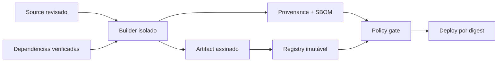

# Secrets e segurança da supply chain

## Lifecycle de secrets

Secret é material cuja posse concede poder: token, password, private key, credential de cloud. Inventarie owner, consumidor, escopo, criação, distribuição, rotação, revogação e auditoria. Prefira identidade de workload e credenciais curtas emitidas sob demanda a segredo estático.

Nunca coloque secret em source, imagem, artifact, log, trace, URL ou variável exposta indiscriminadamente. Em CI, restrinja secrets a ambientes/branches confiáveis; pull request não confiável não deve executar com credenciais. Mascaramento de log é última barreira, não controle primário.

## Resposta a vazamento

Revogue/rotacione primeiro, determine escopo/uso, preserve evidências e só depois remova do histórico conforme necessidade. Apagar commit não invalida credencial já copiada. Teste rotação sem downtime e alertas de uso anômalo.

## Supply chain

Lockfile/pinning melhora reprodução mas exige bot/processo de atualização. SBOM responde “o que há”, provenance “como/onde foi construído”, assinatura “qual identidade atesta”. Nenhum substitui revisão, sandbox e runtime controls.

## Pipeline

- actions/plugins fixados por commit/digest e publishers revisados;
- runners efêmeros, rede/permissions mínimas e isolamento de builds não confiáveis;
- artifact promovido, nunca rebuild por ambiente;
- branch/tag protection, revisão e separação de deploy;
- package namespace protegido contra dependency confusion;
- scan de secret/dependency/image com SLA baseado em risco;
- release reproduzível ou ao menos verificável por provenance.

## Referências oficiais

- NIST. [Secure Software Development Framework SP 800-218](https://csrc.nist.gov/pubs/sp/800/218/final).
- SLSA. [Supply-chain Levels for Software Artifacts](https://slsa.dev/).
- OpenSSF. [Scorecard](https://scorecard.dev/).
- CISA. [SBOM](https://www.cisa.gov/sbom).

---

[← Identidade](identity-and-access.md) · [↑ Segurança](README.md) · [Cloud e IA →](cloud-and-ai.md)
