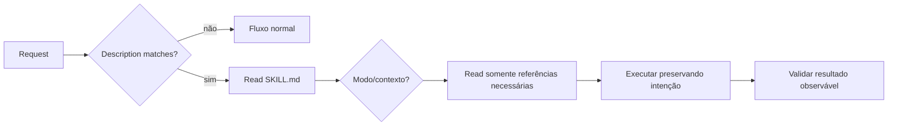

# Skills para coding agents

Uma skill é um pacote de instruções reutilizável que ajuda um agente a executar
uma classe de tarefa com contexto, constraints e recursos específicos. Ela não
substitui a solicitação atual: escolhas explícitas e limites de autorização do
usuário continuam superiores.

## Anatomia

```text
skill-name/
├── SKILL.md              # descoberta + instruções essenciais
├── references/           # detalhes lidos somente quando relevantes
├── scripts/              # automação determinística reutilizável
└── assets/               # artefatos usados na saída, não como instrução
```

`SKILL.md` precisa de frontmatter com `name` e `description`. A descrição é
visível durante seleção e deve dizer quando aplicar a skill sem atrair tarefas
vagamente relacionadas.

## Progressive disclosure

1. **Nome e descrição:** permitem descobrir a capacidade com custo baixo.
2. **Corpo de SKILL.md:** contém decisões e constraints comuns à tarefa.
3. **References/scripts/assets:** são carregados ou executados somente na rota
   que realmente precisa deles.

O objetivo não é esconder informação; é impedir que um manual inteiro ocupe o
contexto antes de sabermos qual variante importa.

## O que escrever

- outcome observável e boundary da skill;
- conhecimento não óbvio que muda decisões;
- invariantes de segurança e stopping conditions;
- critério para escolher modos ou referências;
- scripts apenas quando repetição/determinismo justificam manutenção.

Evite repetir capacidades gerais do agente, transformar uma preferência local em
regra universal ou assumir que executar uma tarefa autoriza publicação, deleção
ou outras mutações externas.

## Fluxo de uso



## Catálogo de exemplos

| Skill | Outcome e boundary sugeridos |
| --- | --- |
| [code-review](examples/code-review/SKILL.md) | encontrar defeitos acionáveis em um patch; não publicar reviews sem autorização |
| [architecture-review](examples/architecture-review/SKILL.md) | testar decisões contra atributos e evolução; não impor um estilo favorito |
| [security-review](examples/security-review/SKILL.md) | modelar ameaças e controles no escopo autorizado; não executar exploração destrutiva |
| [dependency-update](examples/dependency-update/SKILL.md) | atualizar uma dependência e verificar regressões; não ampliar versões sem motivo |
| [debugging](examples/debugging/SKILL.md) | localizar causa com evidência; não implementar fix se o pedido é só diagnóstico |
| [testing](examples/testing/SKILL.md) | desenhar testes por risco e invariantes; não perseguir cobertura vazia |
| [documentation](examples/documentation/SKILL.md) | criar documentação ligada ao leitor e ao sistema real |
| [incident-analysis](examples/incident-analysis/SKILL.md) | construir timeline e ações sem atribuição pessoal de culpa |

O exemplo [code-review](examples/code-review/SKILL.md) é completo e usa uma
rubrica separada somente quando a revisão começa.

## Checklist de qualidade

- descrição curta e discriminante;
- instruções preservam escopo e intenção explícita;
- detalhe é proporcional ao risco;
- referências são descobertas por links e têm propósito claro;
- não há placeholders ou diretórios sem uso;
- validação verifica comportamento, não apenas headings.

## Referência

- [Agent Skills open specification](https://agentskills.io/specification)

---

[← Agentes](../agents/README.md) · [↑ Início](../README.md) · [Skill de exemplo →](examples/code-review/SKILL.md)
