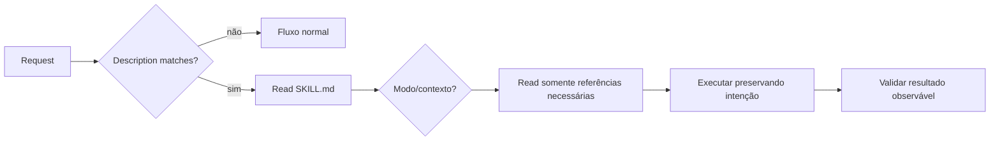

# Skills para coding agents

Uma skill é um pacote de instruções reutilizável que ajuda um agente a executar uma classe de tarefa com contexto, constraints e recursos específicos. Ela não substitui a solicitação atual: escolhas explícitas e limites de autorização do usuário continuam superiores.

O problema que uma skill resolve é recorrente: um agente geral sabe muitas coisas, mas uma organização ou tarefa possui convenções, workflows, ferramentas e limites que não deveriam ser redescobertos a cada execução. A skill encapsula esse conhecimento sem transformar toda conversa em um manual gigante.

## Modelo mental

Pense em uma skill como uma combinação de três elementos:

1. **roteamento:** quando esta capacidade deve ser escolhida;
2. **política:** quais invariantes e decisões precisam ser preservadas;
3. **execução:** referências, scripts e assets que tornam a tarefa reproduzível.

Ela não é um “prompt mágico”. Uma skill boa reduz graus de liberdade onde erro é caro e deixa liberdade onde o contexto precisa decidir.

## Anatomia

```text
skill-name/
├── SKILL.md              # descoberta + instruções essenciais
├── references/           # detalhes lidos somente quando relevantes
├── scripts/              # automação determinística reutilizável
└── assets/               # artefatos usados na saída, não como instrução
```

`SKILL.md` precisa de frontmatter com `name` e `description`. A descrição é visível durante seleção e deve dizer quando aplicar a skill sem atrair tarefas vagamente relacionadas.

## Progressive disclosure

1. **Nome e descrição:** permitem descobrir a capacidade com custo baixo.
2. **Corpo de SKILL.md:** contém decisões e constraints comuns à tarefa.
3. **References/scripts/assets:** são carregados ou executados somente na rota que realmente precisa deles.

O objetivo não é esconder informação; é impedir que um manual inteiro ocupe o contexto antes de sabermos qual variante importa.

Progressive disclosure também reduz conflito de instruções. Se uma referência sobre PostgreSQL só é necessária para uma migration review, ela não precisa influenciar uma revisão de frontend.

## O que escrever

- outcome observável e boundary da skill;
- conhecimento não óbvio que muda decisões;
- invariantes de segurança e stopping conditions;
- critério para escolher modos ou referências;
- scripts apenas quando repetição/determinismo justificam manutenção;
- exemplos de sucesso e falha quando a distinção é sutil;
- como validar o resultado antes de concluir.

Evite repetir capacidades gerais do agente, transformar uma preferência local em regra universal ou assumir que executar uma tarefa autoriza publicação, deleção ou outras mutações externas.

## Fluxo de uso



## Boundary e autorização

Uma skill pode ensinar **como** executar uma ação, mas não deve inventar permissão para executá-la. Se o usuário pediu para analisar um deploy, uma skill de deployment não deve publicar uma nova versão sem pedido explícito.

Separe:

- capacidade técnica;
- intenção da tarefa;
- autorização para efeitos externos.

Esse princípio é especialmente importante para skills que criam PRs, alteram infraestrutura, enviam mensagens, executam migrations ou manipulam dados.

## Falhas comuns de uma skill

### Description ampla demais

`description: use para desenvolvimento` faz a skill competir com quase qualquer tarefa. O resultado é roteamento excessivo e instruções irrelevantes.

Prefira algo discriminante: “revisar migrations PostgreSQL com foco em lock, compatibilidade e rollback”.

### Instruções rígidas demais

Uma regra como “sempre use microsserviços” transforma preferência em dogma. Skills devem codificar invariantes reais e critérios de decisão, não congelar arquitetura.

### Contexto escondido

Se o comportamento depende de uma convenção que só existe na cabeça do autor, a skill falha em outra máquina/equipe. Coloque referências e exemplos próximos da decisão.

### Script opaco

Um script que altera arquivos, publica artefatos ou usa credenciais sem explicar pré-condições cria risco. Scripts precisam de inputs claros, saída verificável e falha segura.

### Validação superficial

“Arquivo criado” não prova que a tarefa terminou. Uma skill de documentação pode exigir links válidos, exemplos executáveis e estrutura navegável; uma skill de dependency update pode exigir testes e diff da lockfile.

## Observabilidade da execução

Em sistemas de agentes, é útil saber **qual skill foi aplicada e qual evidência levou à conclusão**. Sem registrar conteúdo sensível, uma execução pode produzir:

- skill e versão;
- referências consultadas;
- scripts executados;
- arquivos alterados;
- checks realizados;
- falhas/retries;
- decisão final e critérios atendidos.

Isso ajuda debugging. Se uma revisão ruim veio de uma skill desatualizada, o problema é diferente de um erro do modelo ou de uma referência incorreta.

Não transforme observabilidade em gravação indiscriminada da conversa. Preserve minimização de dados e credenciais.

## Versionamento e compatibilidade

Skills evoluem como código. Mudanças podem alterar comportamento de maneira relevante.

Boas práticas:

- mantenha a skill em version control;
- revise mudanças de constraints como mudança de política;
- fixe versão quando execução reprodutível for necessária;
- mantenha exemplos de regressão;
- remova instruções obsoletas em vez de apenas acrescentar exceções;
- registre breaking changes em integrações ou scripts.

Uma skill que depende de ferramenta externa deve indicar versões compatíveis ou como detectar capacidades.

## Scripts: quando valem a pena

Use script quando a operação precisa de determinismo, repetição ou parsing que seria frágil em linguagem natural.

Exemplos:

- validar estrutura de um documento;
- executar test suite padronizada;
- extrair métricas de um diff;
- normalizar configuração;
- gerar artefato a partir de fonte canônica.

Evite script para decisões que exigem julgamento contextual. “Escolher a melhor arquitetura” não vira shell script útil só porque queremos consistência.

## Catálogo de exemplos

| Skill | Outcome e boundary sugeridos |
| --- | --- |
| [code-review](examples/code-review/SKILL.md) | encontrar defeitos acionáveis em um patch; não publicar reviews sem autorização |
| [architecture-review](examples/architecture-review/SKILL.md) | testar decisões contra atributos e evolução; não impor um estilo favorito |
| [security-review](examples/security-review/SKILL.md) | modelar ameaças e controles no escopo autorizado; não executar exploração destrutiva |
| [dependency-update](examples/dependency-update/SKILL.md) | atualizar uma dependência e verificar regressões; não ampliar versões sem motivo |
| [debugging](examples/debugging/SKILL.md) | localizar causa com evidência; não implementar fix se o pedido é só diagnóstico |
| [testing](examples/testing/SKILL.md) | desenhar testes por risco e invariantes; não perseguir cobertura vazia |
| [documentation](examples/documentation/SKILL.md) | criar documentação ligada ao leitor e ao sistema real |
| [incident-analysis](examples/incident-analysis/SKILL.md) | construir timeline e ações sem atribuição pessoal de culpa |

O exemplo [code-review](examples/code-review/SKILL.md) é completo e usa uma rubrica separada somente quando a revisão começa.

## Testando uma skill

Trate a skill como comportamento versionado. Monte casos:

- request que **deve** ativar a skill;
- request parecida que **não deve** ativar;
- happy path;
- input incompleto;
- ferramenta indisponível;
- pedido que exigiria autorização adicional;
- referência desatualizada;
- tarefa em que parar/perguntar é melhor que agir.

Avalie não apenas a resposta final, mas se a skill selecionou as referências corretas, respeitou limites e executou validações.

## Laboratório

Crie uma skill `migration-review`.

1. Defina descrição discriminante.
2. Coloque em `SKILL.md` os invariantes: compatibilidade, lock, rollback e observabilidade.
3. Mova detalhes de PostgreSQL/MySQL para referências separadas.
4. Crie script determinístico que valida nomes/estrutura de migration, sem executá-la.
5. Teste uma migration segura, uma destrutiva e uma request que não é migration.
6. Simule ferramenta ausente e defina fallback.
7. Registre quais arquivos/referências foram usados.
8. Faça uma versão 2 da skill e execute os mesmos casos para detectar regressão.

## Checklist de qualidade

- descrição curta e discriminante;
- instruções preservam escopo e intenção explícita;
- detalhe é proporcional ao risco;
- referências são descobertas por links e têm propósito claro;
- não há placeholders ou diretórios sem uso;
- validação verifica comportamento, não apenas headings;
- falhas e stopping conditions são explícitos;
- scripts têm inputs, efeitos e erros compreensíveis;
- observabilidade não vaza dados sensíveis.

## Referência

- [Agent Skills open specification](https://agentskills.io/specification)

---

[← Agentes](../agents/README.md) · [↑ Início](../README.md) · [Skill de exemplo →](examples/code-review/SKILL.md)
