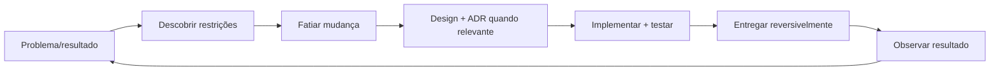

# Engenharia de Software

Engenharia de software é construir e evoluir sistemas úteis sob restrições de pessoas, tempo, risco e operação. Princípios são ferramentas para reduzir custo de mudança; não são leis universais.

## Trilhas

| Trilha | Resultado esperado |
| --- | --- |
| [Princípios de design](principles.md) | Aplicar e criticar SOLID, DRY, KISS, YAGNI, coesão, acoplamento, composição, encapsulamento, imutabilidade e DI |
| [Domain-Driven Design](ddd/README.md) | Conectar estratégia de negócio, Bounded Contexts e modelo tático |
| [Testing](testing/README.md) | Montar portfólio de testes orientado a risco e feedback |
| [System Design](system-design/README.md) | Projetar sistemas a partir de requisitos, estimativas e trade-offs |

## Ciclo de trabalho

## Heurísticas de qualidade

- Torne estado, dependências e efeitos visíveis.
- Mantenha junto o que muda pelo mesmo motivo; separe o que muda por motivos diferentes.
- Otimize o feedback: build, teste, review, deploy, observação e recovery.
- Prefira mudança pequena e reversível a previsão arquitetural distante.
- Automatize invariantes importantes e elimine toil repetitivo.
- Trate mensagens de erro, documentação, migração e runbooks como parte do produto.

## Trade-offs recorrentes

| Tensão | Pergunta útil |
| --- | --- |
| Generalidade × clareza | Quantas variações reais justificam a abstração? |
| Consistência × disponibilidade | Qual operação aceita dado atrasado, por quanto tempo? |
| Velocidade × segurança | Qual feedback automatizado reduz risco sem lote/aprovação? |
| Reuso × acoplamento | Consumidores mudam juntos por uma razão semântica? |
| Imutabilidade × custo | Cópia/alocação é relevante e foi medida? |
| Teste isolado × fidelidade | Qual falha real este nível consegue revelar? |

## Anti-patterns de processo e código

- métricas de atividade (linhas, story points) tratadas como resultado;
- abstração antes da segunda variação concreta;
- “best practice” sem contexto, hipótese ou gatilho de revisão;
- ownership sem autoridade operacional ou documentação;
- testes numerosos que não bloqueiam regressões relevantes;
- refatoração big bang sem caracterização, compatibilidade e rollback;
- postmortem focado em culpado, sem condições sistêmicas e ações verificáveis.

## Exercício integrador

Escolha uma funcionalidade real. Escreva o resultado do usuário, modele domínio/efeitos, implemente o menor slice, combine testes de unidade + integração + contrato, entregue com flag/canary, instrumente uma métrica técnica e uma de negócio, e registre o que aprendeu. A solução é completa apenas quando pode ser operada e alterada por outra pessoa.

## Referências

- Hunt & Thomas. *The Pragmatic Programmer*, 20th Anniversary Edition. [Pearson](https://www.pearson.com/en-us/subject-catalog/p/pragmatic-programmer-the-your-journey-to-mastery-20th-anniversary-edition/P200000000337/9780135957059).
- McConnell. *Code Complete*, 2nd ed. [Microsoft Press](https://www.microsoftpressstore.com/store/code-complete-9780735619678).
- Ousterhout. *A Philosophy of Software Design*, 2nd ed. [Site oficial](https://web.stanford.edu/~ouster/cgi-bin/book.php).
- Fowler. *Refactoring*, 2nd ed. [Site do autor](https://martinfowler.com/books/refactoring.html).
- Google. [Software Engineering at Google](https://abseil.io/resources/swe-book).

---

[← Alexandria](../README.md) · [↑ Índice principal](../README.md) · [Princípios →](principles.md)
