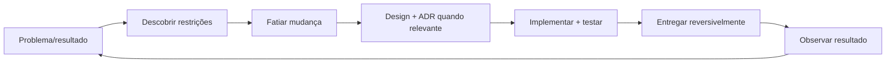

# Engenharia de Software

Engenharia de software é construir e evoluir sistemas úteis sob restrições de pessoas, tempo, risco e operação. Princípios são ferramentas para reduzir custo de mudança; não são leis universais.

## O problema

Escrever código que funciona uma vez é diferente de manter um sistema que precisa continuar entregando valor por anos. Engenharia começa quando entram restrições como:

- múltiplas pessoas alterando o mesmo sistema;
- mudanças frequentes de requisito;
- disponibilidade e segurança;
- dados que não podem ser perdidos;
- necessidade de rollback;
- custo de operação;
- performance sob carga;
- incidentes e aprendizado.

O objetivo passa a ser **entregar mudança segura com feedback rápido**.

## Modelo mental: software como sistema sociotécnico

Código, arquitetura, pipeline, documentação, ownership e comunicação fazem parte do mesmo sistema. Uma função elegante não compensa um deploy manual arriscado; uma arquitetura sofisticada não compensa ownership confuso.

Pense no ciclo:

`problema → hipótese → mudança → validação → entrega → observação → aprendizado`

O tempo e a qualidade desse ciclo dizem mais sobre maturidade que a quantidade de patterns utilizados.

## Trilhas

| Trilha | Resultado esperado |
| --- | --- |
| [Princípios de design](principles.md) | Aplicar e criticar SOLID, DRY, KISS, YAGNI, coesão, acoplamento, composição, encapsulamento, imutabilidade e DI |
| [Domain-Driven Design](ddd/README.md) | Conectar estratégia de negócio, Bounded Contexts e modelo tático |
| [Testing](testing/README.md) | Montar portfólio de testes orientado a risco e feedback |
| [System Design](system-design/README.md) | Projetar sistemas a partir de requisitos, estimativas e trade-offs |

## Ciclo de trabalho

Cada etapa deve reduzir uma incerteza. Discovery descobre o problema; testes reduzem incerteza sobre comportamento; canary reduz incerteza sobre produção; métricas reduzem incerteza sobre impacto.

## Fatiamento de mudança

Mudanças pequenas reduzem blast radius e aceleram feedback. “Pequena” não significa apenas poucas linhas. Um bom slice é:

- observável;
- reversível;
- testável;
- com dependências limitadas;
- valioso ou habilitador claro.

Uma migration destrutiva de três linhas pode ser mais arriscada que 500 linhas isoladas atrás de feature flag.

## Heurísticas de qualidade

- Torne estado, dependências e efeitos visíveis.
- Mantenha junto o que muda pelo mesmo motivo; separe o que muda por motivos diferentes.
- Otimize o feedback: build, teste, review, deploy, observação e recovery.
- Prefira mudança pequena e reversível a previsão arquitetural distante.
- Automatize invariantes importantes e elimine toil repetitivo.
- Trate mensagens de erro, documentação, migração e runbooks como parte do produto.

## Trade-offs recorrentes

| Tensão | Pergunta útil |
| --- | --- |
| Generalidade × clareza | Quantas variações reais justificam a abstração? |
| Consistência × disponibilidade | Qual operação aceita dado atrasado, por quanto tempo? |
| Velocidade × segurança | Qual feedback automatizado reduz risco sem lote/aprovação? |
| Reuso × acoplamento | Consumidores mudam juntos por uma razão semântica? |
| Imutabilidade × custo | Cópia/alocação é relevante e foi medida? |
| Teste isolado × fidelidade | Qual falha real este nível consegue revelar? |

## Performance é requisito, não polimento

Performance deve ser ligada a uma experiência ou capacidade. Em vez de “precisa ser rápido”, defina:

- p95/p99 esperado;
- concorrência;
- tamanho de payload;
- throughput;
- recurso limitante;
- custo aceitável.

O primeiro passo é medir. Profiling e métricas evitam otimização por intuição. Um endpoint lento pode estar limitado por query, rede, lock, garbage collection, fila ou downstream.

### Lei do gargalo

O throughput do sistema é limitado pelo recurso mais saturado. Aumentar workers quando o banco já está em 100% pode piorar latência. Mais concorrência não implica mais capacidade.

### Tail latency

Usuários sentem cauda, não média. Um serviço com média 40 ms e p99 1,5 s pode parecer instável. Cadeias de chamadas acumulam risco de cauda e precisam de orçamento de deadline.

## Testes como portfólio

Não existe um único “melhor nível” de teste.

- unidade oferece feedback rápido sobre lógica;
- integração verifica semântica de banco/broker;
- contrato verifica fronteiras;
- E2E valida poucas jornadas críticas;
- carga verifica capacidade;
- fault injection verifica recovery.

A pergunta é: **qual risco este teste detecta e quanto custa mantê-lo?**

Cobertura de linhas sozinha não responde isso.

## Código e abstração

Abstração deve nascer de semântica compartilhada, não de coincidência textual. Duas funções parecidas podem divergir por motivos diferentes; unificá-las pode criar coupling.

Antes de extrair abstração, pergunte:

1. as variações mudam pelo mesmo motivo?
2. o contrato é estável?
3. o consumidor ganha clareza?
4. a abstração esconde informação importante?

YAGNI não significa “nunca generalizar”; significa adiar custo até haver evidência.

## Operação faz parte da definição de pronto

Uma feature entregue precisa responder:

- como saber se funciona?
- como detectar regressão?
- como desativar?
- como recuperar dados?
- quem é owner?
- quais dashboards/runbooks existem?

Se outra pessoa não consegue operar a mudança sem conversar com o autor, parte do conhecimento ainda está implícita.

## Observabilidade

Instrumente resultados, não apenas infraestrutura. Uma API pode retornar 200 enquanto o negócio falha silenciosamente.

Combine:

- métricas RED/USE;
- logs estruturados;
- traces no caminho crítico;
- métricas de negócio;
- SLOs.

Evite cardinalidade não controlada e dados sensíveis em logs.

## Segurança no ciclo de engenharia

Segurança entra desde design e pipeline:

- threat modeling para mudanças relevantes;
- validação de input e autorização;
- secrets fora de código/log;
- dependency scanning com triagem contextual;
- least privilege;
- revisão de migrations e efeitos destrutivos;
- auditabilidade para operações sensíveis.

Security review tardia tende a produzir correções caras porque decisões estruturais já foram tomadas.

## Entrega e reversibilidade

Prefira estratégias que permitam evolução incremental:

- feature flags;
- canary;
- expand/contract em schema;
- backward compatibility;
- branch by abstraction;
- shadow traffic.

Rollback de código não desfaz efeito externo ou migration destrutiva. Em muitos casos, roll-forward seguro é a única recuperação realista.

## Anti-patterns de processo e código

- métricas de atividade, como linhas e story points, tratadas como resultado;
- abstração antes da segunda variação concreta;
- “best practice” sem contexto, hipótese ou gatilho de revisão;
- ownership sem autoridade operacional ou documentação;
- testes numerosos que não bloqueiam regressões relevantes;
- refatoração big bang sem caracterização, compatibilidade e rollback;
- postmortem focado em culpado, sem condições sistêmicas e ações verificáveis;
- otimização sem profiling;
- review usado como fila de aprovação em vez de feedback técnico.

## Laboratório integrador

Escolha uma funcionalidade real, por exemplo exportação de relatório.

1. Escreva o resultado do usuário e restrições.
2. Defina o menor slice útil.
3. Modele estado, dependências e efeitos.
4. Implemente com testes de unidade + integração.
5. Defina um SLO simples e uma métrica de negócio.
6. Faça teste de carga e encontre o primeiro gargalo.
7. Entregue com flag ou canary.
8. Injete falha em uma dependência e observe recovery.
9. Escreva um runbook de rollback/roll-forward.
10. Peça para outra pessoa operar a feature usando apenas documentação.

A solução é completa quando pode ser entregue, observada, recuperada e alterada por outra pessoa.

## Perguntas de revisão

- Qual problema de usuário esta mudança resolve?
- Qual é o gargalo provável e como medir?
- Qual teste protege o risco mais caro?
- O que acontece se uma dependência ficar lenta?
- Como reverter a mudança?
- Que conhecimento ainda depende de uma pessoa específica?

## Referências

- Hunt & Thomas. *The Pragmatic Programmer*, 20th Anniversary Edition. [Pearson](https://www.pearson.com/en-us/subject-catalog/p/pragmatic-programmer-the-your-journey-to-mastery-20th-anniversary-edition/P200000000337/9780135957059).
- McConnell. *Code Complete*, 2nd ed. [Microsoft Press](https://www.microsoftpressstore.com/store/code-complete-9780735619678).
- Ousterhout. *A Philosophy of Software Design*, 2nd ed. [Site oficial](https://web.stanford.edu/~ouster/cgi-bin/book.php).
- Fowler. *Refactoring*, 2nd ed. [Site do autor](https://martinfowler.com/books/refactoring.html).
- Google. [Software Engineering at Google](https://abseil.io/resources/swe-book).

---

[← Alexandria](../README.md) · [↑ Índice principal](../README.md) · [Princípios →](principles.md)
