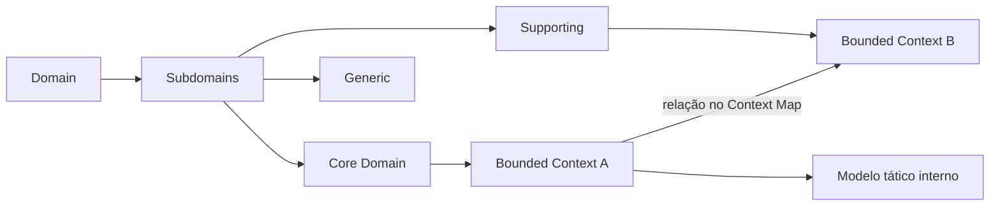

# Domain-Driven Design (DDD)

DDD aproxima modelo de software e entendimento do negócio em domínios complexos. Ele não é uma arquitetura em camadas nem uma lista de classes. O núcleo é aprendizagem colaborativa, linguagem explícita e limites que permitem modelos coerentes.

## Estratégico versus tático

| DDD estratégico | DDD tático |
| --- | --- |
| decide **onde** investir e onde um modelo é válido | implementa invariantes **dentro** de um modelo |
| Domain, Subdomains, Core/Supporting/Generic | Entity, Value Object, Aggregate/Root |
| Ubiquitous Language, Bounded Context | Repository, Factory, Service, Specification |
| Context Map e relações entre equipes | Domain Event e Application Service |
| orienta ownership, integração e arquitetura | orienta design do código e transação |

Comece pelo estratégico. Usar Aggregate e Repository sem descobrir limites produz “DDD decorativo”: mais classes sobre o mesmo modelo acoplado.

## Trilha

1. [DDD estratégico](strategic.md): domínio, subdomínios, linguagem, limites e Context Mapping.
2. [DDD tático](tactical.md): entidades, valores, agregados, repositórios, serviços e eventos.
3. [Exercícios](exercises.md): descoberta, modelagem, implementação e evolução.

## Para que serve

- domínios com regras, exceções e linguagem que mudam;
- alinhar limites de software, ownership e capacidade de negócio;
- concentrar design no Core Domain, onde diferenciação importa;
- tornar integração entre modelos explícita, inclusive tradução e poder organizacional.

## Quando não usar em profundidade

CRUD administrativo, pipeline técnico e commodities podem não pagar o custo de workshops e modelo rico. DDD ainda oferece perguntas úteis, mas um Transaction Script ou produto gerenciado pode ser melhor. Complexidade técnica isolada não torna o domínio complexo.

## Processo de aprendizagem

Converse com domain experts usando exemplos concretos; modele cenários e contraexemplos; observe termos ambíguos; experimente limites; implemente um slice; confronte modelo com exceções reais; atualize linguagem e Context Map. O modelo é temporário e evolui.

## Integração com arquitetura

- Bounded Context é limite semântico; pode ser módulo, serviço ou conjunto de processos.
- Aggregate é limite de consistência transacional, não candidato automático a microsserviço.
- Domain Event comunica fato do modelo; Integration Event é contrato publicado para outros contextos e pode ser traduzido.
- Clean/Hexagonal pode proteger o modelo, mas DDD não exige essa estrutura.
- Event Sourcing pode guardar história de alguns agregados, mas não é requisito de DDD.

## Anti-patterns

- pasta `domain/` com entidades ORM anêmicas e regra em controllers;
- um modelo empresarial canônico imposto a todos os contextos;
- Aggregate espelhando grafo do banco e carregando milhares de objetos;
- evento para toda alteração de campo sem significado de negócio;
- workshop sem expert, código ou decisão posterior;
- microsserviço por Entity;
- Ubiquitous Language mantida apenas num glossário desatualizado.

## Projeto prático

Modele reservas de estoque para um e-commerce. Entregáveis: mapa de subdomínios, glossário com termos conflitantes, dois Bounded Contexts e Context Map, Aggregate com invariante concorrente, porta de Repository, Domain Event traduzido para Integration Event, testes de exemplos e ADR do limite escolhido.

## Referências

- Evans. *Domain-Driven Design*. [Informações do autor](https://www.domainlanguage.com/ddd/).
- Vernon. *Implementing Domain-Driven Design*. [Pearson](https://www.pearson.com/en-us/subject-catalog/p/implementing-domain-driven-design/P200000009616/9780321834577).
- Khononov. *Learning Domain-Driven Design*. [O'Reilly](https://www.oreilly.com/library/view/learning-domain-driven-design/9781098100124/).
- Vernon. [DDD Community](https://www.dddcommunity.org/).
- Brandolini. [EventStorming](https://www.eventstorming.com/).

---

[← Engenharia de Software](../README.md) · [↑ Índice](../README.md) · [DDD estratégico →](strategic.md)
