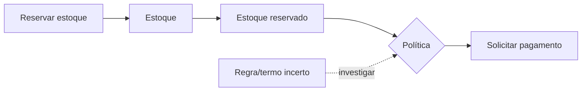
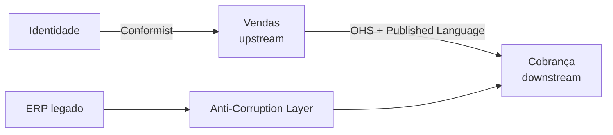

# DDD estratégico

DDD estratégico determina onde um modelo se aplica, como capacidades se relacionam e onde investir design. O resultado não é uma taxonomia perfeita, mas decisões explícitas de linguagem, ownership e integração.

## Domain e Subdomain

**Domain** é o campo de atividade/problema da organização: logística, crédito, saúde. **Subdomain** é uma parte coerente desse domínio, descoberta no problema, não inventada pela topologia de software.

Classifique para orientar investimento, não status:

- **Core Domain:** diferencia o negócio e merece os melhores ciclos de aprendizagem/design. Pode mudar com estratégia.
- **Supporting Subdomain:** necessário e específico, mas não diferenciador; uma solução simples/customizada basta.
- **Generic Subdomain:** problema amplamente resolvido (identidade, email, folha); comprar/terceirizar pode ser melhor.

Pergunte: “Se fizermos isto excepcionalmente bem, há vantagem?”, “Há produto maduro?”, “Qual custo de erro e mudança?”. Uma commodity regulatória ainda pode exigir atenção, mas não necessariamente modelo exclusivo.

## Ubiquitous Language

Linguagem Ubíqua é a linguagem praticada por especialistas e equipe **dentro de um contexto**, presente em conversa, exemplos, código, eventos e testes.

```gherkin
Dado um estoque com 3 unidades disponíveis
Quando uma reserva de 2 unidades é confirmada
Então 2 unidades ficam alocadas à reserva
E 1 unidade permanece disponível
```

Termos conflitantes revelam limites: “cliente” para Marketing pode ser lead; para Cobrança, parte contratual. Não force um dicionário corporativo único. Registre exemplos, termos proibidos/ambíguos e decisões; remova traduções invisíveis.

## Bounded Context

Um Bounded Context define onde um modelo e sua linguagem são consistentes. Ele possui propósito, modelo, dados/contratos e equipe responsável. Contexto não é sinônimo de subdomínio:

- um subdomínio pode ser atendido por vários contextos (legado + novo);
- um contexto pode atender mais de um subdomínio simples;
- a relação deve ser deliberada e revisada.

### Heurísticas de limite

- invariantes que precisam de uma transação tendem a ficar juntas;
- termos mudam de significado na fronteira;
- ritmos de mudança, especialistas e ownership divergem;
- dependência de dado pode ser substituída por contrato/fato;
- capacidade precisa escalar/falhar/ser auditada separadamente.

Não transforme toda fronteira semântica em rede. Um modular monolith pode implementar Bounded Contexts com módulos fiscalizados.

## Descoberta

Event Storming explora fatos passados, comandos, atores, políticas, sistemas externos, hot spots e temporalidade. Domain storytelling, entrevistas, example mapping e análise de histórico complementam.



Workshops não substituem validação: implemente um walking skeleton, mostre a especialistas e ajuste o modelo.

## Context Map

O Context Map descreve relações **técnicas e sociopolíticas** entre contextos upstream e downstream.

| Relação | Significado | Risco/uso |
| --- | --- | --- |
| Partnership | equipes coordenam sucesso e roadmap | alto custo de sincronização |
| Shared Kernel | pequena parte de modelo/código compartilhada | mudanças exigem acordo; mantenha mínima |
| Customer/Supplier | downstream influencia contrato upstream | precisa expectativa/testes claros |
| Conformist | downstream adota modelo upstream | barato, mas importa limitações |
| Anti-Corruption Layer (ACL) | downstream traduz e protege seu modelo | custo de tradução explícito |
| Open Host Service | upstream oferece protocolo público estável | governança/versionamento |
| Published Language | schema/documento comum de intercâmbio | semântica e compatibilidade |
| Separate Ways | integração não vale o custo | duplicação consciente |
| Big Ball of Mud | limite legado não confiável | contenha com ACL; não trate como destino |



### Anti-Corruption Layer

ACL traduz conceitos, unidades, identidades e erros do modelo externo para o modelo local. Pode incluir Facade, Adapter, translator e serviço. Ela não é só um DTO mapper: impede que semântica e ritmo de mudança do upstream contaminem o downstream. Teste exemplos de tradução e monitore casos sem mapeamento.

## Integração e eventos

O produtor publica um contrato de integração estável, não sua Entity interna. Traduza Domain Event para Integration Event após commit/outbox. O consumidor decide qual estado copiar. Defina owner, schema, compatibilidade, classificação de dados, SLO e comportamento quando upstream está indisponível.

## Evolução

Atualize o mapa quando ownership, linguagem ou dependência muda. Métricas úteis: mudanças coordenadas, lead time de contrato, incidentes cruzados, consultas diretas a dados externos. Context merging pode remover um limite caro; splitting pode separar modelos em conflito. Nenhum é fracasso.

## Segurança, testes e observabilidade

- trust boundary pode coincidir ou não com Bounded Context; modele atores e autorização por capability;
- contrato testa semântica e compatibilidade, não apenas JSON válido;
- trace/correlation mostra fluxo entre contextos e lag de eventos;
- log usa linguagem local e traduz identidade externa com cuidado;
- dados regulados precisam de owner e política de propagação/eliminação.

## Perguntas de revisão

- Qual termo tem dois significados e onde muda?
- Qual invariante exige consistência imediata?
- Quem é upstream e quem tem poder para mudar o contrato?
- Onde uma ACL evita importar um modelo ruim?
- Qual subdomínio é Core hoje e qual evidência mudaria isso?

## Referências

- Evans. [DDD Reference (PDF)](https://www.domainlanguage.com/wp-content/uploads/2016/05/DDD_Reference_2015-03.pdf).
- Brandolini. [EventStorming](https://www.eventstorming.com/).
- Microsoft. [Use domain analysis to model microservices](https://learn.microsoft.com/en-us/azure/architecture/microservices/model/domain-analysis).

---

[← DDD](README.md) · [↑ Índice](README.md) · [DDD tático →](tactical.md)
