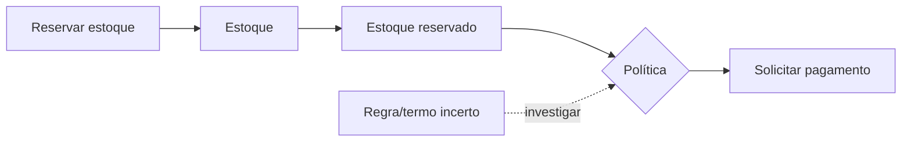
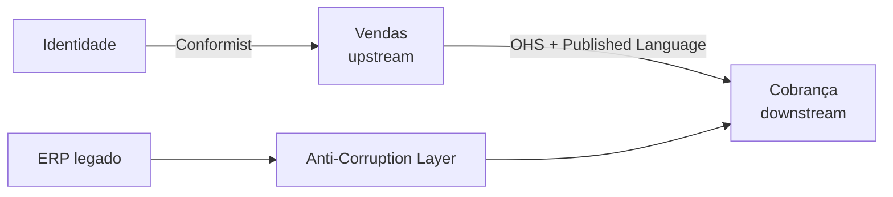

# DDD estratégico

DDD estratégico determina onde um modelo se aplica, como capacidades se relacionam e onde investir design. O resultado não é uma taxonomia perfeita, mas decisões explícitas de linguagem, ownership e integração.

O problema que ele enfrenta é recorrente: conforme o software cresce, o mesmo termo passa a significar coisas diferentes, integrações viram dependências bidirecionais e ninguém sabe mais quem possui uma regra. DDD estratégico cria um mapa para conter essa entropia.

## Domain e Subdomain

**Domain** é o campo de atividade/problema da organização: logística, crédito, saúde. **Subdomain** é uma parte coerente desse domínio, descoberta no problema, não inventada pela topologia de software.

Classifique para orientar investimento, não status:

- **Core Domain:** diferencia o negócio e merece os melhores ciclos de aprendizagem/design. Pode mudar com estratégia.
- **Supporting Subdomain:** necessário e específico, mas não diferenciador; uma solução simples/customizada basta.
- **Generic Subdomain:** problema amplamente resolvido, como identidade, email ou folha; comprar/terceirizar pode ser melhor.

Pergunte: “Se fizermos isto excepcionalmente bem, há vantagem?”, “Há produto maduro?”, “Qual custo de erro e mudança?”. Uma commodity regulatória ainda pode exigir atenção, mas não necessariamente modelo exclusivo.

A classificação também precisa ser revisada. Um mecanismo de recomendação pode começar como supporting e tornar-se core se passar a dirigir receita. Um core antigo pode virar commodity quando o mercado padroniza a solução.

## Ubiquitous Language

Linguagem Ubíqua é a linguagem praticada por especialistas e equipe **dentro de um contexto**, presente em conversa, exemplos, código, eventos e testes.

```gherkin
Dado um estoque com 3 unidades disponíveis
Quando uma reserva de 2 unidades é confirmada
Então 2 unidades ficam alocadas à reserva
E 1 unidade permanece disponível
```

Termos conflitantes revelam limites: “cliente” para Marketing pode ser lead; para Cobrança, parte contratual. Não force um dicionário corporativo único. Registre exemplos, termos proibidos/ambíguos e decisões; remova traduções invisíveis.

Um modelo saudável permite que código e conversa se alinhem. Se o especialista diz “reserva expira” e o código diz `setStatus(3)`, a linguagem não está cumprindo seu papel.

## Bounded Context

Um Bounded Context define onde um modelo e sua linguagem são consistentes. Ele possui propósito, modelo, dados/contratos e equipe responsável. Contexto não é sinônimo de subdomínio:

- um subdomínio pode ser atendido por vários contextos, como legado + novo;
- um contexto pode atender mais de um subdomínio simples;
- a relação deve ser deliberada e revisada.

### Heurísticas de limite

- invariantes que precisam de uma transação tendem a ficar juntas;
- termos mudam de significado na fronteira;
- ritmos de mudança, especialistas e ownership divergem;
- dependência de dado pode ser substituída por contrato/fato;
- capacidade precisa escalar, falhar ou ser auditada separadamente.

Não transforme toda fronteira semântica em rede. Um modular monolith pode implementar Bounded Contexts com módulos fiscalizados.

## Modelo mental: contextos são limites de consistência semântica

Um Bounded Context não existe para “organizar pastas”. Ele protege um modelo contra significados externos. Dentro de Cobrança, `Account` pode ser a entidade financeira responsável por saldo e cobrança. Em Identidade, `Account` pode significar credencial de login. Compartilhar a mesma classe porque o nome coincide cria acoplamento semântico.

A fronteira permite tradução. Em vez de importar o modelo externo, o contexto recebe um contrato e converte para seus conceitos. Isso torna a dependência explícita e evolutiva.

## Descoberta

Event Storming explora fatos passados, comandos, atores, políticas, sistemas externos, hot spots e temporalidade. Domain storytelling, entrevistas, example mapping e análise de histórico complementam.



Workshops não substituem validação: implemente um walking skeleton, mostre a especialistas e ajuste o modelo.

Durante descoberta, procure especialmente por:

- regras que mudam com frequência;
- decisões que exigem especialista;
- termos disputados;
- dependências manuais entre equipes;
- planilhas que funcionam como verdade informal;
- etapas que falham ou precisam de reconciliação.

Esses pontos costumam revelar onde o modelo merece mais investimento.

## Context Map

O Context Map descreve relações **técnicas e sociopolíticas** entre contextos upstream e downstream.

| Relação | Significado | Risco/uso |
| --- | --- | --- |
| Partnership | equipes coordenam sucesso e roadmap | alto custo de sincronização |
| Shared Kernel | pequena parte de modelo/código compartilhada | mudanças exigem acordo; mantenha mínima |
| Customer/Supplier | downstream influencia contrato upstream | precisa expectativa/testes claros |
| Conformist | downstream adota modelo upstream | barato, mas importa limitações |
| Anti-Corruption Layer (ACL) | downstream traduz e protege seu modelo | custo de tradução explícito |
| Open Host Service | upstream oferece protocolo público estável | governança/versionamento |
| Published Language | schema/documento comum de intercâmbio | semântica e compatibilidade |
| Separate Ways | integração não vale o custo | duplicação consciente |
| Big Ball of Mud | limite legado não confiável | contenha com ACL; não trate como destino |



## Poder organizacional também é arquitetura

Relações de Context Map não são apenas técnicas. Se um upstream tem roadmap próprio e nenhum compromisso com o downstream, tratá-lo como parceria é fantasia. Um downstream pode precisar de ACL, cache ou réplica local não porque a API é ruim, mas porque a relação organizacional não oferece autonomia suficiente.

Conway's Law aparece aqui: estruturas de comunicação tendem a influenciar limites do software. Reverse Conway Maneuver pode reorganizar ownership para favorecer a arquitetura desejada, mas mover caixas no organograma sem clareza de domínio não resolve dependências.

Meça sinais como:

- quantidade de mudanças coordenadas entre equipes;
- tempo esperando aprovação externa;
- incidentes em cascata entre contextos;
- frequência de acesso direto ao banco de outra equipe;
- contratos quebrados sem aviso.

## Anti-Corruption Layer

ACL traduz conceitos, unidades, identidades e erros do modelo externo para o modelo local. Pode incluir Facade, Adapter, translator e serviço. Ela não é só um DTO mapper: impede que semântica e ritmo de mudança do upstream contaminem o downstream. Teste exemplos de tradução e monitore casos sem mapeamento.

Exemplo: um ERP usa `customer_status=5` para “bloqueado por crédito”. O contexto de Vendas pode traduzir isso para uma política `CreditHold` em vez de espalhar `status == 5` pelo domínio.

A ACL também pode normalizar erros, moeda, timezone e identificadores. Mas cuidado: se ela cresce para conter todas as regras de ambos os lados, virou um novo contexto sem owner.

## Integração e eventos

O produtor publica um contrato de integração estável, não sua Entity interna. Traduza Domain Event para Integration Event após commit/outbox. O consumidor decide qual estado copiar. Defina owner, schema, compatibilidade, classificação de dados, SLO e comportamento quando upstream está indisponível.

Consistência precisa ser nomeada. Se Faturamento copia endereço de Cliente, quanto atraso é aceitável? Se o dado precisa ser forte no momento da cobrança, talvez a fronteira ou o fluxo precise mudar. “Eventual consistency” não substitui uma decisão de negócio.

## Dados e ownership

Ownership significa mais que “qual serviço tem a tabela”. O contexto deve controlar:

- semântica do dado;
- regras de escrita;
- ciclo de vida e retenção;
- contratos publicados;
- política de correção;
- acesso e classificação.

Read models locais podem copiar dados externos para autonomia, mas a fonte de verdade continua explícita. Duplicação deliberada é diferente de ownership ambíguo.

## Evolução de contextos

Contextos não são permanentes. Três operações são comuns:

### Split

Um contexto cresce demais e passa a conter linguagens ou ritmos diferentes. Separe quando o limite reduz conflitos reais, não apenas porque o repositório ficou grande.

### Merge

Dois contextos exigem mudanças coordenadas, compartilham invariantes e não ganham autonomia real. Juntar pode reduzir protocolo e duplicação.

### Replace

Um legado é gradualmente substituído por um novo modelo usando strangler e ACL. O mapa precisa mostrar quem é fonte de verdade em cada etapa.

Em qualquer migração, registre compatibilidade, backfill, reconciliação e rollback. Context boundaries mudam dados e contratos, portanto não são refactors puramente internos.

## Falhas e modos de degradação

DDD estratégico também precisa considerar falha operacional. Uma fronteira remota cria latência e indisponibilidade. Para cada relação do Context Map, documente:

- o que o downstream faz quando o upstream está fora;
- se pode usar dado stale;
- quais operações precisam ser bloqueadas;
- se há fila/outbox para desacoplar;
- como reconciliar divergência;
- qual SLO é realmente contratado.

Um Bounded Context que depende sincronamente de cinco outros para qualquer decisão não é autônomo, mesmo que tenha banco próprio.

## Segurança, testes e observabilidade

- trust boundary pode coincidir ou não com Bounded Context; modele atores e autorização por capability;
- contrato testa semântica e compatibilidade, não apenas JSON válido;
- trace/correlation mostra fluxo entre contextos e lag de eventos;
- log usa linguagem local e traduz identidade externa com cuidado;
- dados regulados precisam de owner e política de propagação/eliminação.

Observe também métricas arquiteturais: mudanças coordenadas, chamadas síncronas por jornada, lag de projeções, falhas de tradução na ACL e incidentes por contrato.

## Laboratório estratégico

Modele um marketplace com Catálogo, Pedidos, Estoque, Pagamentos e Identidade.

1. Conduza um mini Event Storming e liste comandos, eventos, políticas e hot spots.
2. Identifique termos que mudam de significado entre contextos.
3. Classifique subdomains como core/supporting/generic e justifique com valor de negócio.
4. Crie um Context Map com upstream/downstream e padrão de relação.
5. Escolha uma integração e implemente uma ACL com testes de tradução.
6. Introduza uma mudança incompatível no upstream e prove que o modelo local permanece estável.
7. Simule indisponibilidade do upstream e documente degradação/recovery.
8. Escreva um ADR propondo split ou merge de dois contextos com evidência de changes coordenadas.

## Perguntas de revisão

- Qual termo tem dois significados e onde muda?
- Qual invariante exige consistência imediata?
- Quem é upstream e quem tem poder para mudar o contrato?
- Onde uma ACL evita importar um modelo ruim?
- Qual subdomínio é Core hoje e qual evidência mudaria isso?
- Que contexto depende demais de outros para funcionar?
- Quais dados estão duplicados e quem continua sendo a fonte de verdade?
- Qual boundary existe por motivo de negócio e qual existe apenas por história organizacional?

## Referências

- Evans. [DDD Reference (PDF)](https://www.domainlanguage.com/wp-content/uploads/2016/05/DDD_Reference_2015-03.pdf).
- Brandolini. [EventStorming](https://www.eventstorming.com/).
- Microsoft. [Use domain analysis to model microservices](https://learn.microsoft.com/en-us/azure/architecture/microservices/model/domain-analysis).
- Fowler. [Bounded Context](https://martinfowler.com/bliki/BoundedContext.html).

---

[← DDD](README.md) · [↑ Índice](README.md) · [DDD tático →](tactical.md)
