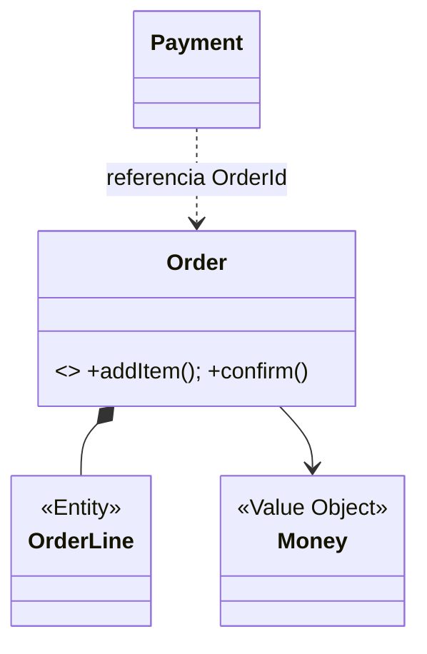
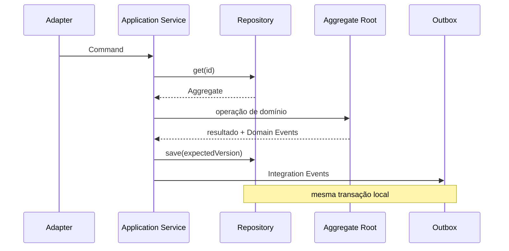

# DDD tático

Padrões táticos de Domain-Driven Design expressam identidade, invariantes,
transações e colaboração **dentro de um Bounded Context**. O problema que eles
resolvem não é “organizar pastas”. É impedir que regras importantes do domínio
se dissolvam em controllers, ORM callbacks e condicionais espalhadas.

Use apenas os padrões que tornam o modelo mais claro. Um contexto CRUD simples
pode continuar simples. DDD tático adiciona valor quando existem estados
inválidos, concorrência, linguagem de negócio e decisões que precisam ficar
explícitas no código.

## Modelo mental: comportamento ao redor de invariantes

Pense no domínio como uma máquina que aceita comandos e só permite transições
válidas:

```text
estado válido + comando válido → novo estado válido + fatos
```

O modelo tático define:

- quem possui identidade;
- quais valores são imutáveis;
- qual boundary precisa consistência imediata;
- onde uma regra pertence;
- quais fatos surgem após uma decisão.

A pergunta central não é “isso é Entity ou Value Object?”. É:

> qual desenho torna a invariante impossível ou difícil de violar?

## Entity

Entity é definida por identidade e continuidade, não por igualdade de todos os
atributos.

Um `Order` continua o mesmo após mudança de endereço ou status.

Características:

- identidade estável dentro do contexto;
- lifecycle explícito;
- comportamento que protege transições;
- igualdade por identidade quando semanticamente correta.

Prefira:

```text
order.cancel(reason)
```

em vez de:

```text
order.status = "CANCELLED"
```

O primeiro pode validar:

- pedido já enviado não cancela;
- reason obrigatório;
- evento `OrderCancelled` é produzido;
- timestamp é registrado.

Setter expõe estado sem semântica.

## Identidade é contextual

Um `CustomerId` em CRM e um `BuyerId` em Orders podem apontar para a mesma pessoa
real e ainda representar conceitos diferentes.

Não force um identificador global a unificar modelos que possuem linguagens e
lifecycles distintos.

## Value Object

Value Object descreve valor sem identidade própria.

Exemplos:

- `Money`;
- `DateRange`;
- `EmailAddress`;
- `Coordinates`;
- `Quantity`.

Propriedades desejáveis:

- imutabilidade;
- validação na criação;
- igualdade por valor;
- operações que devolvem novos valores.

```text
Money(1000, BRL) + Money(500, BRL) = Money(1500, BRL)
```

Tentar somar moedas diferentes deveria exigir regra explícita, não produzir
resultado silencioso.

## Tipos como proteção semântica

`int` não explica se representa:

- centavos;
- quantidade;
- percentual;
- segundos;
- ID.

Tipos de domínio reduzem combinações inválidas.

`Money` precisa declarar:

- currency;
- escala;
- arredondamento;
- overflow;
- regras de comparação.

Para dinheiro, ponto flutuante geralmente não representa adequadamente a precisão
decimal/auditável desejada.

## Aggregate

Aggregate é boundary de invariantes que precisam permanecer consistentes numa
mudança atômica.

A Aggregate Root é a porta de entrada para objetos internos.



O aggregate não é “um grafo de objetos que quero carregar junto”. O limite vem da
invariante.

## Como descobrir um Aggregate

Pergunte:

1. qual regra precisa ser verdadeira imediatamente após commit?
2. quais dados são necessários para decidir?
3. qual concorrência pode acontecer?
4. o que pode convergir depois?

Exemplo: `Order` precisa garantir que não pode confirmar sem itens e que total
corresponde às linhas. Isso pode caber no mesmo aggregate.

Pagamento pode ser outro aggregate/contexto se possui lifecycle e autoridade
próprios.

## Aggregate pequeno é uma vantagem

Aggregate grande:

- aumenta contenção;
- carrega mais dados;
- cria conflitos otimistas;
- torna transação maior;
- acopla mudanças independentes.

Regra prática: carregue apenas o necessário para uma decisão consistente.

## Consistência entre Aggregates

Em geral, uma transação altera um aggregate. Mudanças entre aggregates podem usar:

- Domain Events;
- process manager;
- saga;
- reserva;
- reconciliation.

Isso não significa que toda regra pode ser eventual. Se uma invariante realmente
atravessa objetos, talvez o boundary precise mudar ou uma autoridade única seja
necessária.

## Concorrência otimista

Um aggregate persistido pode ter `version`.

```text
load Order version=7
execute confirm()
save expectedVersion=7
```

Se outro writer salvou version 8, o update falha.

A aplicação decide:

- recarregar e reexecutar;
- rejeitar conflito;
- pedir nova ação do usuário.

Retry automático nem sempre preserva intenção.

## Pessimistic locking

Quando conflito é muito provável e custo de retry alto, lock pessimista pode
fazer sentido.

Trade-offs:

- espera;
- deadlock;
- menor paralelismo;
- transação longa mais perigosa.

DDD não determina estratégia de lock. O storage e a invariante orientam.

## Repository

Repository oferece acesso a Aggregates na linguagem da aplicação/domínio.

Exemplo:

```text
orders.get(orderId)
orders.save(order, expectedVersion)
```

Ele esconde detalhes de persistência relevantes para o consumidor.

Evite:

```text
repository.findAll(predicate, joins, orderBy, projection)
```

se isso transforma Repository em query builder genérico sobre o modelo inteiro.

Consultas de tela podem usar read model dedicado sem reconstruir Aggregate.

## Repository e transação

A implementação precisa deixar claro:

- onde transaction começa/termina;
- como optimistic concurrency funciona;
- se lazy loading existe;
- quais relations são carregadas;
- como domain events são persistidos/publicados.

Fake repository ajuda em alguns testes, mas não reproduz locks, isolation e
constraints do banco real. Tenha integration tests do adapter.

## Domain Service

Domain Service representa operação de domínio que não pertence naturalmente a
uma Entity/Value Object.

Exemplo: política de câmbio entre moedas ou cálculo que usa dois conceitos
independentes.

Ele deve falar linguagem do domínio e evitar virar orquestrador de HTTP, ORM e
queues.

Antes de criar `SomethingService`, tente colocar comportamento no objeto que
possui a invariante.

## Application Service

Application Service orquestra caso de uso:

1. autenticação/autorização de aplicação;
2. load;
3. chamada ao domínio;
4. persistência;
5. transação;
6. publicação/outbox;
7. resposta.

```text
handle(ConfirmOrder cmd):
  order = orders.get(cmd.orderId)
  order.confirm(clock.now())
  orders.save(order, expectedVersion=cmd.version)
  outbox.add(toIntegrationEvents(order.pullEvents()))
```

A regra “pedido sem item não confirma” pertence ao Aggregate, não ao Application
Service.

## Domain Event

Domain Event é fato passado relevante no contexto:

`OrderConfirmed`

Características:

- imutável;
- linguagem do domínio;
- produzido após uma decisão válida;
- carrega dados suficientes à semântica.

Não injete broker no Aggregate. O aggregate produz fato; infraestrutura publica
depois.

## Domain Event versus Integration Event

Domain Event pertence ao modelo interno. Integration Event é contrato externo.

Pode existir tradução:

```text
OrderConfirmed (domínio)
→ commerce.order.confirmed.v2 (integração)
```

Isso evita expor estrutura interna e permite aplicar:

- versionamento;
- minimização de dados;
- nomenclatura estável;
- políticas de segurança.

## Outbox

Estado do Aggregate e Integration Event precisam ser persistidos atomicamente se
perda do evento for inaceitável.

```text
BEGIN
UPDATE orders...
INSERT outbox...
COMMIT
```

Relay publica posteriormente. Duplicidade continua possível e consumers precisam
idempotência.

## Factory

Factory concentra construção quando criação possui variantes, invariantes ou
complexidade que prejudica um construtor simples.

Exemplo:

```text
Order.place(customer, items, pricingPolicy)
```

A factory nunca deveria entregar objeto “meio válido” esperando setters futuros.

Separe criação de negócio de reconstituição do storage.

## Specification

Specification nomeia predicado de domínio reutilizável:

```text
EligibleForCreditLimit
```

Pode combinar regras:

```text
activeCustomer
.and(noOverdueDebt)
.and(riskBelow(limit))
```

Não assuma que qualquer Specification pode executar idêntica em memória e SQL.
Null, collation e funções diferem. Se necessário, separe domain specification de
query specification.

## Policy

Alguns modelos usam Policy para decisão intercambiável:

- `ShippingPolicy`;
- `DiscountPolicy`;
- `FraudPolicy`.

O nome só ajuda se representa conceito reconhecido no domínio.

## Fluxo completo



## Persistência e ORM

ORM não deve definir o modelo por acidente.

Problemas comuns:

- Entity exige construtor vazio público;
- lazy loading dispara query inesperada dentro de método de domínio;
- coleção mutável permite bypass;
- mapping annotations poluem regra;
- cascades persistem mais do que boundary real.

Opções:

- modelo separado de persistence model;
- mapping explícito;
- ORM configurado para respeitar encapsulamento.

Não crie dois modelos apenas por dogma. Pague mapping quando ele protege algo real.

## Performance

DDD tático também tem custo operacional.

Meça:

- tamanho do Aggregate carregado;
- número de queries por command;
- lock/conflict rate;
- transaction duration;
- serialization size;
- event volume;
- projection lag.

Aggregate enorme pode funcionar em testes e colapsar sob concorrência.

Não otimize removendo invariantes. Reavalie boundary e access patterns.

## Observabilidade do domínio

Telemetria deveria carregar linguagem de negócio, não apenas detalhes técnicos.

Exemplos de métricas:

- `orders.confirmed`;
- `orders.confirm_conflict`;
- `reservations.expired`;
- `payments.authorization_rejected`.

Traces podem marcar:

- command name;
- aggregate type;
- outcome;
- version conflict;
- domain error;
- outbox latency.

Evite colocar IDs sensíveis/PII indiscriminadamente como atributos.

## Domain errors

Falhas de domínio esperadas não são iguais a erro 500.

Exemplos:

- `OrderAlreadyCancelled`;
- `InsufficientStock`;
- `CreditLimitExceeded`.

Modele resultado para Application Service traduzir em API/evento apropriado.

Isso melhora observabilidade: erro de regra não dispara alerta de infraestrutura.

## Segurança e invariantes

Authorization de aplicação e invariantes de domínio se complementam.

Exemplo:

- application layer verifica se caller pode operar order;
- Aggregate verifica se transição é válida independentemente de quem chamou.

Não passe `isAdmin=true` arbitrário ao domínio sem representar a política real.

## Testes do Aggregate

Testes devem focar comportamento:

```text
Given order com itens
When confirm
Then status confirmado + OrderConfirmed
```

Teste:

- boundary values;
- transições inválidas;
- property invariants;
- duplicate command quando aplicável.

Evite testar getters/setters.

## Property-based testing

É útil para Value Objects e invariantes.

Exemplos:

- `Money + zero = Money`;
- quantidade nunca negativa;
- range válido sempre start <= end;
- sequência de comandos nunca produz estado proibido.

## Mutation testing

Remove/inverte condições para verificar se testes realmente protegem invariantes.

Se remover `if (items.empty)` e testes continuam verdes, sua suite não prova a
regra.

## Testes do Repository

Com banco real/efêmero:

- mapping roundtrip;
- optimistic conflict;
- transaction rollback;
- constraint;
- outbox atomicity;
- concurrent writers.

## Modos de falha

### Aggregate cresce demais

Sintomas: command lento, muitos conflicts, alto consumo de memória.

Ação: revisar invariante, separar read model, reduzir boundary.

### Evento publicado antes do commit

Consumer reage a estado que depois rollbacka. Use outbox ou publicação pós-commit
com garantia adequada.

### Domain Event quebra consumer externo

Provavelmente evento interno vazou como contrato. Introduza Integration Event
versionado.

### Retry repete comando não idempotente

Command precisa operation ID ou regra de deduplicação na boundary apropriada.

### ORM contorna encapsulamento

Teste de integração e mapping explícito revelam escrita inválida.

## Laboratório progressivo

### Beginner

Implemente `Money` e `Order` sem framework. Faça estados inválidos impossíveis na
criação/transição.

### Intermediate

Persista Aggregate em PostgreSQL com `version`. Execute dois writers concorrentes
e trate conflito.

### Advanced

Adicione Domain Event + tradução para Integration Event + outbox. Mate processo
após commit e antes da publicação; prove recovery.

### Expert

Divida uma invariante entre dois Aggregates usando reserva/process manager.
Injete timeout, duplicidade e atraso. Documente por que a consistência eventual é
aceitável ou por que o boundary deveria mudar.

## Projeto de síntese

Modele checkout:

- `Cart`;
- `Order`;
- `Money`;
- `Reservation`;
- `PaymentAuthorization`.

Requisitos:

1. Order não confirma vazio;
2. total é derivado de linhas/preço aceito;
3. concorrência usa expected version;
4. integração publica por outbox;
5. retry de command possui identity;
6. métricas usam linguagem do domínio;
7. read model não precisa carregar Aggregate;
8. ADR justifica boundaries.

## Anti-patterns

- Entity anêmica com getters/setters;
- Aggregate enorme para navegação;
- Repository genérico por tabela;
- Domain Service com infraestrutura;
- Application Service decidindo toda regra;
- evento `EntityUpdated` sem semântica;
- evento publicado antes do commit;
- Factory que cria estado inválido;
- Specification como SQL disfarçado;
- ORM definindo boundary de domínio;
- DDD aplicado a CRUD sem problema real.

## Critério de conclusão

Você domina DDD tático quando consegue olhar uma regra e decidir:

- qual objeto a possui;
- qual boundary precisa atomicidade;
- o que pode convergir depois;
- como concorrência é tratada;
- qual fato deve ser emitido;
- como observar a regra em produção.

## Referências

- Evans. [DDD Reference](https://www.domainlanguage.com/ddd/reference/).
- Vernon. *Implementing Domain-Driven Design*. [Pearson](https://www.pearson.com/en-us/subject-catalog/p/implementing-domain-driven-design/P200000009616/9780321834577).
- Fowler. [Domain Model](https://martinfowler.com/eaaCatalog/domainModel.html) e [Repository](https://martinfowler.com/eaaCatalog/repository.html).

---

[← DDD estratégico](strategic.md) · [↑ Índice](README.md) · [Exercícios →](exercises.md)
