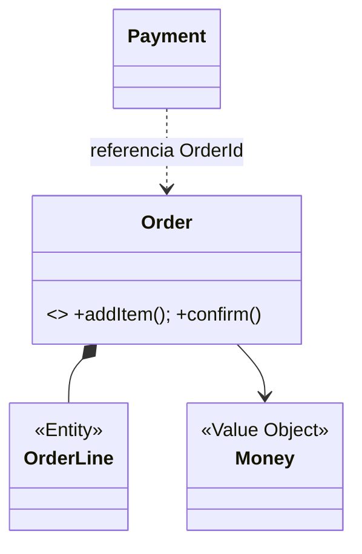
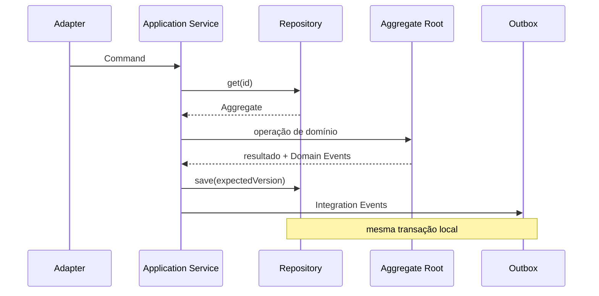

# DDD tático

Padrões táticos expressam identidade, invariantes, transações e colaboração **dentro de um Bounded Context**. Use apenas os que esclarecem o modelo; um contexto CRUD pode permanecer simples.

## Entity

Objeto definido por identidade e continuidade, não por todos os atributos. Um `Order` continua o mesmo após mudança de endereço. Igualdade usa identidade no mesmo contexto; um ID global não torna dois modelos a mesma Entity.

- proteja transições por métodos de domínio (`order.cancel(reason)`), não setters;
- defina ciclo de vida e estados inválidos;
- evite identidade de banco vazando para todo conceito;
- não exponha coleção mutável que contorna invariantes.

## Value Object

Descreve um valor sem identidade: `Money(1000, BRL)`, `DateRange`, `Address` em muitos contextos. Deve ser imutável, validado na criação e comparado por valor. Operações devolvem novos valores.

Unidades/tipos evitam `int` ambíguo. `Money` precisa moeda, arredondamento e overflow; não use ponto flutuante para centavos.

## Aggregate e Aggregate Root

Aggregate é limite de invariantes consistentes e mudança atômica. A **Aggregate Root** é a única entrada para objetos internos. Outros agregados referenciam-na por identidade.



Heurísticas:

- mantenha pequeno; carregue o necessário para uma decisão;
- uma transação modifica, em geral, um Aggregate;
- consistência entre Aggregates é eventual por Domain Event/processo;
- `expectedVersion` protege contra escrita concorrente;
- limite vem da invariante, não do diagrama de relacionamento do banco.

“Tudo precisa estar consistente agora” costuma sinalizar regra não priorizada ou limite errado. Algumas invariantes realmente atravessam dados; modele reserva/ledger/constraint no local que as garante.

## Repository

Repository oferece coleção de Aggregates na linguagem do domínio e esconde persistência relevante. Exemplo: `orders.get(id)` e `orders.save(order, expectedVersion)`.

- contrato pertence ao consumidor/aplicação;
- não ofereça SQL/ORM query genérico sobre o Aggregate;
- consultas de tela podem usar read model dedicado sem Repository;
- teste adaptador com banco real; fake não reproduz locks/transaction.

## Domain Service

Operação de domínio que não pertence naturalmente a uma Entity/Value Object, mas usa linguagem e regras do domínio: uma política de câmbio entre duas moedas/contas. Deve ser coeso e, idealmente, sem orquestração de infraestrutura.

Não transforme toda regra em `*Service`; primeiro tente comportamento no Aggregate/Value Object.

## Application Service

Orquestra o caso de uso: autorização, load, chamada ao domínio, persistência, transação e publicação. Ele não decide regra de negócio central.

```text
handle(ConfirmOrder cmd):
  order = orders.get(cmd.orderId)
  order.confirm(clock.now())
  orders.save(order, expectedVersion=cmd.version)
  outbox.add(integrationEvents(order.pullEvents()))
```

## Domain Event

Fato passado relevante dentro do modelo: `OrderConfirmed`. É imutável e nomeado na Ubiquitous Language. Pode disparar política dentro do contexto. Antes de publicar externamente, traduza para Integration Event estável; não exponha objeto interno.

Inclua identidade, tempo e dados suficientes à semântica, mas não injete infraestrutura no Aggregate para publicar. Colete eventos e grave estado + outbox atomicamente.

## Factory

Cria Aggregate/Value Object quando construção envolve invariantes, variantes ou conhecimento que não cabe num construtor legível. Factory pode reconstituir do storage separadamente da criação de negócio. Nunca permita objeto parcialmente válido.

## Specification

Predicado de domínio nomeado e combinável: `EligibleForCreditLimit`. Serve para validação/seleção quando a regra é um conceito e precisa reutilização.

```text
eligible = activeCustomer.and(noOverdueDebt).and(riskBelow(limit))
```

Não prometa que qualquer Specification executa igual em memória e SQL; traduções têm semântica de null, collation e capabilities. Separe especificação de domínio de query specification quando necessário.

## Fluxo e dependências



## Anti-patterns

- Entity com getters/setters e regra em Application Service;
- Aggregate enorme para “navegar fácil”;
- Repository genérico por tabela e método `findAll` irrestrito;
- Domain Service com HTTP, ORM ou transação;
- evento presente (`OrderStatusChanged`) sem intenção semântica;
- evento publicado antes de commit;
- Factory que cria estado inválido para preencher depois;
- Specification usada como linguagem SQL disfarçada.

## Testes

- exemplos Given/When/Then no Aggregate;
- propriedades de Value Objects (igualdade, fechamento, arredondamento);
- transições inválidas e boundary values;
- concorrência por versão no Repository real;
- contrato de integração separado do Domain Event;
- mutation testing para saber se testes detectam remoção de invariantes.

## Referências

- Evans. [DDD Reference](https://www.domainlanguage.com/ddd/reference/).
- Vernon. *Implementing Domain-Driven Design*. [Pearson](https://www.pearson.com/en-us/subject-catalog/p/implementing-domain-driven-design/P200000009616/9780321834577).
- Fowler. [Domain Model](https://martinfowler.com/eaaCatalog/domainModel.html) e [Repository](https://martinfowler.com/eaaCatalog/repository.html).

---

[← DDD estratégico](strategic.md) · [↑ Índice](README.md) · [Exercícios →](exercises.md)
