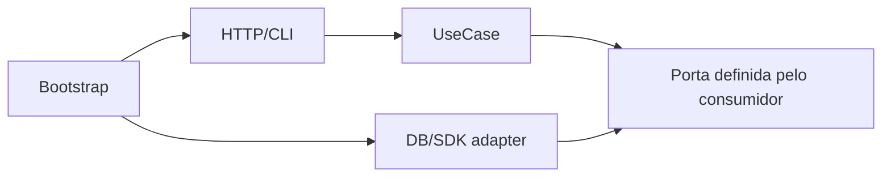

# Princípios de design

Princípios ajudam a formular perguntas; não substituem contexto, profiling ou feedback. Aplique-os ao **custo de mudança observado**, não para maximizar abstrações.

## Mapa rápido

| Princípio | Favorece | Risco quando dogmático |
| --- | --- | --- |
| SRP / Separation of Concerns | razões de mudança explícitas | fragmentação em classes minúsculas |
| OCP | extensão em eixos previstos | plug-ins para variações inexistentes |
| LSP | substituição sem surpresa | hierarquia artificial para reuso |
| ISP | contratos por consumidor | interfaces de um método sem semântica |
| DIP / DI | política independente de detalhe | container/service locator onipresente |
| DRY | uma fonte de verdade por conhecimento | unir coincidências que evoluem separadas |
| KISS | entendimento e operação simples | ignorar complexidade essencial |
| YAGNI | adiar custo especulativo | fechar caminhos baratos de evolução |
| Coesão/acoplamento | mudança localizada | medir apenas imports, ignorar semântica |
| Imutabilidade/encapsulamento | invariantes e concorrência segura | cópia, alocação e APIs pouco ergonômicas |

## SOLID, com limites

### Single Responsibility Principle (SRP)

Um módulo deve ter uma razão coesa para mudar, ligada a ator/capacidade. “Fazer uma coisa” é vago: um use case pode validar, decidir e persistir como uma responsabilidade de orquestração. Separe quando mudanças vêm de stakeholders ou ritmos distintos. Fragmentar cada linha em uma classe aumenta navegação e acoplamento indireto.

### Open/Closed Principle (OCP)

Facilite extensão nos **eixos estáveis e comprovados** sem editar política central: adicionar um novo método de frete por uma Strategy pode fazer sentido. Toda extensão precisa de um ponto de integração; tentar fechar tudo gera frameworks internos. Primeiro observe a variação, depois estabilize o seam.

### Liskov Substitution Principle (LSP)

Um subtipo preserva contrato observável: pré-condições não ficam mais fortes, pós-condições não enfraquecem, invariantes e semântica de erro permanecem. `Square extends Rectangle` falha quando setters independentes são esperados. Composição ou tipos distintos expressam melhor contratos diferentes.

### Interface Segregation Principle (ISP)

Consumidores não devem depender de operações que não usam. Interfaces pequenas orientadas ao caso de uso diminuem blast radius. Porém, dividir um conceito coeso apenas para obter “um método” pode apagar invariantes e multiplicar wiring.

### Dependency Inversion Principle (DIP) e Dependency Injection (DI)

Política define contratos para detalhes voláteis; o composition root fornece implementações. **DI é mecanismo**, DIP é direção de dependência. Constructor injection deixa requisitos visíveis; service locator e campos globais os escondem. Nem todo detalhe requer interface: tipos concretos estáveis podem ser dependências honestas.

## DRY: conhecimento, não texto

DRY significa não manter a **mesma decisão de conhecimento** em lugares diferentes. Duas validações sintaticamente iguais para contextos com regras independentes podem e devem duplicar. Extração prematura cria dependência compartilhada e mudança condicional.

Use a “regra de três” como freio, não lei: espere padrões de mudança, nomeie a abstração na linguagem do domínio e mantenha testes por consumidor. Geração de código/schema pode ser melhor que biblioteca compartilhada quando artefatos devem permanecer compatíveis.

## KISS e complexidade essencial

Simplicidade reduz estados, conceitos e caminhos necessários para operar uma mudança. Ela não é menor contagem de linhas. Uma state machine explícita pode ser maior e mais simples que flags combinatórias. Encapsule complexidade essencial atrás de uma interface profunda; remova complexidade acidental em tooling, configuração e fluxo.

## YAGNI e opções baratas

Não construa requisitos hipotéticos. Ainda assim, preserve opções de baixo custo: migrações reversíveis, contrato pequeno, observabilidade e seam em uma fronteira externa. YAGNI rejeita implementação especulativa, não aprendizado, protótipo de risco ou desenho de evolução.

## Separation of Concerns, coesão e acoplamento

- **Coesão:** elementos pertencem ao mesmo conceito e mudam juntos.
- **Acoplamento:** mudança/entendimento exige conhecer outro elemento.
- **Temporal coupling:** operações precisam ocorrer em ordem.
- **Data coupling:** consumidores dependem da mesma representação.
- **Operational coupling:** deploy/falha/recovery precisam coordenar.

Organizar por capability costuma aumentar coesão de mudança. Métricas de import ajudam, mas revise histórico: quantos commits atravessam limites? Quantos times coordenam um release?

## Composição e encapsulamento

Composição monta comportamentos explícitos e evita hierarquias frágeis. Herança continua útil para relação “é um” com contrato substituível e framework controlado. Encapsular não é criar getter/setter para tudo; é preservar invariantes e esconder escolhas que podem mudar. Um módulo profundo oferece muita função por uma interface pequena.

## Imutabilidade

Valores imutáveis reduzem aliasing e races, facilitam cache/retry e tornam transições observáveis. Custos incluem cópia/alocação e integração com frameworks. Prefira imutabilidade para Value Objects, mensagens e configuração; use mutação localizada atrás de ownership claro em buffers/hot paths medidos.

## Princípios precisam de evidência

Uma aplicação intermediária dos princípios exige perguntar se o design melhorou **algum resultado observável**. Exemplos:

- SRP: mudanças passaram a tocar menos módulos e owners?
- DIP: um adapter realmente pode ser testado/substituído sem contaminar regra?
- DRY: a abstração reduziu divergência ou passou a exigir condicionais por consumidor?
- KISS: onboarding/debug ficou mais simples?
- Imutabilidade: eliminou race/aliasing e qual foi o custo de alocação?

Use histórico Git, profiling, tempo de build/test, incidentes e feedback de manutenção como evidência. Princípios não devem virar pontuação estética em code review.

## Performance e princípios

Design “limpo” ainda precisa respeitar caminhos quentes. Algumas tensões:

- objetos imutáveis podem aumentar cópia/alocação;
- abstrações virtuais/dinâmicas podem reduzir otimizações em hot path;
- interfaces excessivamente genéricas podem impedir batching;
- encapsulamento ruim pode criar N+1 escondido;
- decomposição excessiva pode multiplicar hops remotos.

Isso não invalida princípios. Significa que **performance é uma restrição do contexto**. Profile antes de quebrar encapsulamento e mantenha otimização localizada, documentada e testada.

Um buffer mutável com owner único pode ser mais simples e rápido que copiar megabytes para preservar uma imutabilidade dogmática.

## Code review usando princípios

Em vez de “isso viola SOLID”, prefira perguntas concretas:

- qual mudança futura este seam facilita?
- quais consumidores realmente compartilham esta regra?
- esta interface esconde um custo relevante?
- qual invariant fica protegida?
- há uma alternativa mais simples?
- temos evidência de que este coupling dói?

Isso transforma princípio em ferramenta de raciocínio, não argumento de autoridade.

## Anti-patterns

- interface e implementação `Foo`/`FooImpl` sem variação;
- `BaseService` genérico que acopla domínios distintos;
- injeção de 15 dependências sinalizando responsabilidade ampla;
- `utils` como destino de conhecimento sem owner;
- boolean blindness (`process(true, false, true)`);
- objeto anêmico com invariantes espalhadas;
- imutabilidade superficial contendo coleção mutável compartilhada;
- abstração que exige `if concreteType` em consumidores;
- “SOLID score” usado como métrica de qualidade;
- refatoração que piora performance crítica sem medição.

## Exercícios em quatro níveis

### Beginner

Caracterize testes de uma classe com relógio global e extraia somente a dependência temporal. Explique DIP e por que não criou interfaces para valores puros.

### Intermediate

Analise cinco duplicações em dois módulos. Classifique “mesmo texto” versus “mesmo conhecimento”; extraia apenas a segunda categoria e simule uma mudança divergente.

### Advanced

Use o histórico Git para medir change coupling. Reorganize um slice por capability e compare arquivos tocados, build/test e entendimento necessário.

### Expert

Remova um framework interno especulativo. Preserve compatibilidade, migre dois consumidores gradualmente e registre em ADR quais opções foram perdidas/ganhas e o gatilho para reintrodução.

## Checkpoint de decisão

Antes de introduzir uma abstração, escreva três frases:

1. **Força:** qual mudança/risco existe hoje?
2. **Seam:** qual menor fronteira contém essa variação?
3. **Evidência:** como saberemos se a fronteira melhorou manutenção, teste, performance ou operação?

Se a primeira frase depende apenas de “talvez no futuro”, YAGNI merece atenção. Se a terceira não pode ser respondida, provavelmente o benefício ainda está abstrato demais.

## Referências

- Martin. [Solid Relevance](https://blog.cleancoder.com/uncle-bob/2020/10/18/Solid-Relevance.html) — defesa e formulação dos princípios pelo autor; confronte criticamente com o contexto.
- Fowler. [Dependency Injection](https://martinfowler.com/articles/injection.html).
- Hunt & Thomas. *The Pragmatic Programmer*. [Pearson](https://www.pearson.com/en-us/subject-catalog/p/pragmatic-programmer-the-your-journey-to-mastery-20th-anniversary-edition/P200000000337/9780135957059).
- Ousterhout. *A Philosophy of Software Design*. [Site oficial](https://web.stanford.edu/~ouster/cgi-bin/book.php).

---

[← Engenharia de Software](README.md) · [↑ Índice](README.md) · [DDD →](ddd/README.md)
