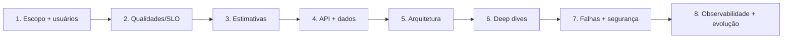

# System Design

System design transforma objetivos ambíguos em um modelo explícito de requisitos, capacidade, dados, interfaces, falhas e operação. O resultado é uma conversa rastreável sobre trade-offs—não um diagrama com tecnologias populares.

## Método

Veja [processo e ferramentas](process.md) para requirements, capacity estimation, APIs, banco, cache, filas, particionamento, load balancing, CDN, consistência, confiabilidade e observabilidade.

## Estudos de caso

O [catálogo de estudos](case-studies.md) contém nove sistemas. Cada estudo é um ponto de partida com hipóteses declaradas; altere números e requisitos para explorar outro desenho.

| Caso | Força dominante | Deep dive sugerido |
| --- | --- | --- |
| [URL Shortener](case-studies.md#1-url-shortener) | leitura intensa + chave curta | geração, redirect e hot keys |
| [Chat](case-studies.md#2-chat) | conexão persistente + ordem | fan-out, presença e offline |
| [Notification System](case-studies.md#3-notification-system) | preferência + entrega multi-canal | agendamento, retry e provider |
| [Payment System](case-studies.md#4-payment-system) | correção financeira | idempotência, ledger e reconciliação |
| [E-commerce](case-studies.md#5-e-commerce) | fluxo entre capacidades | estoque, pedido e saga |
| [Streaming](case-studies.md#6-streaming-de-vídeo) | mídia global | ingest/transcode/CDN |
| [Search Engine](case-studies.md#7-search-engine) | indexação + ranking | inverted index e freshness |
| [Social Network](case-studies.md#8-rede-social) | feed fan-out | celebrity problem e moderação |
| [Ride Sharing](case-studies.md#9-ride-sharing) | geo em tempo real | matching, localização e viagem |

## Entregável mínimo

- escopo funcional e explicitamente fora do escopo;
- 3–5 SLOs/qualidades priorizados;
- estimativa de tráfego, storage e bandwidth com fórmula;
- APIs e modelo de dados com ownership;
- diagrama de fluxo crítico e um de falha;
- decisões de consistência, cache, fila e particionamento;
- threat model curto, privacidade e abuso;
- observabilidade, capacidade, backup/restore e plano evolutivo;
- 1–3 ADRs para decisões realmente arquiteturais.

## Como avaliar

Uma boa solução é internamente coerente e sabe onde quebrará. Ela não precisa “chegar” à mesma stack de uma empresa. Avalie:

- requisitos dirigem componentes e números;
- garantia tem mecanismo (não “alta disponibilidade” por adjetivo);
- estado e owner são identificáveis;
- caminhos de falha, overload e recovery são explícitos;
- segurança/privacidade entram antes da API final;
- o desenho começa simples e apresenta gatilhos para evoluir.

## Anti-patterns

- estimativas com precisão falsa ou sem unidade;
- cache/queue/CDN adicionados sem problema declarado;
- replicar banco e assumir consistência/backup resolvidos;
- ignorar escrita, backfill e hot partition em sistema “read heavy”;
- dizer “exactly once”, “real-time” ou “infinite scale” sem definição;
- escolher NoSQL apenas por volume, sem access patterns;
- omitir operador, custo e exclusão de dados.

## Referências

- Kleppmann. *Designing Data-Intensive Applications*. [O'Reilly](https://www.oreilly.com/library/view/designing-data-intensive-applications/9781491903063/).
- Google. [Site Reliability Engineering](https://sre.google/sre-book/table-of-contents/).
- Google Cloud. [Architecture Framework](https://cloud.google.com/architecture/framework).
- AWS. [Well-Architected Framework](https://docs.aws.amazon.com/wellarchitected/latest/framework/welcome.html).
- IETF. [HTTP Semantics — RFC 9110](https://www.rfc-editor.org/rfc/rfc9110).

---

[← Engenharia de Software](../README.md) · [↑ Índice](../README.md) · [Processo →](process.md)
