# System Design

System Design transforma objetivos ambíguos em um modelo explícito de requisitos,
capacidade, dados, interfaces, falhas e operação. O resultado não é um diagrama
com tecnologias populares. É uma **hipótese de sistema** que pode ser criticada,
medida, testada e evoluída.

O problema central é tomar decisões sob informação incompleta sem fingir precisão.
Você precisa descobrir quais requisitos realmente dirigem a arquitetura, estimar
ordens de grandeza e escolher a menor solução que preserva as propriedades
importantes.

## Modelo mental: requisitos → mecanismos → evidências

Para cada atributo desejado, conecte:

```text
requisito mensurável
→ mecanismo arquitetural
→ failure mode
→ sinal observável
→ teste/experimento
```

Exemplo:

```text
p99 < 300 ms
→ cache + índice + budget por hop
→ cache miss / hot key / banco lento
→ latency histogram + cache hit + DB saturation
→ load test + fault injection
```

“Alta disponibilidade com Kubernetes” não é uma cadeia de raciocínio.

## Método

```mermaid
flowchart LR
    Scope[1. Escopo + usuários] --> NFR[2. Qualidades/SLO]
    NFR --> Capacity[3. Estimativas]
    Capacity --> API[4. API + dados]
    API --> Shape[5. Arquitetura mínima]
    Shape --> Deep[6. Deep dives]
    Deep --> Failure[7. Falhas + segurança]
    Failure --> Operate[8. Observabilidade]
    Operate --> Evolve[9. Evolução + rollback]
```



## 1. Clarifique o produto

Antes de falar de banco, pergunte:

- quem usa?
- qual ação principal?
- leitura ou escrita domina?
- resultado precisa ser imediato?
- quais dados são críticos?
- quais regiões?
- quais integrações externas?
- quais requisitos estão fora do escopo?

Escolha 2–4 jornadas críticas. Um sistema inteiro é grande demais para raciocinar
com profundidade ao mesmo tempo.

## 2. Transforme “NFRs” em cenários

Ruim:

> precisa ser escalável e resiliente.

Melhor:

> a leitura de feed deve manter p99 < 400 ms em 20 mil req/s e continuar servindo
> conteúdo stale por até 5 min se ranking ficar indisponível.

Ou:

> nenhuma cobrança confirmada pode ser aplicada duas vezes para a mesma operação
> lógica, inclusive após timeout e retry.

Esses cenários revelam mecanismo e teste.

## Quality Attribute Scenario

Estrutura útil:

- source do estímulo;
- estímulo;
- ambiente;
- artifact afetado;
- response;
- response measure.

Exemplo:

```text
source: uma AZ
stimulus: fica indisponível
ambiente: pico de tráfego
artifact: checkout
response: tráfego migra, writes preservam invariante
measure: recuperação < 2 min, erro < 1%, sem duplicação
```

## 3. Estimativas de capacidade

Não busque precisão falsa. Use ordem de grandeza.

### Requests

Se existem 10 milhões de usuários ativos/dia e cada um gera 20 reads:

```text
200M reads/dia
≈ 2.3k reads/s média
```

Mas média não dimensiona pico. Se pico é 10x:

```text
≈ 23k reads/s
```

### Storage

```text
itens/dia × bytes/item × retenção × replication factor
```

Inclua:

- índices;
- metadata;
- backups;
- growth;
- tombstones/versioning.

### Bandwidth

```text
req/s × payload médio
```

Considere p99 de payload, compressão e egress.

### Concurrency

Little's Law ajuda:

`L = λ × W`

10k req/s com 200 ms médios implica aproximadamente 2k requests em voo em steady
state.

## 4. Defina contratos

API define o que callers podem assumir.

Pergunte:

- idempotência?
- versioning?
- pagination?
- consistency?
- error semantics?
- timeout?
- auth?
- rate limit?

Uma boa API não vaza topologia interna sem necessidade.

## Idempotência de escrita

Se caller pode retry após timeout, use operação lógica identificável.

```text
POST /payments
Idempotency-Key: pay-order-123-attempt-logical-1
```

Servidor precisa distinguir key repetida com mesmo payload de key reutilizada com
payload diferente.

## Modelagem de dados

Comece pelas invariantes e access patterns.

Liste:

- entidades/agregados;
- autoridade de cada dado;
- relações;
- leitura dominante;
- update patterns;
- retenção;
- consistency.

Escolha storage depois.

## Relacional versus NoSQL

Perguntas melhores que “SQL escala?”:

- preciso de transações multi-row fortes?
- queries mudam/ad hoc?
- access patterns são conhecidos?
- sharding é necessário?
- joins têm valor?
- latência por key precisa ser previsível?

Tecnologia vem depois do modelo.

## 5. Arquitetura mínima

Desenhe a solução mais simples que atende requisitos atuais.

Exemplo:

```text
client
→ load balancer
→ stateless API
→ PostgreSQL
```

Não adicione cache, Kafka, Redis, Elasticsearch e Kubernetes porque “sistemas
reais têm”. Cada componente precisa fechar um requisito.

## Quando adicionar cache

Cache pode reduzir latência/carga se:

- read domina;
- dado tolera staleness;
- hit ratio provável é alto.

Defina:

- cache key;
- TTL;
- invalidation;
- stampede;
- failure behavior;
- tenant isolation.

## Quando adicionar fila

Queue ajuda quando trabalho pode ser assíncrono ou pico precisa buffering.

Pergunte:

- qual backlog aceitável?
- ordering?
- delivery semantics?
- retries?
- DLQ?
- idempotência?

Fila não aumenta capacidade do consumer.

## Quando adicionar CDN

Útil para conteúdo cacheável próximo ao usuário.

Considere:

- cache key;
- invalidation;
- signed URLs/cookies;
- origin shielding;
- regional compliance;
- stale behavior.

## Quando particionar

Particione quando um único node/store não atende volume, tamanho ou isolamento.

Escolha key por:

- cardinalidade;
- distribuição;
- access pattern;
- ordering;
- tenant.

Hot partition pode limitar sistema mesmo com muita capacidade agregada.

## 6. Deep dives pelo risco dominante

Não aprofunde tudo. Escolha 2–3 decisões onde erro custa mais.

Exemplos:

- feed: fan-out;
- pagamento: idempotência/ledger;
- chat: ordering/presence;
- search: indexing/freshness;
- streaming: transcode/CDN;
- ride sharing: geo/matching.

## Replicação

Defina:

- leader/follower ou multi-leader?
- sync/async?
- read replicas?
- failover?
- commit semantics?

Replication factor sem semântica de commit é só contagem.

## Consistência

Escolha por operação:

- strong;
- read-your-writes;
- eventual;
- stale bounded;
- serializable transaction.

Conecte à invariante.

## 7. Modele falhas antes de encerrar

Para cada componente, pergunte:

- crash;
- lento;
- network partition;
- data corruption;
- quota;
- overload;
- deploy incompatível;
- dependency outage.

A falha “lento” é frequentemente mais perigosa que “off”.

## Deadline budget

Se usuário aceita 1 s, distribua budget.

Exemplo:

```text
edge       50 ms
API       150 ms
DB        200 ms
provider  400 ms
margin    200 ms
```

Downstream não deve receber timeout maior que o deadline restante.

## Retry

Retry apenas para falha transitória, com idempotência, backoff, jitter e budget.

Em cadeia, escolha uma camada dona do retry para evitar multiplicação.

## Overload

Projete:

- concurrency limits;
- bounded queues;
- rate limits;
- load shedding;
- priority;
- graceful degradation.

Um sistema que aceita tudo até OOM não é resiliente.

## 8. Segurança

Faça threat model curto:

- assets;
- actors;
- trust boundaries;
- abuse cases.

Inclua:

- authentication;
- authorization;
- secret management;
- encryption;
- tenant isolation;
- audit;
- data deletion;
- abuse/rate limit.

Segurança não é uma caixa adicionada no fim do diagrama.

## Privacidade

Pergunte:

- qual PII existe?
- onde replica?
- por quanto tempo?
- backup também exclui?
- analytics precisa do dado bruto?
- data residency?

## 9. Observabilidade

Para cada SLO, identifique sinais.

### RED

- Rate;
- Errors;
- Duration.

### Saturation

- CPU;
- memory;
- pools;
- queue;
- disk;
- connections.

### Dados distribuídos

- replication lag;
- consumer lag/age;
- cache hit;
- retry;
- circuit state.

Trace deve revelar caminho crítico, não coletar tudo sem propósito.

## SLI e SLO

Exemplo:

```text
SLI: proporção de checkouts concluídos < 2 s sem erro
SLO: 99.9% em 30 dias
```

Error budget ajuda a decidir ritmo de mudança versus confiabilidade.

## 10. Backup e recovery

Defina RPO/RTO.

Teste:

- restore;
- failover;
- data reconciliation;
- service dependency recovery.

Backup que nunca foi restaurado não fecha requisito.

## 11. Evolução

Arquitetura precisa admitir mudança.

Use:

- expand/contract migrations;
- backward-compatible APIs;
- event versioning;
- feature flags;
- canary;
- strangler;
- dual-read comparativo;
- rollback.

Documente **gatilhos** de evolução.

Exemplo:

> adicionar read replica quando p95 de CPU do primary permanecer >70% por 15 min
> e queries já estiverem otimizadas.

Isso é melhor que “no futuro, escalar horizontalmente”.

## ADR

Decisões importantes devem registrar:

- contexto;
- drivers;
- opções;
- decisão;
- consequências;
- sinais para revisar.

ADR evita que diagrama vire explicação perdida no tempo.

## Custos

Inclua:

- compute;
- storage;
- egress;
- managed services;
- observability;
- replicas;
- people/operations.

Uma arquitetura pode economizar máquina e aumentar enormemente custo humano.

## Multi-region

Não desenhe active-active por reflexo.

Defina:

- user geography;
- write authority;
- conflict policy;
- RPO/RTO;
- replication latency;
- failover;
- failback;
- compliance.

Active-passive pode ser melhor quando writes concorrentes criam complexidade sem
benefício.

## Estudo: URL shortener

### Drivers

- read-heavy;
- redirect rápido;
- chave curta única.

### Perguntas

- geração central ou aleatória?
- collision handling?
- cache?
- hot URLs?
- analytics síncrono ou async?

### Experimento

Load test com Zipf distribution para criar hot key. Observe cache e store.

## Estudo: Chat

### Drivers

- conexão persistente;
- ordering por conversa;
- presença;
- offline.

### Perguntas

- WebSocket gateway state?
- message ID?
- ordering global ou conversation-local?
- fan-out?
- delivery receipt?

### Experimento

Reordene mensagens e desconecte/reconecte cliente.

## Estudo: Notification System

### Drivers

- multi-channel;
- providers externos;
- preferences;
- retry.

### Perguntas

- idempotency por notification/channel?
- provider timeout ambíguo?
- rate limit?
- DLQ?

### Experimento

Provider retorna 429 e timeout após aceitar request.

## Estudo: Payment System

### Drivers

Correção financeira domina.

Perguntas:

- ledger?
- idempotência?
- provider reconciliation?
- auth/capture?
- duplicate webhook?

Não confunda “transação no banco” com garantia fim a fim.

## Catálogo de estudos

O [catálogo de estudos](case-studies.md) contém nove sistemas:

| Caso | Força dominante | Deep dive sugerido |
| --- | --- | --- |
| [URL Shortener](case-studies.md#1-url-shortener) | leitura intensa + chave curta | geração, redirect e hot keys |
| [Chat](case-studies.md#2-chat) | conexão persistente + ordem | fan-out, presença e offline |
| [Notification System](case-studies.md#3-notification-system) | preferência + entrega multi-canal | retry e provider |
| [Payment System](case-studies.md#4-payment-system) | correção financeira | idempotência e reconciliação |
| [E-commerce](case-studies.md#5-e-commerce) | fluxo entre capacidades | estoque, pedido e saga |
| [Streaming](case-studies.md#6-streaming-de-vídeo) | mídia global | ingest/transcode/CDN |
| [Search Engine](case-studies.md#7-search-engine) | indexação + ranking | inverted index e freshness |
| [Social Network](case-studies.md#8-rede-social) | feed fan-out | celebrity problem e moderação |
| [Ride Sharing](case-studies.md#9-ride-sharing) | geo em tempo real | matching, localização e viagem |

## Laboratório obrigatório: capacidade

Escolha um case study e faça uma planilha simples com:

- DAU;
- requests/user;
- pico;
- payload;
- retenção;
- replication factor.

Altere cada premissa por 10x e veja quais componentes mudam. Isso treina
sensibilidade, não precisão falsa.

## Laboratório: cache stampede

Implemente endpoint com cache e TTL simultâneo. Faça milhares de chaves expirarem
juntas.

Compare:

- sem proteção;
- request coalescing;
- jitter de TTL;
- stale-while-revalidate.

Meça DB load e p99.

## Laboratório: queue backlog

Producer gera trabalho 2x mais rápido que consumer por cinco minutos.

Meça:

- depth;
- oldest-message age;
- recovery time;
- efeito de autoscaling.

Mostre que fila não cria capacidade.

## Laboratório: failure injection

Para o fluxo crítico, injete:

- 500 ms latency;
- 5% errors;
- connection reset;
- read replica lag;
- queue redelivery.

Compare comportamento com hipóteses do design.

## Entregável mínimo

- escopo funcional e fora do escopo;
- 3–5 quality attribute scenarios;
- estimativas com fórmulas;
- APIs e ownership de dados;
- arquitetura mínima;
- dois deep dives;
- failure model;
- threat model;
- SLO/observabilidade;
- RPO/RTO;
- plano evolutivo;
- 1–3 ADRs;
- pelo menos um experimento reproduzível.

## Como avaliar uma solução

Uma boa solução:

- requisitos dirigem componentes;
- garantia possui mecanismo;
- estado/owner são identificáveis;
- caminhos de falha são explícitos;
- números são coerentes;
- segurança entra no desenho;
- recovery é testável;
- arquitetura começa simples;
- gatilhos de evolução são mensuráveis.

Ela não precisa reproduzir stack de empresa famosa.

## Anti-patterns

- precisão falsa;
- cache/queue/CDN sem problema;
- replicar banco e assumir HA/backup resolvidos;
- ignorar write/backfill/hot partition;
- exactly-once sem definição;
- NoSQL “porque escala”;
- multi-region sem conflito/RTO/RPO;
- microservices sem driver organizacional;
- security no último minuto;
- observability como lista de ferramentas;
- sistema sem operator/runbook;
- diagrama sem experimento.

## Projeto de síntese

Escolha um case e produza duas versões:

### V1

Menor arquitetura capaz de atender carga atual.

### V2

Evolução após um driver objetivo, por exemplo 20x volume ou segunda região.

Para cada mudança:

1. registre ADR;
2. declare benefício;
3. declare custo;
4. injete failure relevante;
5. meça;
6. defina rollback.

O objetivo é provar que arquitetura é processo de decisão, não desenho final.

## Referências

- Kleppmann. *Designing Data-Intensive Applications*. [O'Reilly](https://www.oreilly.com/library/view/designing-data-intensive-applications/9781491903063/).
- Google. [Site Reliability Engineering](https://sre.google/sre-book/table-of-contents/).
- Google Cloud. [Architecture Framework](https://cloud.google.com/architecture/framework).
- AWS. [Well-Architected Framework](https://docs.aws.amazon.com/wellarchitected/latest/framework/welcome.html).
- IETF. [HTTP Semantics — RFC 9110](https://www.rfc-editor.org/rfc/rfc9110).

---

[← Engenharia de Software](../README.md) · [↑ Índice](../README.md) · [Processo →](process.md)
