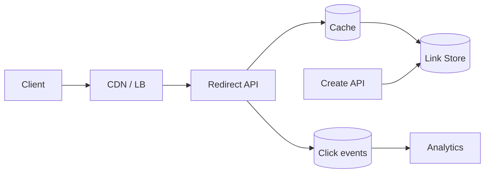
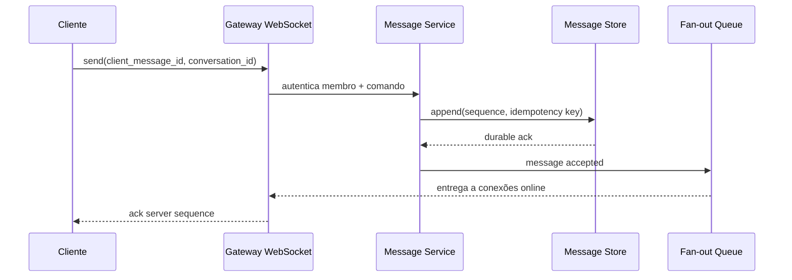
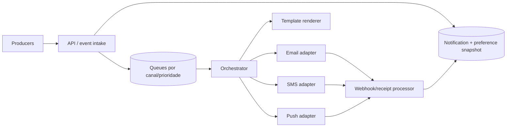
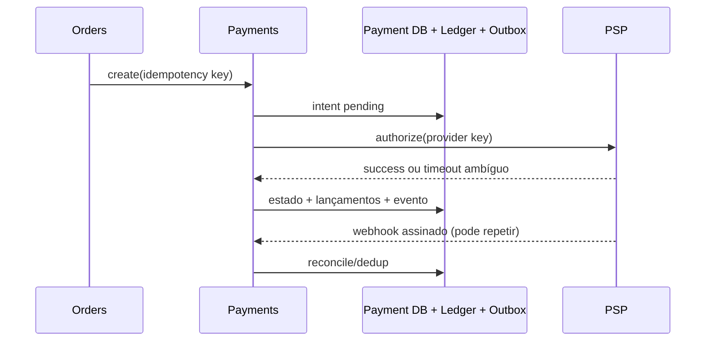
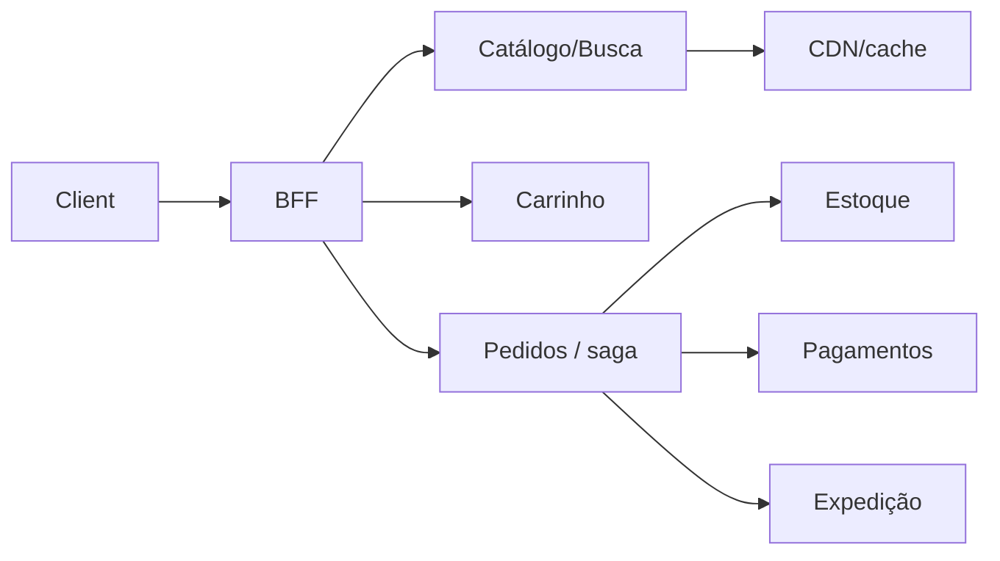
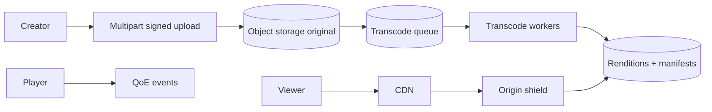
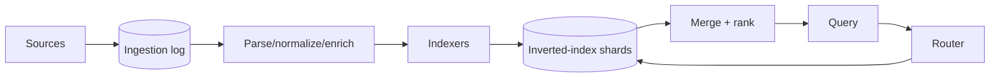
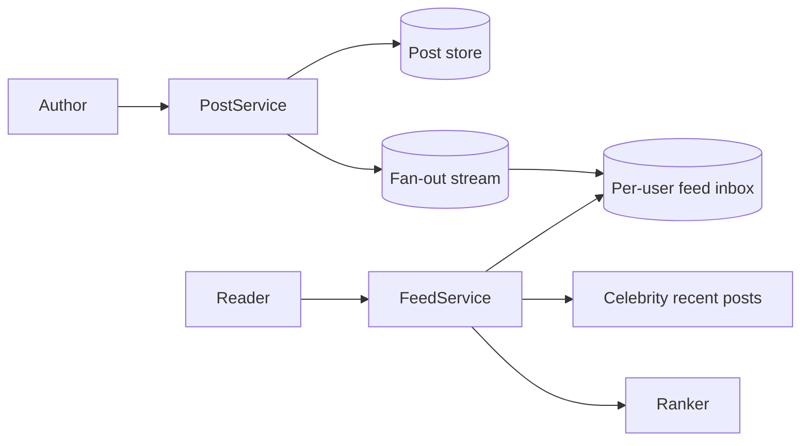
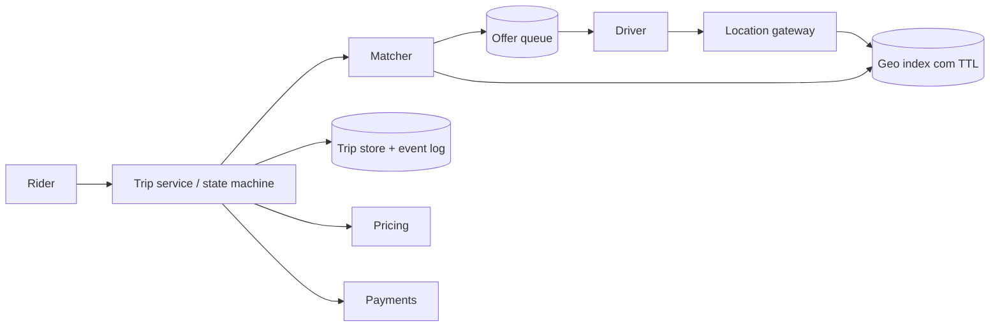

# Catálogo de estudos de System Design

Os números abaixo são hipóteses didáticas, não dados de empresas reais. Recalcule quando mudar região, SLO ou escopo. Cada desenho começa simples e destaca o ponto que merece deep dive.

## 1. URL Shortener

### Escopo e drivers

Criar link curto opcionalmente customizado/expirável e redirecionar; analytics pode ser assíncrono. Hipótese: 2 M criações/dia, 100 M redirects/dia, pico 10×, 5 anos; redirect p99 <100 ms e 99,99% mensal. Links maliciosos e enumeração fazem parte do problema.

### API e dados

```http
POST /v1/links  Idempotency-Key: ...  {url, custom_alias?, expires_at?}
GET /{code}     -> 302 Location: ...
```

Use 302 se destino pode mudar/analytics importa; 301 é cacheável e difícil de revogar. `links(code PK, destination, owner_id, created_at, expires_at, status)`; índice por owner é secundário. Gere ID único (sequência por bloco/Snowflake) e codifique base62, ou código aleatório com retry de colisão. `6` chars oferecem `62^6 ≈ 56,8 bilhões`, mas espaço não é capacidade efetiva sob abuso/reserva.



### Deep dive e trade-offs

Cache-aside por `code`, negative cache curto, single-flight e TTL limitado por expiração/revogação. Particione store por hash de código; aliases customizados exigem unique claim forte. Analytics nunca bloqueia redirect; amostragem e agregação controlam custo. Filtre esquemas, normalize com cuidado, verifique malware de forma assíncrona, rate-limit criação e ofereça takedown. Multi-região pode ler réplicas; criação global precisa alocação sem colisão. Restore do mapeamento é mais importante que clicks.

**Falhas a ensaiar:** cache vazio (stampede), hot link, store indisponível, destino revogado ainda cacheado. **Evolução:** um banco indexado → cache → read replicas/partição quando medido.

## 2. Chat

### Escopo e drivers

Conversas 1:1 e grupos, texto, entrega offline, receipts e presença best-effort. Hipótese: 10 M DAU, 50 mensagens/usuário/dia, pico 50 k msg/s, conexão persistente; aceitamos ordem por conversa, não global. Mensagem aceita deve ser durável; presença pode perder atualização.

### Fluxo e modelo



`conversation_members`, `messages(conversation_id, sequence, sender, body_ref, created_at)`, `device_cursor`. Particione por `conversation_id`; um sequenciador/líder por partição atribui ordem. Grupos enormes viram hot partition e pedem subpartição + semântica de ordem relaxada. Gateway mantém conexão e registry com TTL; mensagem permanece no store, portanto conexão caída faz catch-up por cursor.

### Deep dive e trade-offs

Fan-out on write reduz latência de leitura para grupos pequenos; fan-out on read evita milhões de cópias em grupos grandes. Receipts agregados e presença têm coalescing/rate limit. Push notification recebe preview mínimo e deduplica com mensagem. Upload usa object storage + signed URL e scanner. E2EE muda busca, moderação, multi-device e recuperação de chave; trate como arquitetura própria, não checkbox.

**Falhas:** reconexão simultânea, duplicidade após timeout, membro removido, gateway perdido e sequência com lacuna. **Observação:** conexões, send-to-durable p99, delivery lag, reconnect storm, mensagens duplicadas e shard hotness.

## 3. Notification System

### Escopo e drivers

Enviar email, SMS, push e in-app a partir de eventos/comandos, respeitando preferência, quiet hours, template/locale, prioridade e rate limit. Hipótese: 500 M tentativas/dia, pico 100 k/s; entrega é at-least-once, efeito deve ser deduplicável; “aceito” não significa “entregue pelo carrier”.

### Arquitetura



`POST /notifications` exige idempotency key e audience/tenant. Grave intenção e snapshot/version da preferência antes de enfileirar; defina se opt-out posterior cancela agendados. State machine: accepted → scheduled → dispatched → provider_accepted → delivered/failed/suppressed. Provider message ID conecta webhook, mas webhook também duplica e chega fora de ordem.

### Deep dive e trade-offs

Filas por canal, prioridade e região isolam falhas; fairness por tenant impede vizinho ruidoso. Token bucket respeita quotas do provider. Retry apenas transitório; endereço inválido/suppression vai para estado terminal. Circuit breaker permite failover de provider somente se semântica/preço/compliance equivalem. Templates são versionados, escapam conteúdo e têm preview/teste. PII minimizada e retenção diferenciada; unsubscribe é confiável e auditável.

**Falhas:** provider aceita e timeout ocorre (reconciliar antes de reenviar), webhook falso (assinatura/replay window), campanha satura transacional, quiet-hours com fuso/DST. **Sinais:** oldest-message age, dispatch/delivery por provider, suppression, retry/DLQ, custo e jornada de negócio.

## 4. Payment System

### Escopo e drivers

Autorizar/capturar/reembolsar por PSP, registrar saldo em ledger e reconciliar. Hipótese: 5 k operações/s no pico; zero perda silenciosa, API 99,99%; toda decisão financeira é auditável. Cartão é tokenizado por provedor; reduzir escopo PCI é requisito.

### API, estado e ledger

```http
POST /v1/payments   Idempotency-Key: order-123-attempt-1
POST /v1/payments/{id}/captures
POST /v1/payments/{id}/refunds
GET  /v1/payments/{id}
```

Payment state machine evita transição inválida, mas saldo vem de **ledger de partidas dobradas**: cada transação balanceada soma débitos e créditos a zero na moeda/unidade. Nunca atualize “balance” sem lançamentos imutáveis; saldo materializado é projeção reconciliável.



### Deep dive e trade-offs

Idempotency scope inclui tenant/operação/payload hash; mesma chave com payload diferente é erro. Lock/version por Payment serializa transições relevantes. Timeout após autorização é **unknown**, não failure: consulte PSP/webhook antes de repetir. Saga com Pedido/Estoque usa estados e compensações; reembolso não apaga captura.

Reconciliation compara ledger interno, PSP e banco/settlement diariamente/intraday; exceções viram fila operacional. Segregue duties, least privilege, criptografia/tokenização, webhook signature + timestamp, audit log imutável e limites antifraude. Logs nunca contêm PAN/CVV.

**Falhas:** duplicate command/webhook, callback fora de ordem, PSP lento, moeda/rounding, partial refund, failover que cobra duas vezes. **Sinais:** autorização/captura p99 e taxa, unknown age, imbalance (deve zero), reconciliation breaks, duplicate prevented e SLO de resolução.

## 5. E-commerce

### Escopo e drivers

Catálogo/busca, carrinho, preço, pedido, reserva de estoque e pagamento. Hipótese: leitura 100× escrita; pico de promoção 20×; oversell deve respeitar política explícita. Não tente transação ACID global entre estoque e PSP.

### Limites e fluxo



Catálogo é fonte de produto; índice de busca/projeção pode atrasar. Carrinho tem TTL e preço indicativo; checkout recalcula preço/promoção. Order captura snapshot de item/preço/endereço necessários à história. Inventory reserva `(sku, qty, expires_at, order_id)` com operação condicional/versão; expiração libera. Não use cache para decidir estoque final.

### Saga e trade-offs

Fluxo possível: criar pedido pending → reservar estoque → autorizar pagamento → confirmar → expedição. Falha libera reserva e cancela autorização quando possível; compensação também falha e precisa retry/owner. Orquestração explicita state machine; coreografia reduz centralização mas pode ocultar fluxo. O usuário vê estado pendente e recebe confirmação final.

Cache/CDN de catálogo usa versioned keys e invalidação; hot SKU requer particionamento/buffer/fairness. Proteja preço no servidor, autorização por pedido, antifraude, PII/retention e webhook. **Falhas:** flash crowd, reserva expira durante pagamento, evento duplicado, índice atrasado, migração de promoção. **Sinais:** conversão, checkout latency, oversell, reservation expiry, saga stuck/age, payment unknown, inventory divergence.

## 6. Streaming de vídeo

### Escopo e drivers

Upload, processamento para múltiplos bitrates, reprodução global e analytics de QoE; live fica fora do primeiro desenho. Hipótese: 100 k uploads/dia de 1 GB e 10 M espectadores concorrentes; start p95 <2 s, rebuffer ratio <1%, origem protegida de picos.

### Pipeline e delivery



Upload multipart retoma chunks e valida checksum; finalize idempotentemente. Orquestrador cria DAG por codec/bitrate/thumbnail, workers stateless e jobs idempotentes. Segmentos HLS/DASH e manifest permitem adaptive bitrate. URLs versionadas tornam conteúdo CDN-imutável; signed URL/cookie limita acesso. Origin shield e multi-CDN podem melhorar escala/resiliência, com custo e roteamento.

### Estimativa e trade-offs

Egress domina: `10 M × 3 Mbps ≈ 30 Tbps` no instante; CDN é essencial. Storage inclui original + renditions e política de lifecycle. Codec mais eficiente reduz egress, aumenta compute e compatibilidade. Chunk menor adapta rápido e aumenta requests/overhead. DRM protege licenças, não impede captura; geo/entitlement e revogação precisam propagação.

**Falhas:** poison media, transcode parcial, CDN miss storm, manifest aponta segmento ausente, token expirando no playback. **Sinais:** startup time, rebuffer, bitrate, playback failure por device/CDN/ISP, transcode age/error, origin egress/cache hit. Analytics é assíncrono e amostrado; não bloqueia player.

## 7. Search Engine

### Escopo e drivers

Indexar documentos autorizados e responder busca textual com ranking, autocomplete e filtros. Hipótese: 1 B documentos, 50 k queries/s, atualização pesquisável em <60 s, query p99 <300 ms. Crawler de web aberta é opcional; para busca interna, ingestão vem de fontes donas.

### Arquitetura



Índice invertido mapeia termo → postings `(doc, positions, score features)`. Shard por hash de doc distribui indexação; cada query faz scatter/gather, então muitas shards elevam tail latency. Réplicas atendem query. Segmentos imutáveis + merge simplificam escrita; tombstones tratam delete até merge. Metadados/fonte de documento permitem rebuild.

### Ranking, freshness e segurança

Pipeline lexical (BM25) pode recuperar candidatos; ranking posterior usa sinais. Avalie offline (NDCG/recall) e online com guardrails, evitando feedback que amplifica popularidade. Autocomplete tem índice próprio e proteção contra termos abusivos. ACL deve filtrar **antes/na recuperação**; pós-filtro pode vazar contagem/snippet e devolver poucos resultados. Exclusão propaga ao índice/cache dentro de SLA e é reconciliada.

Cache de query ajuda head, mas personalização e freshness fragmentam chaves. Hedge apenas requests idempotentes e com orçamento. **Falhas:** shard lento, merge satura I/O, mapping incompatível, reindex perde ACL, thundering popular query. **Sinais:** p50/p99, timeout parcial, zero-result, freshness lag, index size/merge, relevance, ACL/delete lag.

## 8. Rede social

### Escopo e drivers

Publicar, seguir/deixar de seguir, timeline, likes e moderação. Hipótese: 100 M DAU, 2 posts e 200 leituras de feed/usuário/dia; feed pode atrasar segundos, privacidade/bloqueio precisa efeito rápido. Contagens podem ser aproximadas; autoria/post não pode sumir silenciosamente.

### Feed híbrido



Fan-out on write materializa feed para seguidores comuns: leitura rápida, alto custo na escrita. Para celebridades, fan-out on read busca posts recentes e mescla/rankeia—evita milhões de writes por post, aumenta latência. Threshold é dinâmico por seguidores/atividade. Particione graph e inbox por user ID; hot author e fan-out storm usam filas, rate/fairness e backpressure.

### Privacidade, moderação e trade-offs

Feed item referencia post; exclusão/takedown deve invalidar cache/inbox e ser verificada na leitura. Bloqueio/visibilidade são autorização, não apenas filtro de UI. Mídia em object storage/CDN com scan e signed controls. Ranking registra versão/experimento, oferece explicação e guardrails de segurança. Like contador usa sharded/approx counter; relação “usuário curtiu” precisa dedup.

**Falhas:** usuário deixa de seguir durante fan-out, post privado em cache, celebrity burst, fila atrasada, contador divergente. **Sinais:** publish-to-visible lag, feed p99/freshness, fan-out backlog, cache hit, privacy/takedown SLA, moderação queue age e distribuição de exposição.

## 9. Ride Sharing

### Escopo e drivers

Atualização de localização, estimativa, solicitação, matching motorista-passageiro, viagem e cobrança. Hipótese: 1 M motoristas online, localização a cada 4 s (250 k updates/s), 20 k solicitações/s no pico; matching p95 <5 s. Segurança física e privacidade de localização são drivers centrais.

### Plano em tempo real e plano transacional



Localização recente é efêmera: célula geoespacial (H3/S2/geohash), TTL e timestamp; histórico tem retenção/acesso separados. Matcher expande anéis/células, filtra capacidade/ETA e envia ofertas com lease curto. Aceite usa compare-and-set em `trip/driver assignment` para impedir dois matches. Trip é state machine versionada: requested → offered → matched → arriving → in_progress → completed/cancelled.

### Deep dive e trade-offs

GPS é ruidoso; map matching/ETA são aproximados. Partição geográfica favorece locality, mas aeroporto/evento cria hot cell; subparticione e aplique admission control. Surge/pricing usa snapshot/version e explicação; nunca muda preço aceito silenciosamente. Offline do motorista e reconnect reconciliam estado durável—push não é fonte de verdade. Pagamento segue idempotência/ledger/reconciliação do estudo anterior.

Minimize precisão/retention de localização, separe acesso operacional, criptografe e audite; proteja stalking/account takeover e forneça canal de emergência com requisitos próprios. **Falhas:** dois motoristas aceitam, região perde conectividade, clock/GPS antigo, oferta expira, viagem fica presa. **Sinais:** request-to-match, acceptance, unmatched, location freshness, hot cell, state conflict, cancellation e safety escalation.

## Comparação transversal

| Caso | Chave natural de partição | Consistência forte localizada | Estado degradável |
| --- | --- | --- | --- |
| URL | short code | alias único | analytics |
| Chat | conversation | append/sequence por conversa | presença/receipt |
| Notification | notification/tenant | state transition/idempotência | analytics |
| Payment | payment/account | ledger/transição | dashboard |
| E-commerce | order/SKU | reserva por SKU, payment | busca/recomendação |
| Streaming | asset/video | publicação de versão | QoE analytics |
| Search | doc/shard | source ownership/delete | ranking fresco |
| Social | user/post | autoria/privacidade | contador/feed rank |
| Ride | region/trip | assignment/trip transition | mapa/ETA momentâneo |

## Perguntas para aprofundar qualquer caso

1. Qual hipótese numérica muda primeiro e qual componente satura?
2. Qual dado é fonte de verdade, projeção, cache ou efêmero?
3. Que operação exige strong consistency e qual aceita staleness mensurável?
4. Como sistema degrada sob dependência lenta e como se recupera?
5. Qual abuso/ameaça cresce com escala?
6. Como migrar chave de partição ou schema sem parada?

## Referências

- Kleppmann. *Designing Data-Intensive Applications*. [O'Reilly](https://www.oreilly.com/library/view/designing-data-intensive-applications/9781491903063/).
- Google SRE. [Distributed Systems chapters](https://sre.google/workbook/table-of-contents/).
- Apple. [HTTP Live Streaming](https://developer.apple.com/streaming/).
- PCI Security Standards Council. [Document library](https://www.pcisecuritystandards.org/document_library/).
- Uber Engineering. [H3 geospatial index](https://h3geo.org/).

---

[← Processo](process.md) · [↑ Índice](README.md) · [Exercícios →](exercises.md)
