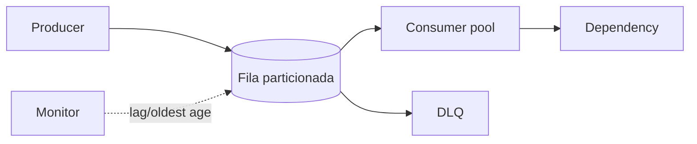

# Processo e ferramentas de System Design

## 1. Requirements

Comece por atores e jornadas. Separe funcional (“criar link”, “enviar mensagem”) de atributo de qualidade (“p99 de redirect <100 ms”). Pergunte:

- quem usa, em qual região e dispositivo?
- leitura/escrita e payload? picos e sazonalidade?
- perda, duplicidade, ordem e staleness toleráveis por operação?
- retenção, privacidade, fraude e compliance?
- RTO/RPO, disponibilidade e custo?
- o que está fora do escopo agora?

Transforme qualidade em cenário: **fonte + estímulo + ambiente + artefato + resposta + medida**. Ex.: “durante perda de uma zona, redirects já criados mantêm 99,95% de sucesso mensal e p99 <200 ms”.

## 2. Capacity estimation

Use ordens de grandeza e mostre fórmula. Exemplo hipotético:

```text
100 milhões redirects/dia / 86.400 ≈ 1.160 req/s médios
pico 10× ≈ 11.600 req/s
2 milhões links/dia × 500 bytes ≈ 1 GB/dia (antes de índices/réplicas)
retenção 5 anos ≈ 1,8 TB bruto
egress de 1 KB × 11.600/s ≈ 11,6 MB/s no pico
```

Inclua fator de replicação, índices, metadados e crescimento. Little: `concorrência = throughput × latência`. Estimativa orienta gargalo; benchmark valida.

## 3. API design

Modele recursos/intenção, idempotência, paginação, erros e evolução.

```http
POST /v1/links
Idempotency-Key: 8e...

{"url":"https://example.com/a","expires_at":"2027-01-01T00:00:00Z"}
```

- cursor opaco é mais estável que offset em coleção mutável;
- ETag/version permite optimistic concurrency;
- timeout/cancelamento e rate limit fazem parte da experiência;
- validação, autorização por objeto/tenant e tamanho máximo em toda fronteira;
- não vaze schema de banco ou stack trace;
- deprecação exige uso observado, janela e migração.

Para eventos, defina event ID/type/version, aggregate key/version, timestamp, causation/correlation, schema e classificação de dado.

## 4. Database selection e modelo de dados

Comece por invariantes e access patterns, não marca.

| Necessidade | Candidato inicial | Pergunta crítica |
| --- | --- | --- |
| transação relacional, joins, flexibilidade | PostgreSQL/relacional | particionamento/índice sustentam escala? |
| chave-valor previsível e escala horizontal | KV/document | quais queries secundárias e transações? |
| busca textual/ranking | índice de busca | fonte de verdade e freshness? |
| séries temporais/eventos | store/log/time-series | retenção, compaction e consulta? |
| relações profundas | grafo | travessias justificam operação adicional? |

Especifique primary key, índices, cardinalidade, tamanho, retenção, owner e migração. Réplica não substitui backup; teste restore. Sharding muda transações, joins, unique constraints e rebalance.

## 5. Cache

Cache reduz latência/carga usando dado possivelmente atrasado. Antes de adotar, defina chave, owner, TTL, invalidação, consistência e comportamento no miss/failure.

- **cache-aside:** app lê cache, depois DB e preenche; simples, sujeito a stale/stampede;
- **read-through/write-through:** cache/proxy participa da leitura/escrita;
- **write-behind:** alta performance, maior risco/durabilidade complexa;
- negative caching evita martelar miss, com TTL curto.

Mitigue stampede com request coalescing/single-flight, jitter de TTL, stale-while-revalidate e limites. Proteja hot keys com replicação/local cache. Cache não pode transformar autorização antiga em acesso indevido.

## 6. Queues e streams

Use fila para amortecer pico, executar depois e aplicar backpressure; stream/log para retenção, ordem por partição e múltiplos consumidores. Defina delivery, ack, retry, idempotência, ordering key, retenção, DLQ, replay e lag SLO.



Capacidade do consumer deve exceder entrada sustentável. Quando não excede, lag cresce mesmo sem erro. Escalar consumer é limitado por partições e dependência downstream.

## 7. Partitioning e replication

- hash distribui uniforme, mas range scan/rebalance complicam;
- range ajuda consulta ordenada, mas cria hot range;
- geography reduz latência/compliance, mas coordena mobilidade e cross-region;
- tenant facilita isolamento, com risco de whale tenant.

Escolha chave que preserve transação/ordem necessárias e distribua carga. Consistent hashing reduz movimento em caches/nós, não elimina hot key. Replicação líder-seguidores facilita escrita única e leitura escalável, com lag/failover; multi-leader/leaderless exige conflito/quorum explícito.

## 8. Load balancing e CDN

Load balancer distribui por round-robin, least connections, hash ou locality e remove instâncias não saudáveis. Health check diferencia processo vivo de pronto; connection draining protege requests no deploy. Sticky session mascara estado local: externalize sessão quando possível.

CDN aproxima conteúdo e absorve egress/ataque. Defina cache key (`Vary`), TTL, purge/versioned URL, conteúdo privado, signed URL/cookie e origin shield. Uma configuração errada pode cachear resposta autenticada para outro usuário.

## 9. Consistency

Declare por operação:

- strong/linearizable para saldo/unique claim quando exigido;
- read-your-writes/session consistency para UX;
- monotonic reads para evitar “voltar no tempo”;
- eventual para feeds/analytics com SLA de frescor;
- causal quando relações entre fatos precisam ser preservadas.

CAP trata comportamento sob partição, não escolha cotidiana entre consistência e disponibilidade. PACELC lembra: sem partição ainda existe troca entre latência e consistência. Use versões, quorums e reconciliação; não esconda staleness do produto.

## 10. Reliability

Parta de SLI/SLO e error budget. Modele failure domains e dependências. Padrões:

- timeouts a partir de deadline total;
- retry bounded + exponential backoff + jitter, só quando seguro;
- idempotency key e deduplication;
- circuit breaker observável, bulkhead e concurrency limit;
- load shedding e degradação de feature não essencial;
- redundância por zona/região onde o SLO paga;
- backup/restore, failover e game days medidos.

Disponibilidade de cadeia serial aproxima produto das disponibilidades; adicionar serviços pode reduzir jornada. Fallback deve ser correto e seguro, não apenas retornar 200.

## 11. Observability

Instrumente sinais para perguntas operacionais:

- **RED:** rate, errors, duration por endpoint/serviço;
- saturação de CPU/memória/pools/threads/partições;
- lag/idade, cache hit ratio, retries e circuit state;
- traces com causalidade e exemplars;
- métricas de negócio: pedidos confirmados, pagamentos reconciliados;
- SLO burn-rate em janelas curta/longa.

Logs estruturados não devem conter secrets/PII. Cardinalidade precisa de orçamento. Alertas são acionáveis, ligados a impacto e runbook; “CPU >80%” sem resposta pode ser dashboard.

## 12. Security e abuse

Faça threat model: atores, ativos, trust boundaries e abuso. Autenticação não substitui autorização por recurso. Aplique least privilege, criptografia, rotação, audit log, rate limit/quota, validação de URL/upload, antifraude e minimização/retention de dados. Considere insider, bot, enumeração, replay e supply chain.

## 13. Evolução e custo

Comece com um deploy/banco quando suficiente. Gatilhos concretos: storage excede nó com folga, hot partition persistente, times bloqueiam release, SLO pede isolamento, compliance exige região. Evolua por read replica, cache, particionamento, fila e extração **na ordem do gargalo medido**.

Inclua custo de compute, storage, egress, serviço gerenciado, observabilidade, on-call e complexidade humana. “Escala infinita” pode ter custo não sustentável.

## Checklist de apresentação

- requisitos e números aparecem antes de componentes;
- todo datastore tem dados/owner/access patterns;
- toda seta tem protocolo, sync/async e falha;
- toda fila tem ack/retry/idempotência/lag;
- todo cache tem chave/TTL/invalidação;
- toda promessa de HA tem failure domain/failover/recovery;
- trade-offs e próximo gargalo são declarados.

## Referências

- Kleppmann. *Designing Data-Intensive Applications*. [O'Reilly](https://www.oreilly.com/library/view/designing-data-intensive-applications/9781491903063/).
- Dean & Barroso. [The Tail at Scale](https://research.google/pubs/the-tail-at-scale/).
- Google SRE. [Handling Overload](https://sre.google/sre-book/handling-overload/).
- IETF. [RateLimit Fields for HTTP — RFC 9333](https://www.rfc-editor.org/rfc/rfc9333).

---

[← System Design](README.md) · [↑ Índice](README.md) · [Estudos de caso →](case-studies.md)
