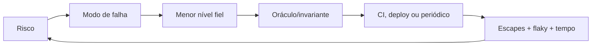
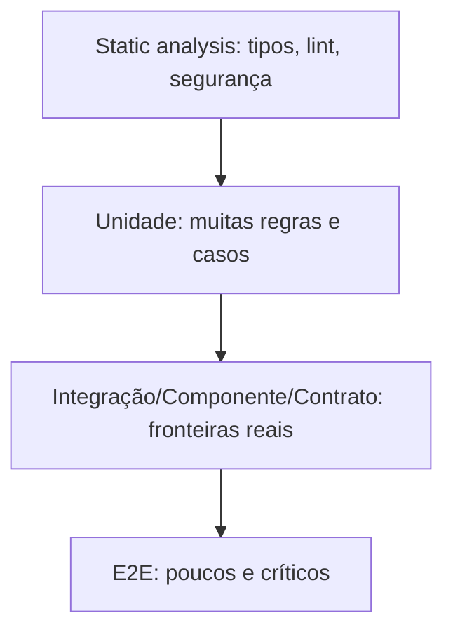

# Testing

Testes produzem informação sobre risco. Uma suíte valiosa falha por uma mudança relevante, explica o problema, roda no momento certo e custa menos para manter que o risco mitigado. Quantidade e cobertura sozinhas não medem confiança.

## Estratégia orientada a risco

1. Liste falhas importantes: dinheiro incorreto, perda de dado, acesso indevido, indisponibilidade, contrato quebrado.
2. Para cada risco, escolha o nível mais barato que consegue observá-lo com fidelidade.
3. Separe checks rápidos por mudança de testes demorados/periódicos.
4. Monitore tempo, flakiness, defeitos escapados e mutantes sobreviventes.
5. Remova testes redundantes ou incapazes de influenciar uma decisão.



## Níveis de teste

### Unit tests

Verificam unidade de comportamento em isolamento de I/O. São rápidos e bons para regras, combinações e boundaries. “Unidade” pode ser uma função ou pequeno conjunto coeso; não precisa equivaler a uma classe. Prefira saída/estado observável. Mocks de métodos internos tornam refatoração cara.

### Integration tests

Verificam a integração com banco, broker, filesystem, SDK ou framework real. Encontram schema, SQL, serialização, transação, configuração e semântica que fakes não reproduzem. Use dependências efêmeras/containers, fixtures mínimas e ownership claro; não transforme todos em E2E.

### Component tests

Exercitam um serviço/módulo inteiro pela interface pública, isolando sistemas externos. Um banco/broker local pode ser real, enquanto APIs externas usam stubs. Validam wiring, use cases e adapters com custo menor que ambiente completo.

### Contract tests

Garantem que produtor e consumidor concordam sobre uma fronteira.

- **schema/compatibilidade:** forma, tipos e evolução;
- **consumer-driven:** exemplos que o consumidor depende e o provedor verifica;
- **conformance:** várias implementações obedecem à mesma semântica.

Contrato não prova jornada nem disponibilidade. Inclua significado de erros, idempotência, units, nullability e auth—JSON válido pode estar semanticamente quebrado.

### End-to-end (E2E)

Exercitam uma jornada por componentes implantados. Detectam wiring, identidade, roteamento e configuração reais, mas são lentos, frágeis e difíceis de diagnosticar. Mantenha poucos caminhos críticos e determinísticos; cubra variações nos níveis inferiores.

### Property-based testing

Gera muitos inputs e reduz (“shrink”) uma falha a exemplo mínimo. Propriedades úteis: round-trip, idempotência, monotonicidade, invariantes, equivalência entre implementação simples e otimizada.

```text
parse(format(value)) == value
normalize(normalize(x)) == normalize(x)
balance(events) >= 0  # quando a regra garante isto
```

Geradores devem produzir casos válidos e inválidos relevantes; uma propriedade tautológica só amplia falsa confiança.

### Mutation testing

Altera código (nega condições, remove chamadas, muda operadores) e espera que testes falhem. Mutante sobrevivente revela oráculo fraco, código equivalente/morto ou risco não testado. Rode em módulos críticos e incrementalmente; mutation score não deve virar meta cega.

### Load testing

Avalia latência, throughput, saturação e erros sob uma carga definida. Modalidades: load (esperado), stress (limite), spike, soak (vazamento/degradação) e capacity. Modele distribuição de requests, payload, concorrência, cache quente/frio e dados realistas. Reporte percentis, não média.

### Chaos engineering

Experimento controlado que testa uma hipótese de estado estável sob falha: matar instância, atrasar dependência, perder zona, esgotar pool. Comece em ambiente seguro, limite blast radius, tenha abort condition e observabilidade. “Quebrar coisas aleatoriamente” sem hipótese não é caos produtivo.

## Pirâmide e troféu



A **Test Pyramid** favorece base ampla de unidades, menos integrações e poucos E2E. O **Testing Trophy** destaca análise estática e muitos testes de integração, especialmente em aplicações web onde comportamento emerge da composição. Não conte formatos; desenhe um portfólio para o risco. Um domínio algorítmico pode ter muitas unidades/property tests; um adapter CRUD ganha mais com integração.

## Test doubles

| Double | Papel | Risco de abuso |
| --- | --- | --- |
| Dummy | preenche parâmetro, não é usado | esconder API com dependência demais |
| Stub | devolve resposta controlada | modelar fornecedor incorretamente |
| Spy | registra chamadas para inspeção | testar detalhe em vez de efeito |
| Mock | expectativa de interação pré-programada | acoplamento à implementação/ordem |
| Fake | implementação simplificada funcional | semântica diverge de produção |

Use mock para fronteira de efeito em que a interação **é** o comportamento (não cobrar após rejeição). Para estado/regra, prefira resultado. Nunca mocke tipo que não controla sem também testar seu adapter contra o real.

## Design de casos

- exemplo feliz + falhas de maior impacto;
- classes de equivalência e valores-limite;
- tabela de decisão para combinações de regra;
- state transition para ciclos de vida;
- concorrência e interleavings importantes;
- metamorphic/property tests quando oráculo exato é caro;
- regressão reproduz primeiro o bug e permanece no nível mais baixo fiel.

Use Arrange–Act–Assert ou Given–When–Then; um teste deve explicar uma regra. Fixtures grandes escondem causa. Builders de teste com defaults válidos reduzem ruído, mas o caso explicita campos relevantes.

## Assincronia e sistemas distribuídos

Evite `sleep`. Exponha relógio/scheduler controlável, aguarde condição com deadline e diagnostique estado no timeout. Teste duplicidade, fora de ordem, retry exhaustion, poison messages e crash entre efeito/ack. Idempotência deve ser observada no storage/efeito, não em contagem de chamadas do mock.

## Flakiness

Quarentena temporária com owner e prazo é melhor que retry invisível. Capture seed, tempo, host, trace e artefatos. Causas comuns: relógio real, ordem compartilhada, dados não isolados, rede, porta, concorrência e polling sem deadline. Um retry pode coletar diagnóstico, mas não transformar vermelho em verde definitivo.

## Performance e confiabilidade

Um teste de carga começa por um modelo:

```text
throughput ≈ usuários concorrentes / tempo médio de resposta  (Lei de Little, sistema estável)
```

Defina objetivo (ex.: 500 rps, p99 < 300 ms, erro < 0,1%), ramp-up, duração e capacidade do gerador. Observe CPU, memória, GC, pool, locks, database, queue lag e dependências. Compare baseline com intervalos; ambiente ruidoso exige várias execuções.

Chaos começa com “sob perda de uma instância, taxa de sucesso permanece >99,9% e p99 <500 ms”. Defina blast radius e stop condition antes de injetar.

## Segurança de testes

- nunca copie PII/segredos de produção sem sanitização;
- credenciais de teste têm least privilege e expiram;
- teste autorização negativa por recurso/tenant, não só autenticação;
- fuzz parsers e fronteiras não confiáveis;
- proteja logs/screenshots/fixtures gerados;
- ambientes de teste não devem permitir cobrança/email real.

## Observabilidade da suíte

Meça duração p50/p95, fila, flaky rate, retries, testes mais lentos, mutation score selecionado e regressões escapadas por categoria. Um dashboard serve para priorizar investimento, não ranquear pessoas. Trace um E2E crítico quando diagnóstico atravessa serviços.

## Anti-patterns

- cobertura de linha como objetivo final;
- testar getter/framework e ignorar regra;
- um E2E gigantesco para todas as combinações;
- mockar banco e concluir que query/transaction funciona;
- snapshot aprovado sem revisão semântica;
- fixtures compartilhadas e ordem-dependentes;
- `sleep(5000)` para “estabilizar” assíncrono;
- teste de carga sem workload, baseline ou observação do backend;
- caos em produção sem abort condition/owner.

## Próximos passos

- [Exercícios](exercises.md)
- [DDD tático](../ddd/tactical.md) para testes de invariantes.
- [System Design](../system-design/README.md) para conectar testes a SLO e capacidade.

## Referências

- Meszaros. [xUnit Test Patterns](http://xunitpatterns.com/).
- Fowler. [Test Pyramid](https://martinfowler.com/articles/practical-test-pyramid.html).
- Google. [Software Engineering at Google — Testing Overview](https://abseil.io/resources/swe-book/html/ch11.html).
- Hypothesis. [Property-based testing documentation](https://hypothesis.readthedocs.io/en/latest/).
- PIT. [Mutation testing](https://pitest.org/).
- ISTQB. [Certified Tester Foundation Level Syllabus v4.0.1 (PDF)](https://www.istqb.org/wp-content/uploads/2024/11/ISTQB_CTFL_Syllabus_v4.0.1.pdf).
- Principles of Chaos Engineering. [Principles](https://principlesofchaos.org/).

---

[← Engenharia de Software](../README.md) · [↑ Índice](../README.md) · [Exercícios →](exercises.md)
