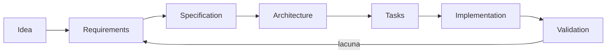

# Spec-Driven Development (SDD)

SDD usa uma especificação revisável como contrato de intenção entre problema e implementação. A spec não precisa prever tudo; precisa tornar requisitos, limites, decisões e validação concretos o bastante para orientar pessoas e coding agents.



## Por que existe

Pedidos em linguagem natural costumam misturar objetivo, solução presumida e detalhes ausentes. Um agente pode preencher lacunas de forma plausível e ainda entregar o produto errado. SDD cria checkpoints para confirmar o **quê**, o **porquê**, as restrições e a evidência antes de multiplicar mudanças.

O problema cresce com autonomia. Quanto mais código, arquivos e integrações uma execução consegue alterar, mais caro fica descobrir no final que uma hipótese silenciosa estava errada.

## Modelo mental: spec é hipótese executável

Uma spec não é verdade eterna. Ela é uma hipótese explícita sobre comportamento desejado e como reconhecê-lo.

```text
intenção → requisito verificável → design → implementação → evidência
```

Se a evidência contradiz a spec, existem três possibilidades: implementação errada, validação errada ou requisito errado. SDD saudável permite atualizar a fonte correta em vez de maquiar o resultado.

## Artefatos

| Arquivo | Pergunta | Evite |
| --- | --- | --- |
| `feature.md` | qual problema e resultado de usuário? | lista de tecnologia |
| `requirements.md` | o que é obrigatório, proibido e verificável? | adjetivos sem métrica |
| `design.md` | como componentes e dados satisfazem requisitos? | decisões sem alternativas |
| `tasks.md` | qual sequência produz increments validáveis? | tarefas grandes sem critério |

Veja o [exemplo de cadastro de usuário](examples/user-registration/feature.md).

## Requisitos funcionais e não funcionais

Requisitos funcionais dizem o que o sistema faz. Requisitos não funcionais definem propriedades sob condições específicas.

Evite:

- “a API deve ser rápida”;
- “o sistema deve escalar”;
- “a solução deve ser segura”.

Prefira:

- `REQ-PERF-01`: `POST /orders` deve manter p99 < 300 ms com 500 req/s, payload de até 32 KB e dependências saudáveis;
- `REQ-REL-01`: após perda de uma instância, tráfego deve recuperar em até 60 s sem perda de pedidos confirmados;
- `REQ-SEC-01`: usuário só pode consultar pedidos do próprio tenant e o teste de autorização deve cobrir IDOR;
- `REQ-DATA-01`: restore precisa recuperar estado com RPO <= 5 min e RTO <= 30 min.

Performance precisa de carga, percentil, volume e ambiente. Sem isso, o requisito não é testável.

## Performance e capacidade na spec

Se a feature depende de volume, registre estimativas antes do design:

- requests/s médio e pico;
- concorrência;
- tamanho de payload;
- crescimento de dados;
- jobs por hora;
- orçamento de latência;
- limites de terceiros.

Uma spec não precisa acertar o futuro com precisão. Precisa tornar a hipótese visível. Se o volume real for 20 vezes maior, o design pode ser revisado com contexto.

Inclua também critério de benchmark: dataset, warm-up, duração, percentis e recursos. “Passou no meu laptop” não valida um requisito de produção.

## Fluxo com coding agents

1. Agente lê a fonte de verdade e inspeciona o sistema atual.
2. Se uma lacuna material muda o produto, pede decisão; detalhes reversíveis podem virar hipóteses explícitas.
3. Requisitos recebem IDs estáveis (`REQ-01`) e critérios observáveis.
4. Design mapeia cada requisito a componentes, dados, falhas e rollout.
5. Tasks formam slices verticais pequenos e indicam dependências.
6. Implementação referencia requisitos e preserva mudanças não relacionadas.
7. Validação combina testes, inspeção, telemetria ou experimento.
8. Descobertas atualizam spec antes de se tornarem comportamento oculto.

## Traceability sem burocracia

Traceability útil permite responder:

- qual requisito justificou esta mudança?
- qual teste prova o requisito?
- qual requisito ficou sem implementação?
- uma alteração de requisito invalida quais tasks/testes?

Não é necessário criar uma ferramenta pesada. IDs estáveis em spec, PR e testes já podem formar uma cadeia suficiente.

Exemplo:

```text
REQ-07 → DESIGN: outbox → TASK-12 → integration_test_outbox_redelivery
```

Se não há evidência associada, o requisito ainda está aberto.

## Design orientado por risco

O design deve aprofundar onde o custo de erro é maior.

Para uma mudança de CSS, talvez acceptance criteria baste. Para pagamento:

- idempotência;
- timeout e outcome desconhecido;
- reconciliação;
- segurança;
- observabilidade;
- rollback;
- migração de dados.

SDD não exige a mesma quantidade de documento para todos os problemas. Exige rigor proporcional ao risco.

## Falhas e caminhos negativos

Specs frequentemente descrevem só happy path. Inclua cenários como:

- dependência indisponível;
- timeout após efeito externo;
- input inválido;
- autorização negada;
- concorrência;
- retry/duplicidade;
- migration parcialmente concluída;
- rollback durante rollout.

Um requisito pode dizer: “Se o PSP retornar timeout após envio da autorização, o pedido fica `payment_pending` e reconciliação resolve o outcome; o sistema não repete cobrança sem idempotency key.”

Esse nível de detalhe muda implementação e testes.

## Segurança e privacidade

Quando dados ou efeitos sensíveis aparecem, registre:

- atores e permissões;
- trust boundaries;
- dados coletados e finalidade;
- retenção/exclusão;
- threat scenarios;
- auditabilidade;
- secrets e identidade de workload.

Não use “seguir OWASP” como requisito genérico. Escreva cenários verificáveis.

## Rollout e reversibilidade

Design deve dizer como a mudança entra em produção:

- feature flag;
- canary;
- migration expand/contract;
- compatibilidade entre versões;
- shadow mode;
- rollback/roll-forward.

A spec precisa reconhecer efeitos irreversíveis. Rollback de aplicação não remove evento já enviado nem restaura coluna destruída.

## Níveis de rigor

- **Mudança pequena e reversível:** uma página com cenário, acceptance criteria e validação pode bastar.
- **Feature que cruza componentes:** separe requirements, design e tasks.
- **Dados, segurança ou migração:** inclua invariantes, threat model, rollout e rollback.
- **Decisão organizacional ou API pública:** use RFC para discussão e ADR após decidir.

O formato deve ser proporcional ao custo de erro; SDD não é documentação por volume.

## Relação com outras práticas

| Prática | Unidade principal | Relação com SDD |
| --- | --- | --- |
| TDD | feedback executável no código | ajuda a implementar requisitos em ciclos curtos |
| BDD | comportamento por exemplos compartilhados | torna acceptance criteria concretos |
| ADR | uma decisão e consequências | preserva decisões resultantes do design |
| RFC | proposta e discussão | converge stakeholders antes de compromisso amplo |
| Design Doc | solução técnica e alternativas | frequentemente corresponde a `design.md` |

SDD não substitui TDD/BDD: uma spec pode estar errada, e testes podem provar com perfeição o comportamento errado. Feedback de produto continua necessário.

## Drift entre spec e implementação

Drift acontece quando comportamento muda e a spec não acompanha. Combata com:

- revisão da spec no mesmo PR quando requisito muda;
- checks que validam schemas/links/IDs quando possível;
- exemplos executáveis;
- remoção de requisitos obsoletos;
- status explícito para hipóteses abandonadas.

Não preserve documentação morta só para manter histórico bonito. Git já mantém histórico; a versão atual precisa representar o contrato atual.

## Observabilidade da entrega

Alguns requisitos só podem ser validados em runtime. A spec deve indicar métricas:

- latência/erro;
- outcome de negócio;
- backlog;
- falha de autorização;
- custo;
- divergence/reconciliation.

Essas métricas fecham o loop entre spec e produção.

## Anti-patterns

- spec gerada depois do código apenas para justificar a solução;
- requirements que dizem “rápido”, “seguro” ou “escalável” sem condição;
- design que escolhe ferramentas antes de modelar dados e falhas;
- task “implementar backend” sem slice ou critério de parada;
- manter implementação e abandonar a spec após uma descoberta;
- usar aprovação da spec como autorização para efeitos externos não declarados;
- 50 páginas para uma mudança reversível de baixo risco;
- benchmark sem workload reproduzível.

## Laboratório

Especifique uma API de upload de arquivos.

1. Escreva problema e fora de escopo.
2. Defina requisitos funcionais com IDs.
3. Adicione p99, tamanho máximo, throughput e custo esperado.
4. Modele malware scan, autorização e retenção.
5. Desenhe falha durante upload e scan.
6. Quebre design em tasks verticais.
7. Associe cada requisito a teste ou métrica.
8. Implemente um pequeno slice.
9. Rode teste de carga e compare com a hipótese de performance.
10. Atualize a spec com uma descoberta real, preservando rastreabilidade.

## Exercícios

- **Beginner:** converta uma solicitação vaga em cinco critérios Given/When/Then.
- **Intermediate:** derive tasks verticais e mostre qual requisito cada uma valida.
- **Advanced:** modele rollout compatível para uma migration de dados.
- **Expert:** revise uma spec adversarialmente e descubra conflitos entre segurança, UX e disponibilidade.

## Referências

- [IEEE/ISO/IEC 29148 overview](https://www.iso.org/standard/72089.html) — standard de engenharia de requisitos.
- [Architecture Decision Records](https://adr.github.io/) — comunidade e recursos sobre ADRs.
- [Behaviour-Driven Development](https://cucumber.io/docs/bdd/) — documentação do Cucumber sobre descoberta por exemplos.

---

[← Skills](../skills/README.md) · [↑ Início](../README.md) · [Exemplo →](examples/user-registration/feature.md)
