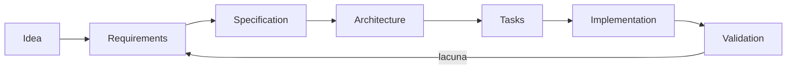

# Spec-Driven Development (SDD)

SDD usa uma especificação revisável como contrato de intenção entre problema e
implementação. A spec não precisa prever tudo; precisa tornar requisitos,
limites, decisões e validação concretos o bastante para orientar pessoas e
coding agents.

## Por que existe

Pedidos em linguagem natural costumam misturar objetivo, solução presumida e
detalhes ausentes. Um agente pode preencher lacunas de forma plausível e ainda
entregar o produto errado. SDD cria checkpoints para confirmar o **quê**, o
**porquê**, as restrições e a evidência antes de multiplicar mudanças.

## Artefatos

| Arquivo | Pergunta | Evite |
| --- | --- | --- |
| `feature.md` | qual problema e resultado de usuário? | lista de tecnologia |
| `requirements.md` | o que é obrigatório, proibido e verificável? | adjetivos sem métrica |
| `design.md` | como componentes e dados satisfazem requisitos? | decisões sem alternativas |
| `tasks.md` | qual sequência produz increments validáveis? | tarefas grandes sem critério |

Veja o [exemplo de cadastro de usuário](examples/user-registration/feature.md).

## Fluxo com coding agents

1. Agente lê a fonte de verdade e inspeciona o sistema atual.
2. Se uma lacuna material muda o produto, pede decisão; detalhes reversíveis
   podem virar hipóteses explícitas.
3. Requisitos recebem IDs estáveis (`REQ-01`) e critérios observáveis.
4. Design mapeia cada requisito a componentes, dados, falhas e rollout.
5. Tasks formam slices verticais pequenos e indicam dependências.
6. Implementação referencia requisitos e preserva mudanças não relacionadas.
7. Validação combina testes, inspeção, telemetria ou experimento.
8. Descobertas atualizam spec antes de se tornarem comportamento oculto.

## Níveis de rigor

- **Mudança pequena e reversível:** uma página com cenário, acceptance criteria e
  validação pode bastar.
- **Feature que cruza componentes:** separe requirements, design e tasks.
- **Dados, segurança ou migração:** inclua invariantes, threat model, rollout e
  rollback.
- **Decisão organizacional ou API pública:** use RFC para discussão e ADR após
  decidir.

O formato deve ser proporcional ao custo de erro; SDD não é documentação por
volume.

## Relação com outras práticas

| Prática | Unidade principal | Relação com SDD |
| --- | --- | --- |
| TDD | feedback executável no código | ajuda a implementar requisitos em ciclos curtos |
| BDD | comportamento por exemplos compartilhados | torna acceptance criteria concretos |
| ADR | uma decisão e consequências | preserva decisões resultantes do design |
| RFC | proposta e discussão | converge stakeholders antes de compromisso amplo |
| Design Doc | solução técnica e alternativas | frequentemente corresponde a `design.md` |

SDD não substitui TDD/BDD: uma spec pode estar errada, e testes podem provar com
perfeição o comportamento errado. Feedback de produto continua necessário.

## Anti-patterns

- spec gerada depois do código apenas para justificar a solução;
- requirements que dizem “rápido”, “seguro” ou “escalável” sem condição;
- design que escolhe ferramentas antes de modelar dados e falhas;
- task “implementar backend” sem slice ou critério de parada;
- manter implementação e abandonar a spec após uma descoberta;
- usar aprovação da spec como autorização para efeitos externos não declarados.

## Exercícios

- **Beginner:** converta uma solicitação vaga em cinco critérios Given/When/Then.
- **Intermediate:** derive tasks verticais e mostre qual requisito cada uma valida.
- **Advanced:** modele rollout compatível para uma migration de dados.
- **Expert:** revise uma spec adversarialmente e descubra conflitos entre segurança, UX e disponibilidade.

## Referências

- [IEEE/ISO/IEC 29148 overview](https://www.iso.org/standard/72089.html) — standard de engenharia de requisitos.
- [Architecture Decision Records](https://adr.github.io/) — comunidade e recursos sobre ADRs.
- [Behaviour-Driven Development](https://cucumber.io/docs/bdd/) — documentação do Cucumber sobre descoberta por exemplos.

---

[← Skills](../skills/README.md) · [↑ Início](../README.md) · [Exemplo →](examples/user-registration/feature.md)
