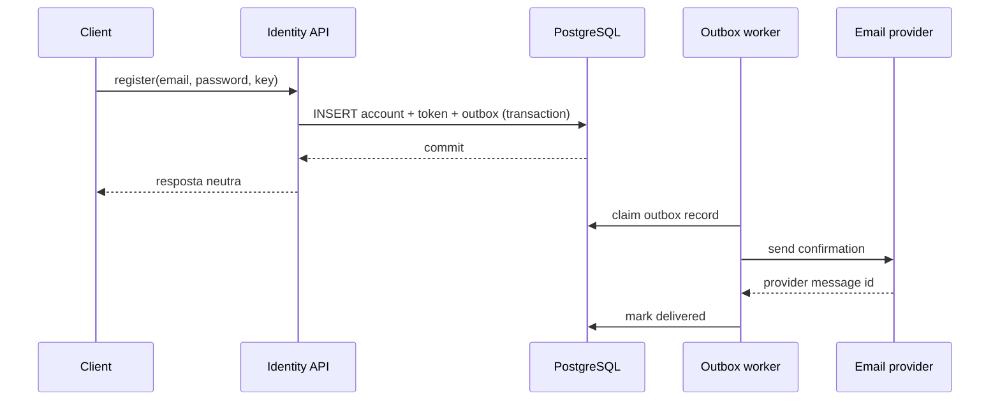

# Design — Cadastro de usuário

## Decisão

Adicionar o módulo `identity` ao monólito modular. PostgreSQL preserva
unicidade/transação; transactional outbox solicita envio; um worker usa o
provider de e-mail. Não criar um microservice nesta fase.

## Dados e invariantes

- índice único sobre e-mail canônico;
- password hash inclui algoritmo/parâmetros e permite rehash futuro;
- somente hash do confirmation token é persistido;
- confirmação faz compare-and-set de `pending` para `active` e consome token na
  mesma transação;
- idempotency record liga chave, actor fingerprint e resultado lógico.

## Falhas

- provider indisponível: outbox reprocessa com backoff/jitter e limite;
- worker cai após envio: retry pode duplicar e-mail, mas token/estado permanecem
  idempotentes; deduplicação do provider é usada se disponível;
- concorrência no cadastro: constraint seleciona uma conta canônica;
- clock skew: banco define tempo de expiração.

## Segurança e privacidade

Password hashing usa biblioteca especializada. Respostas e duração são
normalizadas contra account enumeration. Tokens possuem entropia suficiente,
expiração, uso único e não entram em logs. Threat model inclui stuffing, abuse
do envio, token leakage e merge indevido de progresso.

## Observabilidade

SLIs: taxa/latência de cadastro, idade do outbox, sucesso do provider, tempo até
confirmação e rate-limit decisions. Traces correlacionam request e mensagem por
IDs opacos. Alertas usam backlog/idade, não conteúdo.

## Alternativas

- envio síncrono foi rejeitado porque acopla commit à disponibilidade externa;
- fila sem outbox foi rejeitada pela janela de dual write;
- microservice foi adiado por não haver deploy/escala/ownership independente.

## Rollout

Migration apenas aditiva → deploy do código inativo → canary interno → habilitar
por feature flag → observar SLI → ampliar. Rollback desliga entrada; dados novos
continuam compatíveis com a versão anterior.

---

[← Requirements](requirements.md) · [↑ Exemplo](feature.md) · [Tasks →](tasks.md)
